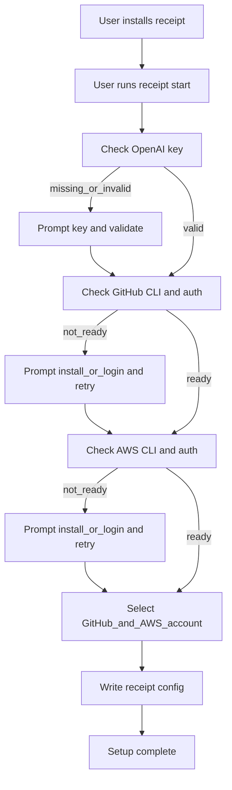

# [Build a Public]() `receipt` [CLI (Beginner-Friendly Plan)]()

## [Goal]()

[Ship a CLI that anyone can install and run, with a guided setup flow:]()

- [OpenAI API key is required]()
- [GitHub CLI (]()`gh`[) and AWS CLI (]()`aws`[) must be installed]()
- [User must be logged into both]()
- [If multiple accounts/profiles exist, user picks one]()
- [Selected accounts are saved and reused automatically]()

## [What problem exists before]()

- [The current CLI is mainly repo/dev oriented, not fully packaged for public install.]()
- [First-run onboarding is not a single guided flow.]()
- [Dependency/auth/account checks are not centralized in one setup command.]()

## [Phase 1: Product Contract (What users should experience)]()

- [Define one official entry setup command:]() `receipt start`[.]()
- [Define “setup complete” as all 3 checks passing:]()
  - [valid OpenAI key]()
  - [GitHub installed + authenticated]()
  - [AWS installed + authenticated + selected profile/account]()
- [Define config location and format (recommended: user home config file).]()

### [Files to touch]()

- `[/Users/phyonyanwinn/Library/Mobile Documents/com~apple~CloudDocs/Project/Ki's Startup/receipt/src/cli.ts](/Users/phyonyanwinn/Library/Mobile%20Documents/com~apple~CloudDocs/Project/Ki's%20Startup/receipt/src/cli.ts)`
- `[/Users/phyonyanwinn/Library/Mobile Documents/com~apple~CloudDocs/Project/Ki's Startup/receipt/src/cli.types.ts](/Users/phyonyanwinn/Library/Mobile%20Documents/com~apple~CloudDocs/Project/Ki's%20Startup/receipt/src/cli.types.ts)`
- [likely a new onboarding module in]() `src/` [for setup logic]()

## [Phase 2: Publishability (Make install work for everyone)]()

- [Convert package to publishable (not private).]()
- [Ensure]() `bin` [points to stable built runtime artifact, not raw source file.]()
- [Keep executable entrypoint predictable for global install.]()
- [Ensure workspace dependency strategy is publish-safe (]()`@receipt/core` [resolution for public users).]()
- [Add release metadata and engine constraints.]()

### [Files to touch]()

- `[/Users/phyonyanwinn/Library/Mobile Documents/com~apple~CloudDocs/Project/Ki's Startup/receipt/package.json](/Users/phyonyanwinn/Library/Mobile%20Documents/com~apple~CloudDocs/Project/Ki's%20Startup/receipt/package.json)`
- [build/runtime config files if needed (]()`tsconfig`[, scripts)]()

## [Phase 3: Build]() `receipt start` [setup wizard]()

[Implement a guided onboarding flow in this order:]()

1. [OpenAI key check (required)]()
2. `gh` [install check]()
3. [GitHub login check]()
4. `aws` [install check]()
5. [AWS login/profile/account check]()
6. [account/profile selection]()
7. [write config]()
8. [final summary]()

### [Why this order]()

- [Fail fast on missing essentials.]()
- [Ask for account choices only after confirming tools/auth are usable.]()

### [Suggested structure]()

- `runSetupWizard()` [orchestrator]()
- `ensureOpenAiKey()`
- `ensureGithubInstalled()` [+]() `ensureGithubAuthed()`
- `ensureAwsInstalled()` [+]() `loadAwsProfilesAndIdentities()`
- `promptAccountSelection()`
- `writeReceiptConfig()`

## [Phase 4: OpenAI key handling (required path)]()

- [If key missing, prompt user to paste key.]()
- [Validate key with a small API auth call before accepting.]()
- [Mask key in output (never print full secret).]()
- [Support key rotation command path (e.g. setup rerun/reset).]()

### [Safety baseline]()

- [Keep key out of logs.]()
- [Save with strict file permissions when persisted.]()

## [Phase 5: GitHub and AWS checks]()

### [GitHub]()

- [Detect CLI presence.]()
- [Check auth status using]() `gh auth status` [behavior.]()
- [If not authenticated, prompt user to run]() `gh auth login`[, then re-check.]()
- [If multiple identities/hosts are relevant, ask user which one to use.]()

### [AWS]()

- [Detect CLI presence.]()
- [Check identity using]() `aws sts get-caller-identity`[.]()
- [If not authenticated, prompt user to run AWS login/config flow, then re-check.]()
- [If multiple profiles/accounts exist, list and let user choose.]()

## [Phase 6: Persist chosen accounts for future runs]()

- [Save selected OpenAI/GitHub/AWS settings in a single CLI config file.]()
- [On future commands, load this config automatically.]()
- [Add a clear command to re-run setup and change selections.]()

### [Config shape (conceptual)]()

- `openai`[: key or key reference]()
- `github`[: host + selected username/account]()
- `aws`[: selected profile + account id + arn]()
- [metadata (last setup time, version)]()

## [Phase 7: User-facing docs]()

[Update docs with beginner-first quickstart:]()

- [Install command]()
- `receipt start`
- [Required prerequisites (]()`gh`[,]() `aws`[, OpenAI key)]()
- [Common errors and fixes]()
- [How to switch account later]()

### [Files to touch]()

- `[/Users/phyonyanwinn/Library/Mobile Documents/com~apple~CloudDocs/Project/Ki's Startup/receipt/README.md](/Users/phyonyanwinn/Library/Mobile%20Documents/com~apple~CloudDocs/Project/Ki's%20Startup/receipt/README.md)`
- [CLI docs under]() `docs/api/` [if command docs are maintained there]()

## [Phase 8: Reliability checks before publishing]()

- [Add smoke tests for setup flow branches:]()
  - [missing]() `gh`
  - [missing]() `aws`
  - [unauthenticated GitHub]()
  - [unauthenticated AWS]()
  - [multiple AWS profiles]()
  - [invalid OpenAI key]()
  - [successful setup writes config]()
- [Add package install smoke test from packed artifact.]()

### [Files to touch]()

- [tests under]() `[/Users/phyonyanwinn/Library/Mobile Documents/com~apple~CloudDocs/Project/Ki's Startup/receipt/tests/smoke](/Users/phyonyanwinn/Library/Mobile%20Documents/com~apple~CloudDocs/Project/Ki's%20Startup/receipt/tests/smoke)`

## [Phase 9: Publish and release workflow]()

- [Version bump and changelog discipline.]()
- [CI gate: build + test + packed-install smoke test.]()
- [Publish to npm.]()
- [Optional: later add installer script like Feynman-style curl installer.]()

## [Flow diagram]()

## [Acceptance criteria (done means done)]()

- `receipt start` [always enforces OpenAI key validation first.]()
- [Missing]() `gh`[/]()`aws` [gives clear install instructions.]()
- [Missing GitHub/AWS login gives clear next-step login instructions.]()
- [Multiple account/profile cases allow explicit user selection.]()
- [Selected identity is saved and reused by later CLI runs.]()
- [Public package installs and runs on clean machine smoke tests.]()

## [Simple mental model]()

- `receipt start` [is your “airport check-in desk.”]()
- [It verifies identity, tools, and destination account before any real work starts.]()

