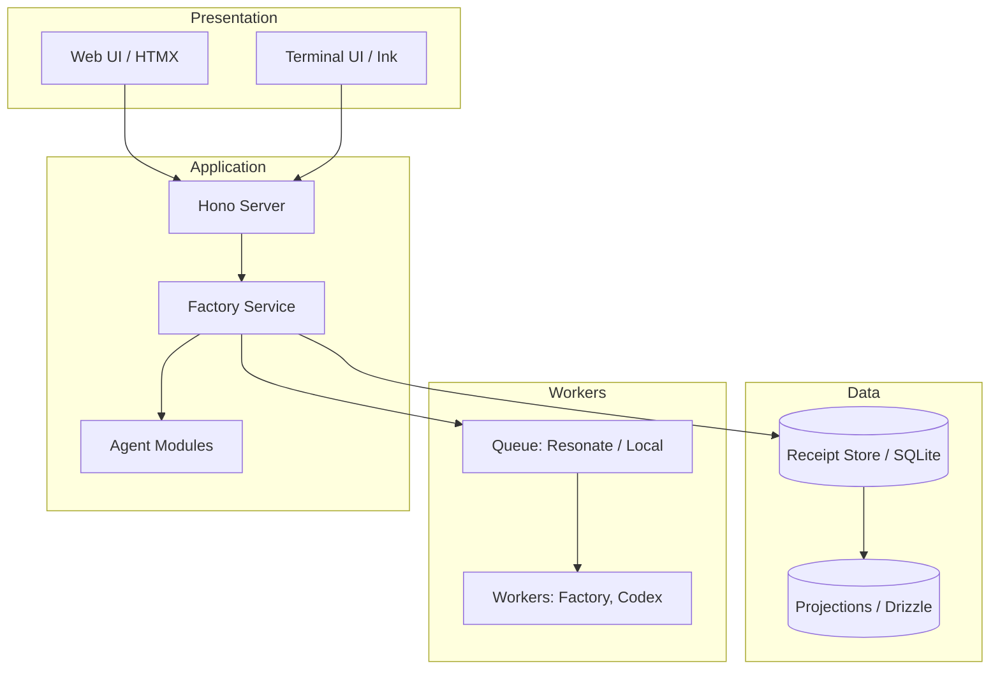

# Receipt

Receipt is an **event-native runtime and orchestration plane** for long-lived agents and software objectives.

Instead of treating traces and job state as incidental logs, Receipt stores immutable, hash-linked receipts and derives runs, jobs, memory, objectives, replay, and operator views from them by folding the same receipts.

## Core Concepts

### What is "Receipt"?
**Receipt** is the event-native substrate. Everything durable—agent runs, jobs, memory, Factory objectives—is meant to be replayed by folding the same receipts, not by mutating hidden rows.

- **Primitives**: Live in `@receipt/core` (`packages/core/src/`). Features include `createRuntime`, hashing, `fold`, branching, and `Store` / `BranchStore` contracts.
- **Persistence**: Implemented via SQLite-backed receipt adapters backed by the `receipts` and `streams` tables. Projections are maintained for quick query access (`drizzle/`).
- **Domain Modules**: Typed events, reducers, and decide functions sit in `src/modules/` (notably `agent.ts`, `job.ts`, and the `factory/` directory).

### What is "Factory"?
**Factory** is the receipt-native control plane for software objectives on a repository. It provides the task DAG, worker dispatch, candidate review, integration, validation, and promotion. Each step is recorded as Factory receipts on streams under `factory/objectives/<objectiveId>`.
- **Code Plane**: Git and worktrees remain the code plane.
- **Orchestration Plane**: Receipt acts as the orchestration plane.
- **No Hidden State**: The `FactoryService` orchestrates events but has no separate durable "service state". Everything is derived from the receipt streams.

## Architecture Layers



The repository is built in stacked layers:

### Layer A — Transport and Composition
- **`src/server.ts`**: The Hono application that wires `DATA_DIR`, the job backend (local or resonate), and creates the core runtimes (agent, job, memory). It builds the queue, `SseHub`, OpenAI adapters, and `FactoryService`, attaches REST endpoints (`/agents`, `/jobs`, `/healthz`), and starts workers.

### Layer B — HTTP Routes (Agents as Route Modules)
- **`src/framework/agent-loader.ts`**: Discovers `src/agents/*.agent.ts` and loads each default export.
- **Factory Route**: `src/agents/factory.agent.ts` re-exports the extensive Factory surface (`/factory`, HTMX islands, SSE, chat, workbench) from `src/agents/factory/route.ts`.

### Layer C — Factory Execution Seam
- **`src/services/factory-service.ts`**: The central orchestrator class. It reads/writes Factory streams via `createRuntime`, enqueues jobs, talks to Codex/Git/memory/SSE, and manages objective control and promotion.
- **Worker Handlers**: `src/services/factory-runtime.ts` exposes `createFactoryWorkerHandlers`, mapping job `agentId` (`factory-control`, `codex`) to their respective execution paths (`runObjectiveControl`, `runTask`).

### Layer D — Semantic / LLM Orchestration
- **`src/agents/orchestrator.ts`**: The entry point for chat and supervisor interactions. It branches between `runFactoryChat` (for Factory-specific chats) and `runCodexSupervisor`.

### Layer E — Generic Agent Run Loop
- **SDK**: `src/sdk/agent.ts` provides `defineAgent` and `runDefinedAgent`.
- **CLI Delegation**: `src/cli/commands.ts` handles `receipt new`, `run`, `trace`, `replay`, `inspect`, delegating Factory commands to `handleFactoryCommand`.

### Layer F — UI (Server-Rendered Projections)
- **Views**: Server-rendered HTML from `src/views/*`.
- **Client Behavior**: `src/client/factory-client.ts` boots HTMX, chat, workbench, and receipt browser from DOM markers.
- **Principle**: The UI is purely a projection of Receipt state. It refreshes via SSE/HTMX invalidations. There is no second client source of truth.

### Layer G — Factory CLI / TUI
- **Terminal UI**: `src/factory-cli/*` uses Ink and React for terminal-based dashboards, utilizing the exact same fold-over-receipts pattern as the server for local inspection.

## Data Flow (Factory Loop)

1. **Initiation**: An operator or API creates/runs an objective. **Factory receipts** are appended to `factory/objectives/...` via `FactoryService`.
2. **Derivation**: The reducer (`reduceFactory`) and selectors derive what actions are legally permitted next.
3. **Dispatch**: The service enqueues jobs onto `jobs` / `jobs/<jobId>`.
4. **Execution**: Workers run handlers (`factory-control` for objectives, `codex` for task execution/polling).
5. **Normalization**: Results are normalized back into **Factory receipts**. Git is updated through `HubGit`. SSE publishes topics causing HTMX islands to refresh.
6. **Projection**: SQLite projectors maintain query-friendly projections for UI and DB features.

## Technologies Used

| Area | Stack |
|------|--------|
| **Runtime** | Bun (`bun:sqlite`), TypeScript |
| **HTTP Framework**| Hono |
| **Validation** | Zod, `@hono/zod-validator` |
| **Database** | Drizzle ORM + SQLite |
| **Queue** | Resonate (`@resonatehq/sdk`, optional) or local SQLite-backed queue |
| **LLM** | OpenAI SDK |
| **CLI / Workers** | Ink, React, `@clack/prompts` |
| **Web UI** | HTMX, `htmx-ext-sse`, Vanilla JS/TS |
| **Styling** | Tailwind CSS v4 |
| **Monorepo** | Workspace package `@receipt/core` |

## Repository Map

| Path | Responsibility |
|------|----------------|
| `packages/core/` | Receipt chain, runtime, graph types |
| `src/sdk/` | Agent authoring API |
| `src/modules/` | Agent, job, factory reducers/events |
| `src/engine/runtime/`| Agent loop, job worker, control receipts, Resonate actions |
| `src/adapters/` | SQLite store, queue, Codex, OpenAI, memory, Git helpers |
| `src/services/` | Factory service, planners, artifacts, workers |
| `src/agents/` | Orchestrator, factory route, capabilities, codex supervisor |
| `src/factory-cli/` | Factory-focused CLI/TUI |
| `src/views/`, `src/client/`, `src/styles/`| Server HTML, browser TS, Tailwind assets |
| `src/db/` | Schema, client, projectors, importer |
| `src/framework/` | Agent loader, HTTP helpers, SSE hub |
| `.receipt/` | Repo-local config and data roots |
| `docs/` | Deep documentation and architecture records |

---

## Prerequisites

- `bun` for development and CLI execution
- `codex` on `PATH` for Factory task execution
- `resonate` on `PATH` for the default `dev` and `start` runtime
- `OPENAI_API_KEY` for model-backed features such as chat, planning, and embeddings

## Quick Start

```bash
bun install
bun run build

# default: single-process runtime backed by local SQLite
bun run dev

# optional: multi-process runtime + local Resonate
bun run dev:resonate
```

Inside this repo, prefer:

```bash
bun run factory
bun src/cli.ts <command>
```

## Common Commands

```bash
# scaffold a new agent
bun src/cli.ts new my-agent --template basic

# open the Factory operator surface
bun run factory

# create or run Factory objectives
bun src/cli.ts factory create --prompt "Plan a README refresh"
bun src/cli.ts factory run --prompt "Update the architecture docs"

# steer or follow up on a live Factory job
bun src/cli.ts factory steer job_demo --message "Retarget this run to the live-output bug"
bun src/cli.ts factory follow-up job_demo --message "Keep the receipt links stable"

# inspect jobs and receipts
bun src/cli.ts jobs --status running --limit 20
bun src/cli.ts inspect <run-id-or-stream>
bun src/cli.ts trace <run-id-or-stream>
bun src/cli.ts replay <run-id-or-stream>
bun src/cli.ts fork <run-id-or-stream> --at 12

# work with receipt-backed memory
bun src/cli.ts memory read factory/objectives/<objective-id> --limit 5
bun src/cli.ts memory search factory/repo/shared --query "integration failure"
```

Memory internals and behavior are documented in `docs/memory.md`.

The live guidance commands target a Factory-visible job directly:

- `receipt factory steer <job-id> --message "<updated direction>"` retargets the active run when the operator needs to correct the plan.
- `receipt factory follow-up <job-id> --message "<extra context>"` adds constraints or extra evidence without replacing the original task.

In the Factory chat composer, the same actions are available as slash commands:

```text
/steer Retarget this run to the live-output bug.
/follow-up Keep the receipt links stable.
```

## Runtime Modes

Receipt currently supports two runtime topologies.

### Local SQLite Default
Starts the local Receipt server directly and persists runtime state in `${DATA_DIR}/receipt.db`.
```bash
bun run dev
bun run start
```

Production note: local mode is intended to run as a single API+worker process against one persistent `${DATA_DIR}` volume. Keep `RECEIPT_FACTORY_AUTO_FIX_ENABLED=false` unless you are deliberately re-enabling audit-created auto-fix objectives after the core runtime is stable.

### Resonate Optional Dispatch
Starts the Receipt API, Resonate driver, workers (chat, control, codex), and a local Resonate server.
```bash
bun run dev:resonate
bun run start:resonate
JOB_BACKEND=resonate receipt dev
```

### Repo-local State
The checked-in config currently points Receipt at:
- config: `.receipt/config.json`
- receipt data: `.receipt/data`
- Resonate SQLite state: `.receipt/resonate`

## Web and API Surfaces

- `/factory`: Main web operator shell for chats, objectives, task state, live output.
- `/receipt`: Browser for raw receipt streams and folds.
- `/healthz`: Runtime health snapshot.
- `/jobs`, `/jobs/:id`: Queue inspection and live updates.
- `/memory/*`: Memory read/search/summarize APIs.

UI rule of thumb: Receipt is the source of truth. UI islands are projections that refresh on live invalidation.

## Docker

### Dev Container
Bind-mounts the repo, uses repo-local `.receipt/` state. Best for iterative work.
```bash
bun run docker:dev:up
bun run docker:dev:down
```

### Prod-style Container
Runs from an image without bind-mounting the full repo.
```bash
bun run docker:prod:up
bun run docker:prod:down
```

Both modes expose: `http://localhost:8787` (Receipt), `http://localhost:8001` (Resonate HTTP), `http://localhost:9090/metrics` (Resonate metrics).

## Development

```bash
bun run build
bun run test:smoke
bun run verify
```

## Docs

Start here:
- [architecture.md](./architecture.md)
- [docs/api/README.md](./docs/api/README.md)
- [docs/agent-framework.md](./docs/agent-framework.md)
- [docs/context-management.md](./docs/context-management.md)
- [docs/create-agent.md](./docs/create-agent.md)
- [docs/factory-on-receipt.md](./docs/factory-on-receipt.md)
- [docs/factory-agent-orchestration.md](./docs/factory-agent-orchestration.md)
- [docs/factory-profile-orchestration.md](./docs/factory-profile-orchestration.md)
- [docs/factory-infrastructure-engineer.md](./docs/factory-infrastructure-engineer.md)
- [docs/factory-self-improvement.md](./docs/factory-self-improvement.md)
