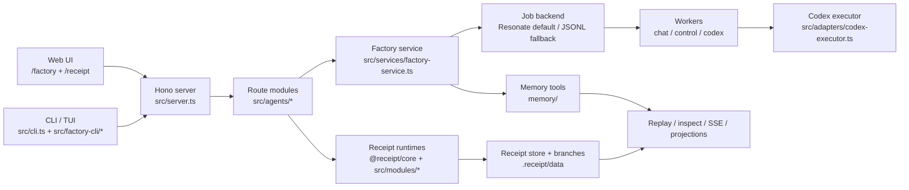

# Receipt

Receipt is a receipt-native runtime for long-lived agents.

Instead of treating traces and job state as incidental logs, Receipt stores immutable, hash-linked receipts and derives runs, jobs, memory, objectives, replay, and operator views from them.

Today this repo contains:

- a low-level receipt runtime and TypeScript SDK
- a queue-backed agent execution model with replay and branching
- a Factory operator surface for repo-scoped multi-agent work
- a Hono server, web UI, CLI/TUI, and receipt browser
- a Resonate-backed multi-process runtime by default, with a JSONL fallback

## Prerequisites

- `bun` for development and CLI execution
- `codex` on `PATH` for Factory task execution
- `resonate` on `PATH` for the default `dev` and `start` runtime
- `OPENAI_API_KEY` for model-backed features such as chat, planning, and embeddings

If you do not want to install `resonate`, use the JSONL fallback commands shown below.

## Quick Start

```bash
bun install
bun run build

# default: multi-process runtime + local Resonate
bun run dev

# fallback: single-process JSONL runtime
bun run dev:jsonl
```

Inside this repo, prefer:

```bash
bun run factory
bun src/cli.ts <command>
```

The CLI binary is `receipt` (`src/cli.ts`) if you install or wrap it separately.

## Common Commands

```bash
# scaffold a new agent
bun src/cli.ts new my-agent --template basic

# open the Factory operator surface
bun run factory

# create or run Factory objectives
bun src/cli.ts factory create --prompt "Plan a README refresh"
bun src/cli.ts factory run --prompt "Update the architecture docs"

# inspect jobs and receipts
bun src/cli.ts jobs --status running --limit 20
bun src/cli.ts inspect <run-id-or-stream>
bun src/cli.ts trace <run-id-or-stream>
bun src/cli.ts replay <run-id-or-stream>
bun src/cli.ts fork <run-id-or-stream> --at 12

# work with receipt-backed memory
bun src/cli.ts memory read factory/objectives/<objective-id> --limit 5
bun src/cli.ts memory search factory/repo/shared --query "integration failure"
```

Factory defaults come from [`.receipt/config.json`](./.receipt/config.json). In this repo the default validation checks are:

- `bun run build`
- `bun run verify`

## Runtime Modes

Receipt currently supports two runtime topologies.

### Resonate default

Use this when you want the current multi-process runtime:

```bash
bun run dev
bun run start
```

This mode starts:

- the Receipt API process
- the Resonate driver process
- the chat worker process
- the control worker process
- the codex worker process
- a local Resonate server with SQLite persistence

### JSONL fallback

Use this when you want a simpler single-process runtime or do not have `resonate` installed:

```bash
bun run dev:jsonl
bun run start:jsonl
JOB_BACKEND=jsonl receipt dev
```

### Repo-local state

The checked-in config currently points Receipt at:

- config: [`.receipt/config.json`](./.receipt/config.json)
- receipt data: [`.receipt/data`](./.receipt/data)
- Resonate SQLite state: [`.receipt/resonate`](./.receipt/resonate)

Repo-local recurring jobs can also be declared in `.receipt/config.json` under `schedules`.

## Architecture

Receipt has two layers:

1. a generic receipt runtime that appends immutable events to streams and folds them back into state
2. a repo-local Factory control plane that turns those streams into objectives, task graphs, candidate review, integration, and promotion



### Key concepts

- Receipts are immutable facts stored on append-only streams.
- State is always derived by folding receipts, never by mutating in-place records.
- Jobs are receipt-backed queue entries, not a separate hidden control plane.
- Factory objectives are receipt-backed state machines with tasks, candidates, integration state, and promotion state.
- Replay, inspect, fork, and branch all operate on the same underlying receipt chains.

### Main stream families

- `agents/<agentId>`
- `agents/<agentId>/runs/<runId>`
- `agents/<agentId>/runs/<runId>/branches/<branchId>`
- `jobs`
- `jobs/<jobId>`
- `factory/objectives/<objectiveId>`
- `memory/<scope>`

## Repository Map

- [`packages/core`](./packages/core): low-level runtime, chain, graph, and type primitives exported as `@receipt/core`
- [`src/sdk`](./src/sdk): high-level agent authoring surface (`defineAgent`, `receipt`, `action`, `assistant`, `tool`, `human`, `goal`, `merge`, `rebracket`)
- [`src/modules`](./src/modules): receipt schemas, reducers, selectors, and state models for agents, jobs, and Factory
- [`src/engine/runtime`](./src/engine/runtime): run loop, job workers, control receipts, Resonate execution adapter, and failure policy
- [`src/adapters`](./src/adapters): JSONL storage, Resonate integration, Codex execution, OpenAI calls, memory tools, delegation, and Git/worktree helpers
- [`src/services`](./src/services): Factory orchestration, planning, promotion, artifacts, helper catalog, cloud context, and worker result handling
- [`src/agents`](./src/agents): built-in agents plus Factory route modules and orchestration entry points
- [`src/factory-cli`](./src/factory-cli): CLI/TUI board, commands, formatting, analysis, and mutations
- [`src/views`](./src/views), [`src/client`](./src/client), [`src/styles`](./src/styles): server-rendered HTML, browser behavior, and Tailwind CSS assets
- [`scripts`](./scripts) and [`docker`](./docker): local boot scripts, Docker entrypoints, and operational helpers

## Web and API Surfaces

Receipt currently exposes:

- `/factory`: the main web operator shell for chats, objectives, task state, live output, and receipts
- `/receipt`: a browser for raw receipt streams and folds
- `/healthz`: runtime health snapshot
- `/jobs`, `/jobs/:id`, `/jobs/:id/events`: queue inspection and live updates
- `/memory/*`: receipt-backed memory read/search/summarize/commit/diff APIs

The web UI is server-rendered and progressively enhanced:

- Hono serves the HTML and JSON routes
- HTMX and SSE handle refresh and live updates
- [`src/client/factory-client.js`](./src/client/factory-client.js) provides the browser-side behavior
- Tailwind builds the shared UI styles into `dist/assets`

## Docker

There are two supported Docker flows.

### Dev container

```bash
bun run docker:dev:up
bun run docker:dev:down
```

Dev mode bind-mounts the repo, uses repo-local `.receipt/` state, and is the best option for iterative work.

### Prod-style container

```bash
bun run docker:prod:up
bun run docker:prod:down
```

Prod mode runs from an image without bind-mounting the full repo and only persists runtime state volumes.

Both modes expose:

- `http://localhost:8787` for Receipt
- `http://localhost:8001` for Resonate HTTP
- `http://localhost:9090/metrics` for Resonate metrics

The container image also includes `receipt-debug-env` for quick environment inspection.

## Development

```bash
bun run build
bun run test:smoke
bun run verify
```

`bun run verify` currently runs build, `check:no-any`, and the smoke suite.

## Docs

Start here:

- [architecture.md](./architecture.md)
- [docs/api/README.md](./docs/api/README.md)
- [docs/create-agent.md](./docs/create-agent.md)
- [docs/receipt-coding-runtime.md](./docs/receipt-coding-runtime.md)
- [docs/receipt-production-rfc.md](./docs/receipt-production-rfc.md)
- [docs/factory-on-receipt.md](./docs/factory-on-receipt.md)
- [docs/factory-agent-orchestration.md](./docs/factory-agent-orchestration.md)
- [docs/factory-profile-orchestration.md](./docs/factory-profile-orchestration.md)
- [docs/factory-infrastructure-engineer.md](./docs/factory-infrastructure-engineer.md)
