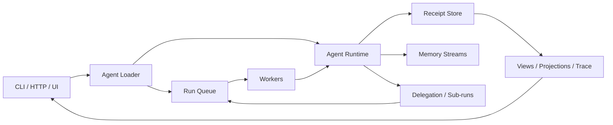

# Receipt Architecture

Receipt is event-native:

**receipts are the source of truth; state, traces, queues, and merge decisions are derived from receipts**

## 1. What Receipt is

Receipt is a framework for long-lived agent systems where:

- facts are immutable, hash-linked, durable receipts
- views are pure folds over receipt streams
- actions/tools/assistants/humans emit receipts
- control-plane decisions are receipts
- replay reconstructs both domain state and control flow

## 2. Core public model

The public model is intentionally small:

- define typed receipts
- define a pure view over receipts
- define actions that emit receipts
- let the runtime record coordination decisions
- replay explains everything

Default SDK:

- `defineAgent(...)`
- `receipt<T>()`
- `action(...)`
- `assistant(...)`
- `tool(...)`
- `human(...)`
- `goal(...)`
- `merge(...)` / `rebracket(...)`

## 3. System overview



## 4. Runtime semantics

Run loop:

1. Read run chain.
2. Fold to current view.
3. Evaluate action predicates.
4. Select runnable actions deterministically.
5. Emit control receipts.
6. Execute action.
7. Append domain receipts.
8. Recompute view.
9. Apply goal/merge policy.
10. Repeat until settled, paused, failed, or completed.

Determinism input:

- receipt chain
- agent version
- runtime policy version
- merge policy version

## 5. Queue architecture

Queue remains receipt-native.

Key rule:

**the queue manages runs, not every internal action**

Stream families:

- `jobs` (index/projection receipts)
- `jobs/<jobId>` (authoritative job lifecycle stream)

Lifecycle receipts:

- `job.enqueued`
- `job.leased`
- `job.heartbeat`
- `job.completed`
- `job.failed`
- `job.canceled`
- `queue.command`
- `queue.command.consumed`
- `job.lease_expired`

Lanes:

- `steer`
- `collect`
- `follow_up`

Singleton modes:

- `allow`
- `cancel`
- `steer`

## 6. Merge / rebracketing

Merge policies are framework-level and optional.

Policy shape:

```ts
type MergePolicy = {
  id: string;
  version: string;
  shouldRecompute: (ctx: MergeCtx) => boolean;
  candidates: (ctx: MergeCtx) => BracketCandidate[];
  evidence: (ctx: MergeCtx) => Evidence;
  score: (candidate: BracketCandidate, evidence: Evidence, ctx: MergeCtx) => ScoreVector;
  choose: (scored: ScoredCandidate[]) => BracketDecision;
};
```

Merge receipts:

- `merge.evidence.computed`
- `merge.candidate.scored`
- `merge.applied`

## 7. Stream families

Agent:

- `agents/<agentId>`
- `agents/<agentId>/runs/<runId>`
- `agents/<agentId>/runs/<runId>/branches/<branchId>`
- `agents/<agentId>/runs/<runId>/sub/<subRunId>`

Queue:

- `jobs`
- `jobs/<jobId>`

Memory:

- `memory/<scope>`

## 8. Storage and integrity

Default store: JSONL.

Integrity guarantees:

- canonical hashing
- previous-hash linking
- chain verification
- idempotent event IDs
- expected-previous-hash guards

Projections are disposable caches.

## 9. UI contract

The UI is receipt-native too:

- Receipt is the only durable source of truth.
- UI models are projections or aggregated projections derived from receipt streams.
- UI islands subscribe to receipt-backed invalidation and re-render from fresh projections.
- Browser code should stay thin and only own ephemeral interaction state such as focus, navigation, optimistic compose state, and streaming overlays.
- Do not introduce a second client-side state store for objective, run, queue, or receipt truth.

The performance model is:

- keep projection building cheap
- refresh islands instead of diffing a second application store
- let SSE or equivalent invalidation wake the relevant island
- make the UI feel instant because the client is mostly projection transport, not business logic

## 10. CLI contract

Core commands:

- `receipt new <agent-id>`
- `receipt dev`
- `receipt run <agent-id>`
- `receipt trace <run-id>`
- `receipt replay <run-id>`
- `receipt fork <run-id> --at N`
- `receipt inspect <stream-or-run-id>`
- `receipt jobs`
- `receipt abort <job-id>`
