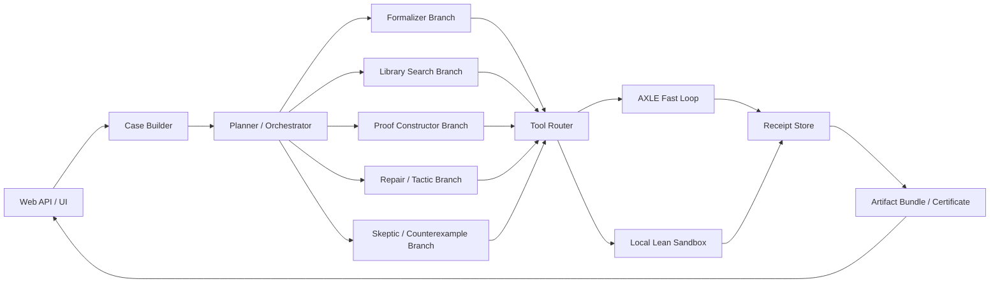

# Public Axiom Prover

This document describes the production design for turning the current `axiom` agent into a public internet-facing theorem prover.

## Objective

Build a theorem proving service that:

- accepts natural-language math tasks, formal statements, or existing Lean files
- searches for proofs with long-horizon agent workflows
- uses real Lean tooling during the run, not prose-only reasoning
- produces auditable Lean artifacts and verifier receipts
- is safe to expose on the public internet

## Current Baseline

Today `axiom` already gives us:

- a durable long-horizon agent loop
- receipt-backed job execution
- AXLE-backed Lean tools for `check`, `verify_proof`, and `repair_proofs`
- workspace file workflows
- monitor integration and queue-driven execution

That is a good base, but it is not enough to expose directly as a public theorem service.

## Production Constraint

AXLE should be the fast inner verification loop, not the final trust boundary.

Relevant AXLE capabilities today:

- [`check`](https://axle.axiommath.ai/v1/docs/tools/check/)
- [`verify_proof`](https://axle.axiommath.ai/v1/docs/tools/verify_proof/)
- [`repair_proofs`](https://axle.axiommath.ai/v1/docs/tools/repair_proofs/)
- [`extract_theorems`](https://axle.axiommath.ai/v1/docs/tools/extract_theorems/)
- [`simplify_theorems`](https://axle.axiommath.ai/v1/docs/tools/simplify_theorems/)
- [`normalize`](https://axle.axiommath.ai/v1/docs/tools/normalize/)
- [`sorry2lemma`](https://axle.axiommath.ai/v1/docs/tools/sorry2lemma/)
- [`disprove`](https://axle.axiommath.ai/v1/docs/tools/disprove/)

Important design rule:

- use AXLE for fast search-time feedback
- use a separately sealed local Lean build for final acceptance
- for adversarial or public submissions, add an independent checker tier before publishing a proof as trusted

## Product Shape

The public product should expose three modes:

1. `formalize`
   Converts prose or semi-formal math into Lean-ready statements and task files.
2. `prove`
   Searches for a Lean proof, iterates with real tools, and returns the best verified artifact.
3. `verify`
   Accepts user Lean code, verifies it, repairs obvious issues when requested, and returns diagnostics plus a proof certificate.

## Architecture

## Core Components

### 1. Case Builder

Every request becomes a structured case file:

- user-visible problem statement
- normalized formal target
- Lean environment
- workspace snapshot
- imported libraries
- theorem class tags such as algebra, analysis, or combinatorics
- resource budget such as time, branch count, and tool quota

This case file should be immutable once execution begins. Any refinement becomes a new receipt.

### 2. Planner / Orchestrator

The orchestrator should not write the proof directly most of the time. Its job is to:

- classify the task
- decide whether formalization is needed
- allocate branch budget
- choose tool strategy
- merge evidence from competing proof branches
- decide when a branch is worth repairing, discarding, or promoting

This is where the current `axiom` loop should evolve from single-threaded tool use into a branch scheduler.

### 3. Specialist Branches

The public prover should use distinct roles, even if they are all implemented with the same base runtime.

- `formalizer`
  Produces a precise Lean theorem statement, imports, namespaces, and local notation assumptions.
- `librarian`
  Finds relevant library lemmas, prior declarations, and proof patterns.
- `constructor`
  Writes proof skeletons and candidate proof terms.
- `repairer`
  Runs short repair loops on broken declarations and missing tactic steps.
- `skeptic`
  Tries to break the candidate proof, identify hidden assumptions, or produce counterexamples.
- `minimizer`
  Reduces imports, shortens tactics, and simplifies the final published proof.
- `publisher`
  Assembles the final artifact bundle and certificate.

### 4. Tool Router

The agent should have two tool tiers.

AXLE tier:

- fast stateless verification
- proof repair
- theorem extraction and normalization
- statement simplification
- counterexample and disproval attempts

Local Lean tier:

- `lake env lean`
- `lake build`
- project-local `.lean` file reads and writes
- mathlib and workspace search
- environment fingerprinting
- final hermetic replay in a clean sandbox

The public product should never rely on only one tier. AXLE is the accelerator; the local sandbox is the trust anchor.

### 5. Verifier Pipeline

Proof acceptance should require three gates:

1. `search-valid`
   AXLE `check` or `verify_proof` says the candidate is valid enough to continue.
2. `sealed-valid`
   A pinned local Lean environment compiles the artifact in an isolated workspace.
3. `publish-valid`
   An independent verification tier, or at minimum a fresh isolated replay with environment fingerprint checks, confirms the publishable artifact.

Only after all three gates pass should the UI label a theorem as `proved`.

## Recommended Tool Set

The public prover needs more than the current v1 AXLE tools.

Add AXLE-backed tools for:

- theorem extraction from messy files
- theorem normalization
- theorem simplification
- `sorry` extraction into explicit lemma obligations
- disproval / counterexample attempts

Add local Lean tools for:

- creating scratch files for `#check`, `#print`, and `#eval`
- running a full project build
- resolving imports and module boundaries
- diffing proof variants
- producing a final single-file replay bundle

## Retrieval and Memory

General chat memory is not enough. The prover needs theorem-specific memory.

Persist:

- failed proof patterns by theorem class
- useful lemmas by environment and namespace
- repair patterns that worked before
- imports that tend to be sufficient for a domain
- branch summaries and failure causes

Memory should be scoped by:

- Lean environment
- project
- namespace
- theorem family

This prevents garbage reuse across unrelated contexts.

## Proof Artifact Bundle

Every successful run should emit a bundle that can be downloaded and replayed:

- canonical theorem statement
- final Lean source
- selected imports
- environment identifier
- verifier results from each gate
- run id and receipt hash
- tool diagnostics
- branch lineage
- proof certificate metadata

This is what makes the service trustworthy on the internet. Users need more than “model says it works.”

## Public API

Expose explicit endpoints instead of overloading the monitor UI:

- `POST /api/axiom/formalize`
- `POST /api/axiom/prove`
- `POST /api/axiom/verify`
- `GET /api/axiom/runs/:runId`
- `GET /api/axiom/runs/:runId/events`
- `GET /api/axiom/runs/:runId/artifact`

Every run should stream status transitions such as:

- queued
- planning
- formalizing
- searching
- repairing
- validating
- sealed
- published
- failed

## Public UI

The theorem UI should be specialized, not a generic monitor redirect.

Minimum layout:

- left column: theorem statement, assumptions, environment, run controls
- center column: active branches, Lean diffs, current candidate proof
- right column: verifier gates, diagnostics, artifact download, receipt trail

Key UX features:

- live branch scoreboard
- proof diffing between candidates
- explicit verifier gate badges
- downloadable final Lean artifact
- “why it failed” summaries that show the last real Lean errors

## Security and Abuse Controls

If this goes on the public internet, do not expose the current unrestricted workspace model.

Required controls:

- per-job isolated workspace
- path allowlists
- no arbitrary shell access in public mode
- pinned allowlisted Lean environments
- resource budgets per run
- request authentication and quotas
- rate limiting by user and IP
- secret-free execution sandboxes
- automatic cleanup of temporary workspaces

## Reliability

The public system should expect AXLE outages, rate limits, and environment drift.

Build in:

- retries with backoff for AXLE calls
- degraded mode when AXLE is unavailable
- queue admission control
- environment health checks
- per-tool latency metrics
- cached environment catalogs

## Evaluation

Track metrics that matter for theorem proving, not generic agent metrics.

- proof success rate by theorem family
- median tool cycles to first valid candidate
- repair success rate
- percentage of proofs that pass sealed validation
- percentage of proofs rejected by skeptic or final verifier
- user-visible latency to first meaningful diagnostic

## Implementation Roadmap

### Phase 1

- expand AXLE tool coverage
- add local Lean sandbox tools
- build theorem-specific public UI
- add artifact bundle generation

### Phase 2

- add branch-specialist scheduler
- add skeptic and minimizer roles
- add theorem-scoped retrieval and memory
- add sealed local validation gate

### Phase 3

- expose dedicated public HTTP API
- add auth, quotas, and billing hooks
- add publishable proof certificates
- add independent final verification tier

## Immediate Code Direction

The next implementation pass should focus on these concrete changes:

1. Extend `src/adapters/axle.ts` and `src/agents/axiom.ts` with the missing AXLE tools.
2. Add a local Lean sandbox tool family instead of relying only on AXLE.
3. Add theorem-specific receipt events for candidate proofs, verifier gates, and artifact publication.
4. Replace `/axiom -> /monitor` with a dedicated theorem UI.
5. Introduce a sealed final-validation stage before the run is marked successful.

## Bottom Line

Do not ship the current `axiom` agent to the public internet as-is.

Ship a layered prover:

- AXLE for fast iteration
- local Lean for final sealing
- receipts for auditability
- specialized branches for search quality
- a theorem-specific UI and API for public use
