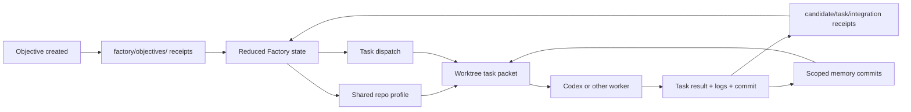

# Context Management In Receipt

Status: Current implementation notes  
Audience: Engineering  
Scope: How "context" is actually represented, persisted, compacted, and handed off in this repo, with special focus on Factory

## Executive Summary

This repo does not have one universal context object.

Instead, "context" is split across several layers that serve different jobs:

| Layer | What it stores | Where it lives | Typical consumer |
| --- | --- | --- | --- |
| Receipts | Raw, append-only event history | JSONL streams via the runtime | Reducers, inspectors, debugging tools |
| Reduced state | Structured current view derived from receipts | In-memory replay result from reducers | Services, routes, projections |
| Prompt context | The exact text or bounded summary sent to an LLM | Prompt builders and `prompt.context` / compaction events | Factory flows |
| Scoped memory | Durable summaries/facts keyed by scope | `memory/<scope>` streams | Long-running agents, Factory workers |
| Factory task packet | Materialized worker handoff for one task pass | `<worktree>/.receipt/factory/*` | Codex or another worker |

The important design choice is this:

- durable context is receipt-backed
- operational context is derived from receipts and Git state
- worker context is materialized just-in-time into a bounded packet

Factory is the strongest example of this design. It does not dump the whole objective transcript into Codex. It builds a compact task packet, a recursive context pack, and a layered memory script, then records the result back into receipts and scoped memory.

## Core Rule: Receipts Are The Durable Context Plane

The generic runtime in `packages/core/src/runtime.ts` is the foundation:

1. A command is executed against a stream.
2. `decide(...)` turns that command into events.
3. Each event is wrapped as a receipt and appended to the stream.
4. State is always derived by replaying the chain with a reducer.

That means the repo treats context primarily as replayable evidence, not mutable service-owned state.

`packages/core/src/chain.ts` and `packages/core/src/types.ts` make this explicit:

- a receipt is immutable
- a chain is append-only
- reducer state is always derived, never authoritative on its own

Two consequences matter for understanding context:

- if something matters later, the system tries to record it as a receipt or memory entry
- if something is too large or too expensive to persist raw, the system stores a summary, a reference, or a derived projection instead

## Repo-Wide Context Patterns

## 1. Raw receipt slices

The simplest context path is in `src/adapters/receipt-tools.ts`.

That file gives the repo four basic primitives:

- `readReceiptFile(...)`: load raw JSONL receipt lines
- `sliceReceiptRecords(...)`: take a bounded head or tail slice
- `buildReceiptContext(...)`: concatenate raw receipt lines until a char budget is hit
- `buildReceiptTimeline(...)`: group receipt counts into timeline buckets

This is intentionally simple. It is used for:

- delegation inspection
- operator-facing debugging

This is not semantic memory. It is just bounded raw evidence.

## 2. Ranked and compacted prompt context

Some agents build smarter prompt context instead of passing raw receipt dumps.

The ranked-context pattern ranks candidate context items by score and recency, optionally keeps pinned items, respects both item count and character budgets, and truncates when needed.

Factory uses this pattern through its recursive context packs and layered memory scopes to deliver bounded, high-value context to workers.

## 3. Prompt snapshots and overflow receipts

Long-running agent flows explicitly record what happened to prompt context through receipts like `prompt.context`, `context.pruned`, `context.compacted`, and `overflow.recovered`.

This is important because it makes prompt management observable. The system does not silently trim prompts and hide that fact.

Common policy shape:

- if prompt text is too large, soft trim it
- if it is much too large, hard reset it to a minimal instruction
- if it still risks overflow, compact it further before the model call
- if the model still overflows, retry once with a smaller prompt and emit a recovery receipt

Context pressure can move information from "live prompt text" into "durable memory" instead of just deleting it.

## 4. Scoped memory is the durable summary layer

`src/adapters/memory-tools.ts` implements receipt-backed memory scopes.

A memory entry is just:

- `scope`
- `text`
- optional `tags`
- optional `meta`
- timestamped receipt-backed storage

Memory supports:

- `read`
- `search`
- `summarize`
- `commit`
- `diff`
- `reindex`

The important point is that memory is still receipt-native:

- commits append `memory.committed` events
- reads and summaries are derived from those events
- embeddings are optional acceleration for search, not a separate source of truth

This makes memory a durable "compressed context" layer for long-running work.

## 5. Loader context is dependency injection, not conversational context

There is one other use of the word "context" in the repo that is easy to confuse with prompt context.

`src/framework/agent-types.ts` defines `AgentLoaderContext`, which carries:

- runtimes
- queue access
- SSE
- prompt registries
- models
- helper services

This is module wiring context for route factories loaded by `src/framework/agent-loader.ts`. It is not the same thing as task prompt context or memory context.

## Factory: How Context Actually Works

Factory uses every one of the layers above, but it is stricter and more structured than the other flows.

The best way to think about Factory context is:

- objective receipts hold the durable control history
- reducer state holds the live orchestrator view
- repo profile and repo skills hold shared repo-level context
- scoped memory holds durable summaries across task passes
- each task dispatch materializes a bounded worktree-local packet

## Factory context pipeline

## 1. Durable objective context lives in one receipt stream

Factory objective state is replayed from the stream:

- `factory/objectives/<objectiveId>`

This stream is produced and consumed by `FactoryService` in `src/services/factory-service.ts` using the reducer in `src/modules/factory.ts`.

The stream contains the full control history:

- objective creation
- repo profile generation
- plan proposal and adoption
- task graph mutations
- candidate creation and review
- integration status changes
- promotion and completion

So the primary answer to "where does Factory context live?" is:

- first in the objective receipt chain
- then in reducer-derived `FactoryState`

## 2. Task records store references, not giant transcripts

The task model in `src/modules/factory.ts` is deliberately pointer-heavy.

Each `FactoryTaskRecord` carries:

- `dependsOn`
- `skillBundlePaths`
- `contextRefs`
- `artifactRefs`
- `workspacePath`
- `candidateId`
- `latestSummary`
- `blockedReason`

This is a key design choice.

Factory task state does not try to inline all worker context. Instead it stores:

- graph structure
- latest status and summaries
- references to files, commits, workspaces, and objective state

`contextRefs` are `GraphRef` pointers such as:

- objective state refs
- commit refs
- artifact refs like the recursive context pack

That keeps reducer state small and replayable.

## 3. Repo profile provides shared repo-level context

Before planning or dispatching work, Factory prepares a shared repo profile.

This is handled in `FactoryService.generateSharedRepoProfile(...)`.

The repo profile:

- infers default validation commands
- summarizes the repo
- generates repo-specific skill markdown files
- caches the result under Factory data storage

Important details:

- cache location: `<dataDir>/factory/repo-profile/profile.json`
- generated skills location: `<dataDir>/factory/repo-profile/skills/*.md`
- cache invalidation key: hash of repo root + `package.json` + `README.md`

Each objective copies the shared profile into reducer state through:

- `repo.profile.requested`
- `repo.profile.generated`

This gives Factory a stable source of shared context before any task starts.

## 4. Planning seeds the first task-level context references

When `planObjective(...)` creates task records, each task starts with baseline `contextRefs`:

- objective state ref
- base commit ref

That matters because Factory establishes early that task context comes from:

- the objective control plane
- the code plane

not from an opaque in-memory prompt blob.

## 5. Dispatch materializes a task packet into the worktree

When a task is dispatched, `dispatchTask(...)` calls `writeTaskPacket(...)`.

This writes a complete worker handoff into:

- `<workspace>/.receipt/factory/`

Current files:

- `<taskId>.manifest.json`
- `<taskId>.context-pack.json`
- `<taskId>.prompt.md`
- `<taskId>.result.json`
- `<taskId>.stdout.log`
- `<taskId>.stderr.log`
- `<taskId>.last-message.md`
- `<taskId>.skill-bundle.json`
- `<taskId>.memory.cjs`
- `<taskId>.memory-scopes.json`

This packet is the most concrete answer to "what context does the worker actually get?"

It is not the whole objective chain. It is a bounded, generated handoff.

## 6. The task packet has four separate context channels

`writeTaskPacket(...)` assembles four distinct kinds of worker context.

### A. Manifest context

The manifest contains:

- objective metadata
- task metadata
- candidate metadata
- integration metadata
- memory script path and scopes
- context pack path
- `contextRefs`
- repo skill paths
- generated skill bundle paths
- trace refs

This is the structural context map for the worker pass.

### B. Recursive context pack

`buildTaskContextPack(...)` generates a focused JSON document for the current task pass.

It contains:

- focus task identity and prompt
- current integration snapshot
- dependency tree
- related tasks in the task subgraph
- candidate lineage for the task
- recent focused receipts
- an objective-wide slice
- memory summaries

The related-task section is richer than it looks.

Factory computes relations such as:

- `focus`
- `dependency`
- `dependent`
- `split_source`
- `split_child`

So the context pack is not just "upstream deps". It gives the worker a local map of the execution neighborhood.

### C. Layered memory config and script

Factory does not expect the worker to read giant memory dumps directly.

Instead it generates:

- `<taskId>.memory-scopes.json`
- `<taskId>.memory.cjs`

The script exposes bounded commands over scoped memory plus the context pack:

- `context`
- `objective`
- `overview`
- `scope`
- `search`
- `read`
- `commit`

Internally, the script shells out to the `receipt memory ...` CLI for scoped memory operations and reads the context pack file directly for `context` and `objective`.

When `OPENAI_API_KEY` is present, that CLI path uses embeddings by default for `search` and query-driven `summarize`; otherwise it falls back to keyword matching.

So the worker gets a tool interface for recall, not just a pile of text.

### D. Repo skills

Factory merges two skill sources:

- checked-in repo skills under `<repo>/skills/**`
- generated repo-profile skills under `<dataDir>/factory/repo-profile/skills/**`

These are attached through:

- `repoSkillPaths`
- `skillBundlePaths`

This makes repo conventions part of task context without baking them into the reducer or prompt text.

## 7. What the recursive context pack actually includes

The context pack built by `buildTaskContextPack(...)` has several intentionally different views.

### Focused task view

The pack always identifies the current task:

- `taskId`
- `title`
- `prompt`
- `workerType`
- `status`
- `candidateId`

### Dependency tree

This is the recursive dependency view rooted at the task's direct dependencies.

It is useful when the worker needs prerequisite context, not the whole objective graph.

### Related tasks

This is the broader local subgraph around the task:

- dependencies
- dependents
- split ancestors/children
- the focus task itself

Each related task also carries a short memory summary from the task memory scope when available.

### Candidate lineage

Factory includes the current task's candidate ancestry and status trail:

- candidate id
- parent candidate id
- status
- summary
- head commit
- latest reason

This is how rework history becomes part of worker context without replaying every old transcript.

### Recent focused receipts

Factory selects recent receipts that are relevant to:

- related task ids
- related candidate ids
- integration events
- `rebracket.applied`

This gives the worker the most recent local execution trail.

### Objective slice

The pack also includes a bounded objective-level summary:

- frontier tasks
- recent completed tasks
- integration tasks
- recent objective receipts not already included in the focused set
- objective memory summary
- integration memory summary

This is the bridge between local task context and the bigger objective state.

## 8. Factory memory scopes are layered by design

For every dispatched task, Factory creates a standard set of memory scopes in `memoryScopesForTask(...)`:

- `factory/agents/<workerType>`
- `factory/repo/shared`
- `factory/objectives/<objectiveId>`
- `factory/objectives/<objectiveId>/tasks/<taskId>`
- `factory/objectives/<objectiveId>/candidates/<candidateId>`
- `factory/objectives/<objectiveId>/integration`

This is one of the most important implementation details in the repo.

Factory does not rely on one monolithic memory scope. It splits recall by responsibility:

- agent-level habits
- repo-level conventions
- objective-wide progress
- task-local facts
- candidate-pass facts
- integration facts

That is why the generated memory script can answer different kinds of questions without returning one huge undifferentiated summary.

## 9. Factory prompt assembly is intentionally thin

`renderTaskPrompt(...)` does not inline the full context pack or full memory corpus.

Instead it includes:

- objective prompt
- task prompt
- dependency summaries
- checks
- `contextRefs`
- repo skill paths
- generated skill bundle paths
- recommended memory-script commands
- a short bootstrap memory summary
- result contract

The prompt explicitly tells the worker:

- use the generated memory script
- do not rely on large raw memory dumps

This is the repo's clearest statement of context policy in Factory.

Context is:

- structured
- layered
- pull-based
- bounded

not eager full-transcript injection.

## 10. After execution, Factory records context artifacts back into durable state

When a worker finishes, `applyTaskWorkerResult(...)`:

- runs checks
- commits the worktree if there is a tracked diff
- records candidate artifacts
- emits review receipts
- commits memory summaries

The produced candidate stores artifact refs for:

- manifest
- prompt
- result JSON
- stdout
- stderr
- last message
- recursive context pack
- memory script
- memory config
- candidate commit

So the worker input packet becomes part of the auditable output trail.

This is a subtle but important point:

- the task packet starts as ephemeral workspace materialization
- after production, the important files become durable references in reducer state

## 11. Memory is updated after the run, not just before it

Factory writes memory in both task and integration flows.

`commitTaskMemory(...)` writes to multiple scopes in parallel:

- agent
- repo
- objective
- task
- candidate

`commitIntegrationMemory(...)` writes to:

- objective
- integration

So context flow in Factory is cyclical:

1. receipts and memory are used to create a task packet
2. the worker acts
3. results and summaries are written back into receipts and memory
4. the next task packet is built from the updated state

## 12. The UI debug view exposes context materialization points

Factory's debug projection in `buildObjectiveDebug(...)` exposes:

- latest decision
- recent receipts
- active and recent jobs
- worktrees
- latest context pack paths
- memory script paths

The inspector and workbench views in `src/views/factory-inspector.ts` and `src/views/factory-workbench.ts` are not inventing context. They are surfacing the files and projections built by the service.

That means the easiest way to inspect live Factory context is usually:

1. open the objective debug view
2. inspect the current worktree packet under `.receipt/factory/`
3. inspect the objective receipt stream
4. inspect the relevant memory scopes

## What Factory Does Not Do

Factory does not manage context by:

- storing a giant mutable session object in the service
- passing the full objective receipt chain to Codex every time
- keeping hidden planner notes outside receipts or memory
- treating prompt text as the durable source of truth

Instead it uses:

- receipts for durable control history
- reducer state for current structured context
- memory scopes for durable summaries
- task packets for bounded worker handoff
- Git for code truth

## Practical Debugging Guide

If you want to understand "why did the worker know X?" or "why did it miss Y?", inspect these layers in order:

1. Objective receipts
   - Look at `factory/objectives/<objectiveId>` and recent task/candidate/integration events.
2. Reduced task state
   - Check `contextRefs`, `artifactRefs`, `latestSummary`, `candidateId`, and `dependsOn`.
3. Repo profile
   - Check the cached profile and generated skills under the Factory repo-profile directory.
4. Worktree packet
   - Open the current `.manifest.json`, `.context-pack.json`, `.memory-scopes.json`, and `.prompt.md`.
5. Scoped memory
   - Read objective, task, candidate, repo, and integration scopes.
6. Worker output
   - Inspect `.stdout.log`, `.stderr.log`, `.last-message.md`, and `.result.json`.

Usually the bug is one of these:

- the right fact never made it into receipts or memory
- the fact exists but only in a scope the worker did not query
- the context pack relation closure was narrower than expected
- the prompt summary was too thin
- the worker ignored the memory script guidance

## Bottom Line

The repo manages context as a layered system, not a single mechanism.

Across the whole codebase:

- receipts are the raw durable context
- reducers are the structured current context
- prompt builders create bounded transient context
- memory scopes preserve reusable compressed context

In Factory specifically:

- the objective stream is the durable source of truth
- task records keep references, not giant transcripts
- repo profile adds shared repo-level context
- each dispatch materializes a bounded packet into the worktree
- the recursive context pack and layered memory script are the worker's main context interface
- results are written back into receipts and scoped memory so the next pass has better context than the last one

That is the actual context model in this repo.
