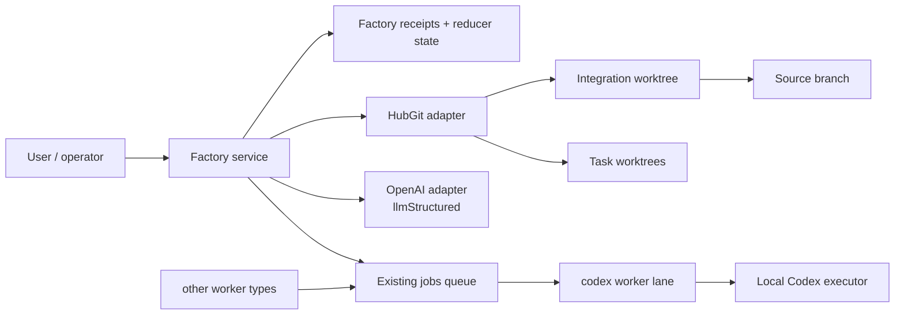
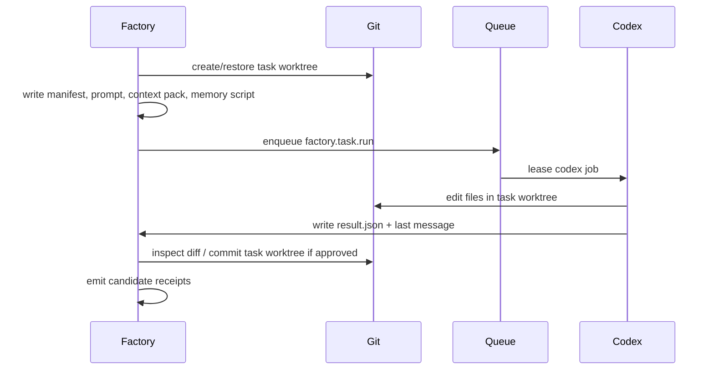
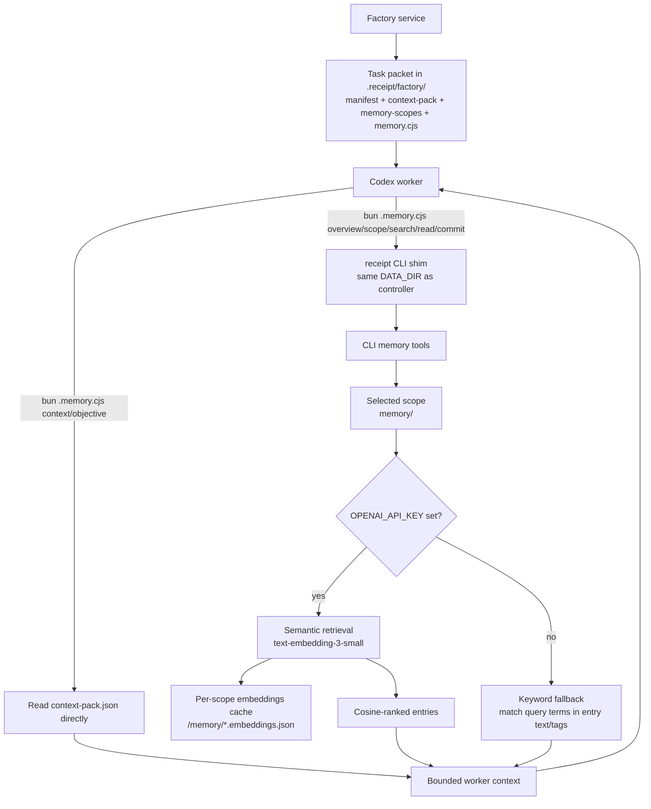
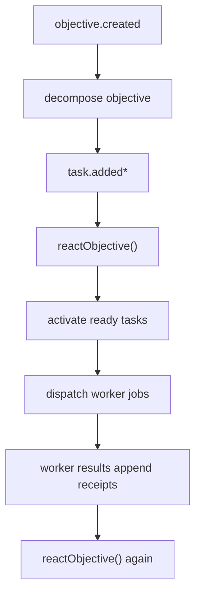
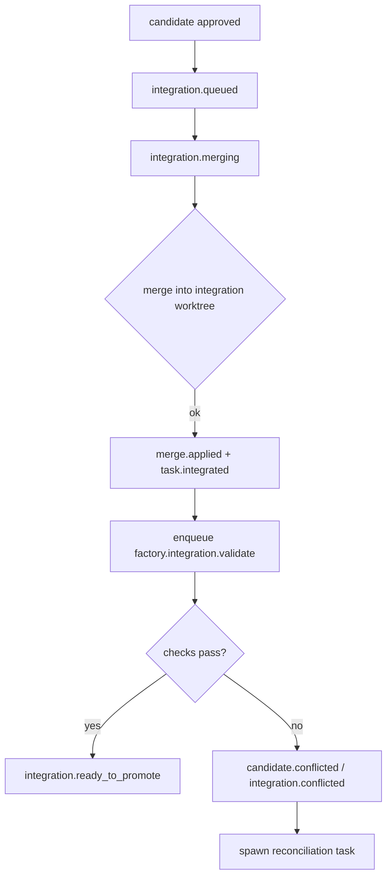
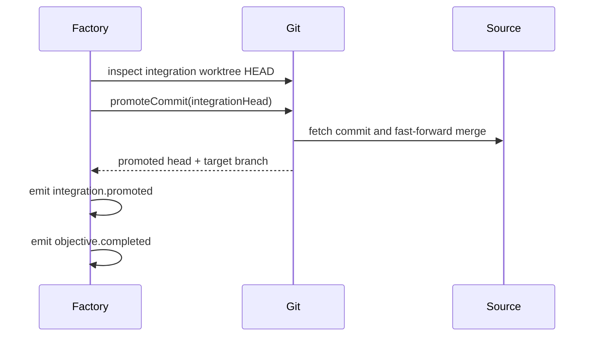
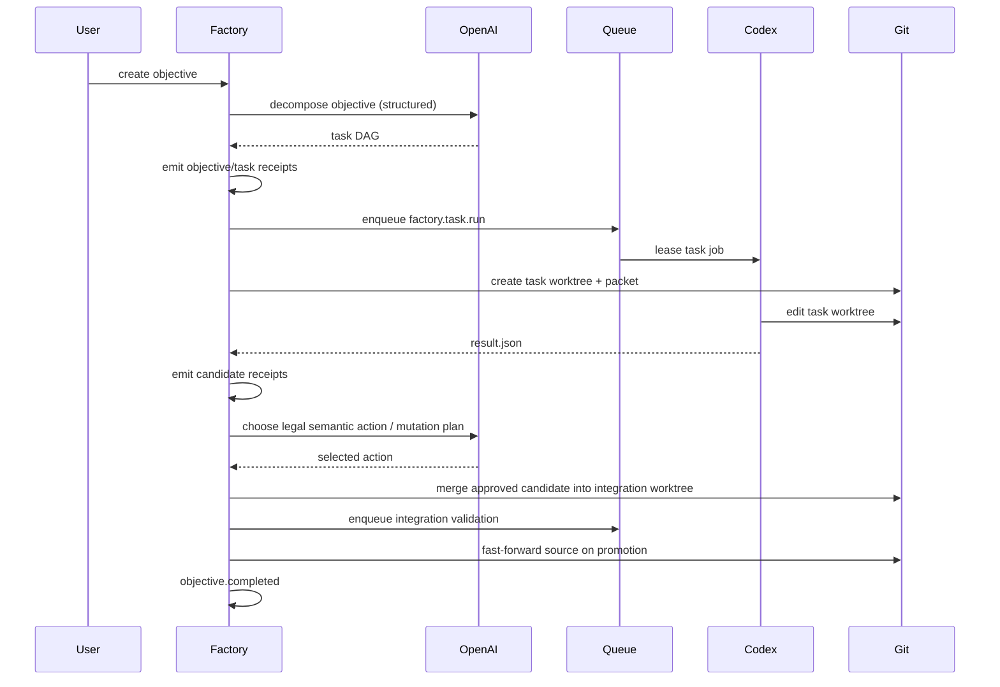

# Factory Agent Orchestration

Status: Current implementation guide  
Audience: Engineering  
Scope: How Factory actually orchestrates objective work, uses OpenAI and Codex, manages task worktrees, and integrates code

## Purpose

This document explains the execution path of Factory as it exists in code today.

It focuses on:

- which agent-like components exist in Factory
- how OpenAI is used
- how Codex is used
- how task worktrees are created and reused
- how orchestration decisions are made and recorded
- how code moves from task output to integration to source promotion

This is intentionally narrower than the broader Factory architecture doc. It is about the agent and code-delivery path, not every Factory projection or UI detail.

## The Short Version

Factory has two different model-driven roles:

- OpenAI is used for structured planning decisions
- Codex is used as a task worker that edits code inside a task worktree

Everything durable around those model calls is receipt-backed and reducer-driven.

That means:

- Factory chat is the canonical human-facing orchestration surface
- objective creation returns immediately and a queued factory control job performs repo prep, planning, and the first react pass
- Factory profiles orchestrate through receipts, status, and dispatch tools instead of direct repo access
- direct `codex.run` from Factory chat is a read-only probe path
- OpenAI prepares a repo profile and proposes a task DAG during startup
- OpenAI can also choose among legal orchestration actions and propose runtime task mutations when enabled
- Codex does not decide the overall workflow; it executes one task at a time inside an isolated Git worktree
- Git remains the code truth
- Receipt remains the orchestration truth

## Main Actors

## Components And Responsibilities

### Factory service

The service in `src/services/factory-service.ts` is the execution seam. It:

- creates objectives
- decomposes objectives into tasks
- decides when tasks are dispatchable
- queues workers
- normalizes worker results back into receipts
- manages integration and promotion

It is not the durable source of truth. It derives state from receipts and emits more receipts.

### Factory orchestrator

The orchestrator in `src/agents/orchestrator.ts` is a narrow semantic chooser. It does not own state. It chooses among valid actions that the service has already enumerated.

### Codex executor

The executor in `src/adapters/codex-executor.ts` launches the local `codex` binary in a workspace and captures stdout, stderr, and the last message. It is a worker adapter, not the system brain.

### HubGit

The Git adapter in `src/adapters/hub-git.ts` owns:

- source repo inspection
- task worktree creation
- integration worktree creation
- commit creation
- merge application
- source promotion

Factory does not implement Git itself.

## Where OpenAI Is Used

Factory uses the existing OpenAI adapter already wired into the server.

In `src/server.ts`, Factory receives `llmStructured` and optionally an OpenAI-backed orchestrator:

- `llmStructured` is passed directly into `FactoryService`
- `createOpenAiFactoryOrchestrator(...)` is used only when orchestration mode is enabled and `OPENAI_API_KEY` is present

OpenAI is used in three places:

### 1. Repo preparation and objective planning

When an objective is created, Factory appends `objective.created`, returns immediately, and enqueues one control job with payload kind `factory.objective.control`.

That control job:

- acquires the repo execution slot or leaves the objective queued
- generates or reuses a shared repo profile
- asks OpenAI for a structured task decomposition
- emits plan proposal/adoption receipts
- then runs the first objective react pass

Repo preparation is visible through:

- `repo.profile.requested`
- `repo.profile.generated`

Planning is visible through:

- `objective.plan.proposed`
- `objective.plan.adopted`

If `llmStructured` is available, it requests a structured task DAG:

- schema name: `factory_task_decomposition`
- output: task titles, prompts, worker type, dependency refs

If decomposition fails, Factory falls back to a single deterministic Codex task.

### 2. Runtime mutation planning

When orchestration is enabled and the policy allows mutation, Factory can ask OpenAI for runtime mutation proposals:

- schema name: `factory_task_mutation_plan`
- output: actions like split, reassign, update dependencies, unblock, supersede

Those proposals are then normalized and filtered against actual Factory rules before any receipt is emitted.

### 3. Action selection

Once the service computes legal semantic actions, the orchestrator can choose one:

- schema name: `factory_orchestrator_decision`
- input: objective snapshot, tasks, candidates, integration state, legal actions, current head hash
- output: `selectedActionId`, `reason`, `confidence`

The current runtime scores these legal actions through the merge/rebracket policy helpers and records the winning decision as `rebracket.applied` with source `runtime`.
Factory does not yet persist per-candidate merge evidence receipts on the objective stream.

## What OpenAI Does Not Do

OpenAI does not:

- edit code directly in the repo
- hold the repo execution slot directly
- manage Git worktrees
- append arbitrary hidden state
- bypass the reducer
- skip queue/job lifecycle mechanics

Every consequential orchestration decision still becomes receipts.

## Where Codex Is Used

Codex is used in two different modes:

- direct Factory-chat probes for read-only inspection
- task-worker execution inside objective-managed worktrees for code changes

The first mode is orchestration support. The second mode is delivery.

### Direct Codex probes from Factory chat

`codex.run` in Factory chat is now a read-only probe, not a delivery path.

When the profile queues a direct probe, Factory materializes a bounded packet under the job artifact directory with:

- `manifest.json`
- `context-pack.json`
- `memory-scopes.json`
- `memory.cjs`
- `prompt.md`
- `stdout.log`
- `stderr.log`
- `last-message.txt`
- `result.json`

That packet includes current run/profile context, the linked objective summary when present, recent objective receipts/evidence, and scoped memory summaries.

The direct probe contract is:

- inspect the packet first
- use current-objective receipts and memory before broader history
- do not edit tracked files
- if the work needs code changes, hand it back to `factory.dispatch`

The executor runs these probes in a read-only sandbox. If the probe attempts to mutate tracked files, Factory fails the job explicitly and tells the parent to create or react a Factory objective instead.

### Objective task execution

Objective task execution is where Codex edits code.

When a task is ready to run, Factory queues a job with payload kind:

- `factory.task.run`

That job is consumed by the `codex` handler in `src/server.ts`, which calls:

- `factoryService.runTask(...)`

Inside that path:

- Factory rebuilds or restores the task worktree if needed
- Factory writes the task packet into `.receipt/factory/`
- Factory renders a task prompt
- `LocalCodexExecutor` launches `codex exec`
- Codex writes its result JSON
- Factory parses the result and emits receipts like candidate produced/reviewed/approved/changes requested/blocked

Codex is therefore a bounded delivery worker:

- one task
- one workspace
- one result contract

It is not the orchestrator, and it does not replace the Factory control plane.

## Other Worker Types

The reducer and queue model allow other worker types via `workerType` on task records. The default decomposition guidance prefers `codex`.

## Task Worktrees

Every task pass runs in an isolated Git worktree.

### Naming

Task worktrees are created through `HubGit.createWorkspace(...)`.

The branch naming pattern is:

- `hub/<workerType>/<workspaceId>`

Factory chooses a workspace id using:

- objective id
- task id
- candidate id

So a single task can have multiple worktree passes over time if it is reworked.

### Task packet contents

For each dispatched task, Factory writes a bounded task packet into:

- `<workspace>/.receipt/factory/`

That packet includes:

- `<taskId>.manifest.json`
- `<taskId>.context-pack.json`
- `<taskId>.prompt.md`
- `<taskId>.result.json`
- `<taskId>.stdout.log`
- `<taskId>.stderr.log`
- `<taskId>.last-message.md`
- `<taskId>.skill-bundle.json`
- `<taskId>.memory.cjs`
- `<taskId>.memory-scopes.json`

These files are the handoff from orchestration to the worker.

### Task worktree lifecycle

## What Codex Receives

The Factory task prompt is rendered by `renderTaskPrompt(...)`.

Codex gets:

- objective id
- task id
- candidate id
- task prompt
- objective prompt
- dependency summaries
- checks
- context refs
- repo skill paths
- generated skill bundle paths
- memory script path
- result contract path

Factory explicitly tells Codex to use the generated memory script instead of trying to pull huge raw memory dumps.

## Memory And Context In The Worker Path

Factory builds a recursive context pack and a layered memory script for each task pass.

The worker-facing memory scopes include:

- `factory/agents/<workerType>`
- `factory/repo/shared`
- `factory/objectives/<objectiveId>`
- `factory/objectives/<objectiveId>/tasks/<taskId>`
- `factory/objectives/<objectiveId>/candidates/<candidateId>`
- `factory/objectives/<objectiveId>/integration`

The generated memory script is the main worker interface for recall and compaction.

In other words:

- `context` and `objective` are packet reads, not live memory queries
- `overview`, `scope`, `search`, `read`, and `commit` go through `receipt memory ...`
- the packet keeps the worker on scoped memory instead of broad receipt discovery
- embeddings are enabled by default when `OPENAI_API_KEY` is present; otherwise the worker falls back to keyword retrieval

This matters because the orchestration layer stays receipt-backed, while the task worker still gets bounded, queryable context instead of a giant prompt transcript.

## Orchestration Loop

Factory orchestration is event-driven, not a hidden infinite service brain.

### Objective startup

### During execution

`reactObjective()` does three broad things:

1. deterministic scheduling
2. semantic action generation
3. integration or promotion triggers

Deterministic scheduling includes:

- unblocking/activating tasks whose dependencies are satisfied
- dispatching ready tasks up to policy concurrency limits

Semantic actions include:

- queueing approved candidates for integration
- promoting validated integration
- splitting/reassigning/updating/unblocking/superseding remaining tasks when policy allows
- blocking the objective when there is no legal path forward

### Compare-and-append discipline

When semantic actions are applied, Factory records the current objective head hash and appends against that expected head.

That prevents stale orchestrator decisions from mutating objective state after the stream has already advanced.

## Runtime Mutation

Runtime mutation is not free-form improvisation.

It is constrained by:

- legal action generation in the service
- policy settings like mutation aggressiveness and cooldown
- reducer-enforced state transitions
- compare-and-append on the current objective head

The orchestrator can reshape remaining work, but it does not rewrite completed history.

## Integration

Approved task candidates do not promote directly to source.

They must first enter the objective integration branch.

### Integration workspace

Factory creates or restores one integration worktree per objective through:

- `HubGit.ensureIntegrationWorkspace(...)`

The integration branch naming pattern is:

- `hub/integration/factory_integration_<objectiveId>`

### Integration flow

### How merge is applied

Factory merges the candidate commit into the integration worktree using:

- `HubGit.mergeCommitIntoWorkspace(...)`

This is a real Git merge in the integration worktree, not a synthetic state fold.

If merge fails:

- Factory emits explicit conflict receipts
- marks the candidate/integration conflicted
- spawns a reconciliation task against the latest integration or source head

## Validation

After a successful integration merge, Factory enqueues:

- `factory.integration.validate`

This goes through the existing queue and uses the `codex` worker lane for scheduling, but the actual validation is local shell check execution in the Factory service.

That is an implementation quirk worth knowing:

- task execution is Codex
- integration validation is queued like a codex job
- but the validation itself is local command execution over the integration worktree

## Promotion

Once validation passes, the objective moves to:

- `integration.ready_to_promote`

If policy allows auto-promotion, or if the operator explicitly promotes, Factory calls:

- `HubGit.promoteCommit(...)`

That promotion is a fast-forward merge of the integration commit into the source branch.

### Promotion flow

### Promotion failure behavior

If promotion fails because the source repo is dirty:

- Factory moves back to `ready_to_promote`
- blocks the objective until the source branch is clean

If promotion fails because source moved:

- Factory emits conflict receipts
- resets the integration workspace to the fresh base
- spawns a reconciliation task

## Code Integration Guarantees

The code path is intentionally explicit:

1. task worker edits only its task worktree
2. approved task output becomes a candidate commit
3. candidate commit merges into the objective integration worktree
4. integration worktree runs checks
5. only then can source promotion happen

This is what prevents “task worker directly merged to main” behavior.

## End-To-End Execution Diagram

## Current Quirks Worth Knowing

- OpenAI is optional. The current runtime still records orchestration decisions without a separate fallback chooser path.
- Codex is the default worker, but Factory is not hard-coded to Codex-only tasks.
- direct `codex.run` packets now mirror the task-packet model, but remain read-only probes instead of delivery paths.
- Integration validation shares the `codex` lane for scheduling simplicity even though validation itself is local shell execution.
- The repo-root env var is still named `HUB_REPO_ROOT` even though Factory is the real objective surface.
- Task context is passed through generated packet files, not only through in-memory prompt assembly.

## Practical Mental Model

If you want one sentence:

Factory uses OpenAI to plan and steer, Factory chat profiles to orchestrate through receipts, Codex probes for narrow inspection, Codex task workers for code changes, Git worktrees to isolate each pass, and an integration branch to prove changes before promotion.

If you want the control split:

- OpenAI decides structure and action selection
- Factory chat/profile decides when to inspect, dispatch, react, or promote
- Codex performs bounded read-only probes or bounded task work depending on the path
- Git owns code movement
- receipts own orchestration truth
