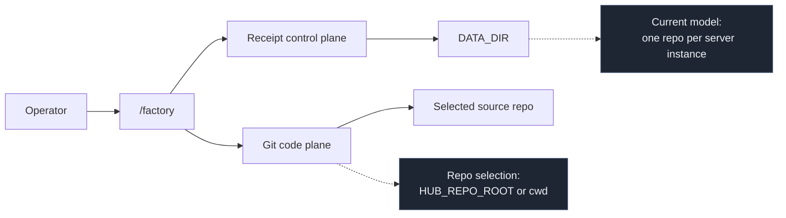

# Using Factory With Another Repo

Status: Current operating guide  
Audience: Operators and developers  
Scope: Running the existing Receipt + Factory server against a Git repo other than this one

## Purpose

Factory is not tied to the Receipt repo itself.

You can run the current Factory implementation against another Git repository, create objectives there, and let Factory build, review, integrate, and promote changes inside that repository.

This document explains the current operating model, the setup steps, and the important constraints.

## Current Model

Factory is reusable, but the current server model is:

- one running server instance
- one source Git repo per instance
- one Factory objective surface at `/factory`

The source repo is selected by:

- `HUB_REPO_ROOT`, or
- the current working directory if `HUB_REPO_ROOT` is not set

This naming is a quirk of the current codebase. Even though Hub is no longer the objective surface, the repo-root env var is still named `HUB_REPO_ROOT`.

## What Factory Can Build

Factory is meant for software delivery work inside a Git repo, including:

- feature implementation
- bug fixes
- refactors
- dependency upgrades
- docs and test changes
- multi-step objectives that benefit from task decomposition and integration-first promotion

Factory is not currently a multi-repo control plane. One process does not manage multiple source repos at once.

## Architecture Boundary



## Prerequisites

- the target directory must be a valid Git repo
- the repo must have at least one commit
- `git` must be available on `PATH`
- your worker environment must be able to run the checks you configure for objectives
- if you want Codex-backed task execution, the local worker setup must already work in your environment

## Recommended Operating Pattern

Use a separate `DATA_DIR` for each target repo.

That keeps:

- receipt streams
- queue state
- memory scopes
- worktree metadata

isolated per repo.

Do not point one old `DATA_DIR` at a completely different source repo unless you explicitly want to carry all prior Factory state with it.

## Quick Start

### Option 1: Run Receipt from this repo, but point Factory at another repo

This is the easiest way to dogfood the current codebase against an external project.

```bash
cd /Users/kishore/receipt

DATA_DIR=/tmp/receipt-my-other-repo \
HUB_REPO_ROOT=/absolute/path/to/target-repo \
npm run dev
```

Then open:

```text
http://localhost:8787/factory
```

### Option 2: Run from inside the target repo

If Receipt is packaged as a binary later, this is the cleaner long-term UX:

```bash
cd /absolute/path/to/target-repo

DATA_DIR=.receipt-data \
receipt server
```

At the moment, this repo is still typically run from source, so Option 1 is the practical path today.

## Creating Your First Objective

Once `/factory` is open:

1. Create a small objective first.
2. Start with explicit checks.
3. Confirm the repo is clean or provide a fixed `baseHash`.

Good first examples:

- add one small test
- update one doc section
- fix one narrow bug with clear validation

Recommended initial checks:

```text
npm run build
```

or repo-specific commands such as:

```text
pnpm test --filter my-package
pytest tests/unit/test_feature.py
cargo test my_module
```

Factory does not require Node projects specifically. What matters is that the target repo has a stable Git history and objective checks that can run in the worker environment.

## Important Constraints

### Factory only sees committed history

If the source repo has uncommitted changes and you do not provide `baseHash`, objective creation is blocked.

That is intentional. Factory treats Git as the code truth and only works from committed source state.

Practical rule:

- commit or stash local changes first, or
- create the objective with an explicit `baseHash`

### One repo per server instance

Today, one running Receipt server should point at one source repo.

If you want to work on another repo, start another server instance with:

- a different `HUB_REPO_ROOT`
- a different `DATA_DIR`
- usually a different port

### DATA_DIR should be repo-scoped

Receipts, jobs, memory, and worktree metadata live under `DATA_DIR`.

Reusing the same `DATA_DIR` across unrelated repos can produce confusing state because the durable orchestration history is not repo-agnostic in practice.

### Git is still the code plane

Factory does not copy source state into Receipt.

Git remains responsible for:

- source commits
- task worktrees
- integration branches
- merge mechanics
- source promotion

### Factory is not yet a hosted multi-tenant service

The current implementation is designed for a local or single-instance server pointed at one repo root, not a central service managing many repos with isolation boundaries.

## Repo Setup Tips

Before using Factory on another repo:

- make sure the repo builds locally without Factory
- choose checks that are fast enough to run frequently
- keep the first objective narrow
- avoid repos with large untracked local changes
- prefer a fresh `DATA_DIR` for first-time testing

If the target repo needs special tools, credentials, or language runtimes, those must already be available to the worker environment. Factory will not invent that environment for you.

## Example Session

```bash
cd /Users/kishore/receipt

DATA_DIR=/tmp/receipt-demo-nextjs \
HUB_REPO_ROOT=/Users/kishore/code/my-nextjs-app \
PORT=8788 \
npm run dev
```

Open:

```text
http://localhost:8788/factory
```

Create an objective such as:

- title: `Add healthcheck endpoint`
- checks:
  - `npm run build`
  - `npm test -- --runInBand`

Factory will then:

- record objective creation as receipts
- decompose the work into tasks
- dispatch workers
- review candidates
- integrate on the objective integration branch
- validate
- promote to source if policy allows

## Troubleshooting

### "HUB_REPO_ROOT is not a git repository"

The selected repo root is not a valid Git repo.

Fix:

- point `HUB_REPO_ROOT` at the actual repo root, or
- run the server from inside a Git repo

### Objective creation is blocked because the repo is dirty

Factory only works from committed source state by default.

Fix:

- commit or stash changes, or
- provide `baseHash`

### Factory opens, but old unrelated state appears

You are likely reusing an old `DATA_DIR`.

Fix:

- start with a fresh repo-specific `DATA_DIR`

### Legacy Hub state exists in the data dir

Older `DATA_DIR` values may still contain legacy Hub receipts from before the Factory-only cutover.

Factory does not depend on that state. For clean testing against another repo, start with a fresh repo-specific `DATA_DIR` and use `/factory`.

## Practical Recommendation

For v1, the cleanest way to use Factory on another repo is:

1. keep the Receipt codebase where it is
2. point `HUB_REPO_ROOT` at the target repo
3. use a fresh `DATA_DIR`
4. open `/factory`
5. start with a narrow objective and explicit checks

That matches the current implementation without pretending the system is already a full multi-repo distribution platform.
