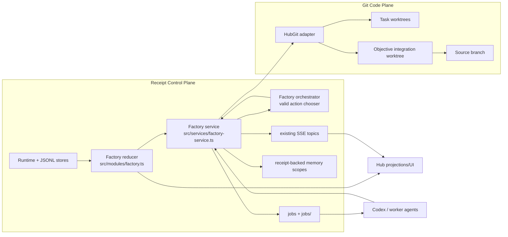
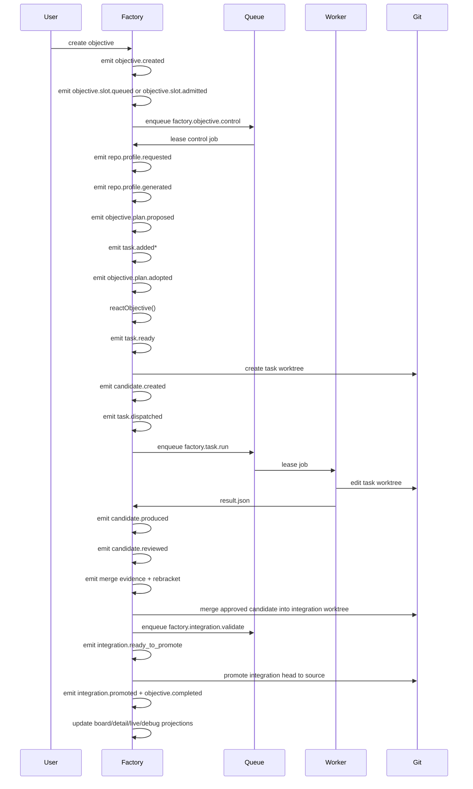
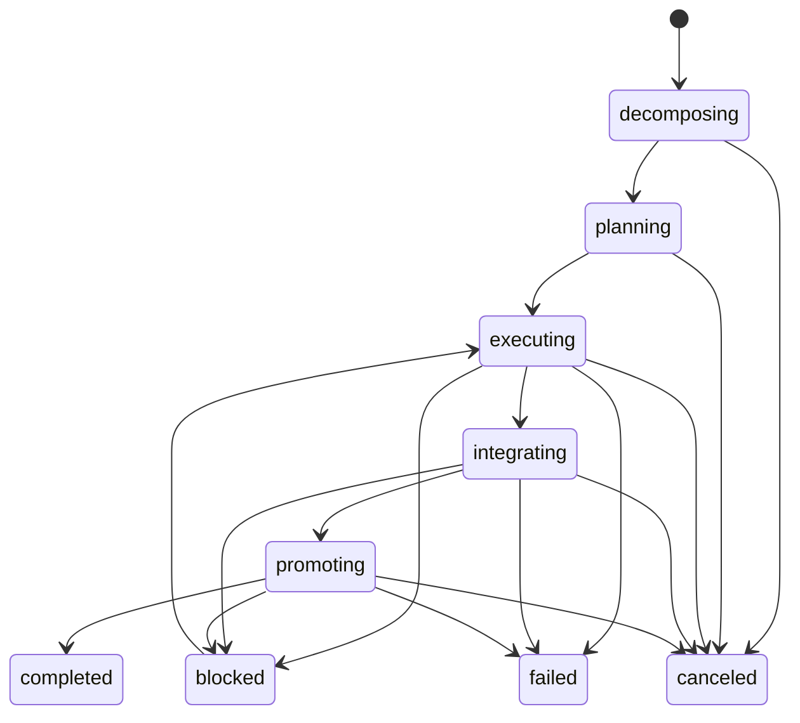
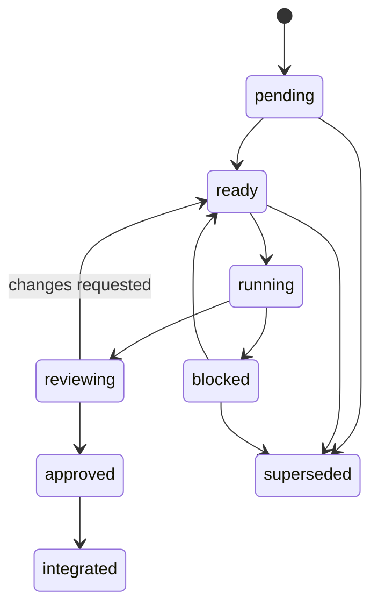
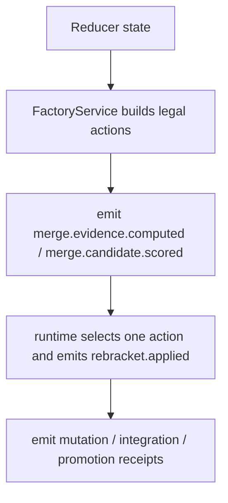
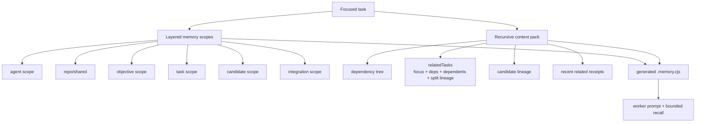

# Receipt-Native Factory Core

Status: Implemented factory v1.1 baseline with async objective startup, repo profiles, queued repo slots, live runtime mutation, candidate lineage, and recursive context packs  
Audience: Engineering  
Scope: Current factory implementation in this repo

## Purpose

This document describes the factory as it exists today in code.

It covers:

- what is implemented now
- what belongs to the deterministic Receipt core
- what belongs to the semantic agent layer
- the important implementation quirks and limitations

This is not a proposal. It is a description of the current shape of the system.

## What Factory Is

Factory is the receipt-native software objective engine.

It takes a high-level software objective and drives it through:

- repo preparation and inferred validation defaults
- decomposition into a task DAG
- worker dispatch
- candidate production and review
- integration into an objective branch
- validation
- promotion to source

Every control decision in that flow is recorded as a factory receipt so the objective can be replayed, inspected, debugged, and resumed without relying on hidden service state.

## What Problem Factory Solves

Factory exists because the old Hub objective flow was too imperative and too UI/service-owned for long-running autonomy.

Factory solves for:

- hidden orchestration state in services
- split-brain between UI state and durable runtime state
- weak replayability for long-running objective execution
- lack of task-level autonomy, candidate tracking, and integration-first promotion
- difficulty debugging why an objective changed direction during runtime

The point of Factory is not to be a second operator console. The point is to make objective execution itself receipt-native.

## Operator Surface

Factory is the operator surface in this repo.

Use `Factory` when you want to:

- create an objective
- run or react an objective
- inspect receipts and control decisions
- review task/candidate/integration state
- debug objective runtime behavior
- use profile-driven orchestration and handoff

There is no separate Hub UI anymore. Factory still reuses `HubGit` as its Git/worktree adapter, but operator interaction now uses `/factory` for chat, objective detail, and live workbench state. `GET /factory/control` is only a compatibility redirect to `/factory`.
Profiles are orchestration lenses over the Factory control plane. They do not receive direct repo read/write tools.
If a Factory chat session uses direct `codex.run`, that path is a read-only probe; code-changing work still flows through objective-managed worktrees.

## Thesis

The factory is now modeled as a Receipt workflow, not as an imperative Hub-owned planner loop.

Two durable truths are kept separate:

- Receipt is the control plane.
- Git is the code plane.

In practice that means:

- every objective, task, candidate, merge, validation, conflict, and promotion step is recorded as a factory receipt
- reducer replay reconstructs factory state deterministically
- Git remains the only durable representation of code content, worktrees, commits, and source-branch promotion
- Hub reads projections from factory state instead of acting as a second objective state store
- only one objective per repo holds the execution slot at a time; later objectives remain visibly queued until admitted
- profiles and direct Codex probes consume receipt-backed evidence, but they do not replace Receipt as the control plane or Git as the code plane

## V1.1 Additions

The current implementation adds a command-center layer on top of the original factory core:

- objective creation is asynchronous and returns before repo prep and planning finish
- repo preparation is explicit and visible through repo-profile receipts
- planning is visible and durable through plan proposal/adoption receipts
- compose defaults come from the shared repo profile when available
- objective detail includes phase, queue state, latest decision, blocked explanation, evidence cards, and recent activity

## Architecture Diagram



## Code Map

### Core Receipt/runtime primitives

- `packages/core/src/runtime.ts`
- `packages/core/src/graph.ts`
- `src/adapters/jsonl.ts`
- `src/adapters/jsonl-queue.ts`
- `src/adapters/memory-tools.ts`
- `src/framework/sse-hub.ts`

These are generic infrastructure. They are not factory-specific.

### Factory durable domain

- `src/modules/factory.ts`

This file is the durable factory model:

- state enums
- event types
- reducer
- selectors
- projections

This is the source of truth for objective/task/candidate/integration state.

### Factory service layer

- `src/services/factory-service.ts`

This file is the execution seam between the generic runtime and the factory domain.

It does not own durable state. It:

- emits typed factory receipts
- derives actionable work from reducer state
- dispatches jobs onto the existing queue
- manages factory worktrees through `HubGit`
- renders task packets and prompts
- normalizes worker results back into receipts
- runs integration validation and promotion logic

### Factory semantic/orchestrator layer

- `src/agents/orchestrator.ts`
- `prompts/factory/orchestrator.md`

This layer chooses among valid actions. It is intentionally narrower than the service layer:

- the service computes legal next actions
- the orchestrator chooses one
- the chosen action is written back as receipts

### Factory route layer

- `src/agents/factory/route.ts`

This is the route/workflow entry, not the durable brain.

It exposes:

- `GET /factory`
- `GET /factory/workbench`
- `GET /factory/control`
- `GET /factory/events`
- `GET /factory/chat/events`
- `GET /factory/background/events`
- `GET /factory/island/workbench/header`
- `GET /factory/island/workbench/block`
- `GET /factory/island/workbench`
- `GET /factory/island/chat`
- `GET /factory/api/workbench-shell`
- `GET /factory/new-chat`
- `POST /factory/compose`
- `GET /factory/api/objectives`
- `GET /factory/api/live-output`
- `GET /factory/api/objectives/:id`
- `GET /factory/api/objectives/:id/debug`
- `GET /factory/api/objectives/:id/receipts`

### Git and worker adapters reused by factory

- `src/adapters/hub-git.ts`
- `src/adapters/codex-executor.ts`

Factory does not own a second Git layer or a second worker runtime.

## Ownership Boundaries

### What is part of the core

The following pieces are deterministic and replayable:

- Receipt runtime append/replay behavior
- queue state and job leasing
- memory state and memory reads
- SSE publish/subscribe
- graph dependency activation
- factory reducer state transitions
- worktree and Git mechanics in `HubGit`
- task packet generation and worker result normalization
- integration validation and source promotion mechanics

These pieces should behave the same on replay given the same receipts and Git state.

### What is part of the agent layer

The following pieces are semantic and model-driven:

- objective decomposition through `llmStructured`
- factory action selection through `FactoryOrchestrator`
- Codex task execution inside worker worktrees
- orchestrator prompt policy in `prompts/factory/orchestrator.md`

The agent layer is allowed to choose from legal actions. It is not allowed to mutate hidden service state.

### What is part of the consumer/UI layer

- factory board/detail/live/debug rendering
- factory control forms and objective APIs
- Hub repo/workspace/task projections and the `/factory` handoff link

These are projections over factory state. They are not another control plane.

## Stream Model

The factory uses one durable stream family:

- `factory/objectives/<objectiveId>`

All factory receipts for an objective are appended to that stream.

Other reused stream families still exist:

- `jobs`
- `jobs/<jobId>`
- `memory/<scope>`

The factory does not create a parallel scheduler stream or a parallel memory store.

## End-To-End Flow



Objective creation no longer waits for decomposition to finish. It returns immediately after the initial receipts are appended, and a queued control job performs repo prep, planning, and the first react pass.

## State Machines

Defined in `src/modules/factory.ts`.

### Objective states

- `decomposing`
- `planning`
- `executing`
- `integrating`
- `promoting`
- `completed`
- `blocked`
- `failed`
- `canceled`

### Task states

- `pending`
- `ready`
- `running`
- `reviewing`
- `approved`
- `integrated`
- `blocked`
- `superseded`

### Candidate states

- `planned`
- `running`
- `awaiting_review`
- `changes_requested`
- `approved`
- `integrated`
- `rejected`
- `conflicted`

### Integration states

- `idle`
- `queued`
- `merging`
- `validating`
- `ready_to_promote`
- `promoting`
- `promoted`
- `conflicted`

### Objective lifecycle



### Objective phase projection

The UI uses a receipt-derived `phase` projection on top of the durable objective status:

- `preparing_repo`
- `planning_graph`
- `waiting_for_slot`
- `executing`
- `integrating`
- `promoting`
- `blocked`

This is a projection layer only. The durable reducer state still uses the core objective enums.

### Task and candidate lifecycle



## Workflow Dependency Model

Factory still has a task DAG conceptually, but it is no longer backed by a generic graph primitive.

Today the dependency model lives directly in `src/modules/factory.ts` as workflow state:

- `workflow.taskIds`
- `workflow.tasksById`
- `workflow.activeTaskIds`
- per-task `dependsOn`

`packages/core/src/graph.ts` is only used for `GraphRef` metadata such as state, artifact, file, workspace, commit, job, and prompt references.

Important behavior in the current custom workflow model:

- task status is domain-defined in the factory reducer
- multiple tasks can be active concurrently through `workflow.activeTaskIds`
- dependency activation and runnable selection stay deterministic because `dependsOn` checks are pure reducer/service logic

Notable behavior:

- `approved` tasks count as completed for dependency activation
- `reviewing` tasks count as active
- `superseded` is terminal but not counted as completed for dependency unlocking

That means downstream tasks can start after review approval, before integration or source promotion.

## Receipt Surface

The durable receipt family currently implemented in `src/modules/factory.ts` includes:

### Objective lifecycle

- `objective.created`
- `objective.completed`
- `objective.blocked`
- `objective.failed`
- `objective.canceled`
- `objective.archived`

### Task lifecycle and mutation

- `task.added`
- `task.split`
- `task.dependency.updated`
- `task.worker.reassigned`
- `task.ready`
- `task.dispatched`
- `task.review.requested`
- `task.approved`
- `task.integrated`
- `task.noop_completed`
- `task.blocked`
- `task.unblocked`
- `task.superseded`

### Candidate lifecycle

- `candidate.created`
- `candidate.produced`
- `candidate.reviewed`
- `candidate.conflicted`

### Merge/rebracketing evidence

- `merge.evidence.computed`
- `merge.candidate.scored`
- `rebracket.applied`
- `merge.applied`

### Integration lifecycle

- `integration.queued`
- `integration.merging`
- `integration.validating`
- `integration.ready_to_promote`
- `integration.promoting`
- `integration.promoted`
- `integration.conflicted`

## What Is Actually Used Today

The reducer supports more receipts than the service currently emits.

### Fully exercised in the current flow

- `objective.created`
- `task.added`
- `task.ready`
- `task.dispatched`
- `task.review.requested`
- `task.noop_completed`
- `task.integrated`
- `task.blocked`
- `candidate.created`
- `candidate.produced`
- `candidate.reviewed`
- `candidate.conflicted`
- `merge.evidence.computed`
- `merge.candidate.scored`
- `rebracket.applied`
- `merge.applied`
- `integration.queued`
- `integration.merging`
- `integration.validating`
- `integration.ready_to_promote`
- `integration.promoting`
- `integration.promoted`
- `integration.conflicted`
- `objective.completed`
- `objective.blocked`
- `objective.canceled`
- `objective.archived`

### Present in the reducer but only conditional in the runtime flow

- `task.split`
- `task.dependency.updated`
- `task.worker.reassigned`
- `task.unblocked`
- `task.superseded`
- `objective.failed`
- `task.approved`

The important implementation detail now is narrower:

- the dynamic mutation surface is live when factory orchestration is enabled and legal actions are generated
- the reducer still supports a few receipts that are mostly held for future expansion or explicit tooling paths, not the baseline auto-run path

## Objective Creation Flow

Implemented in `FactoryService.createObjective()`.

Flow:

1. Ensure the Git mirror and repo are ready.
2. Reject uncommitted source state unless an explicit `baseHash` was supplied.
3. Emit `objective.created`.
4. Decompose the objective through `llmStructured`, or fall back to a single `codex` task.
5. Emit one `task.added` receipt per initial task.
6. Call `reactObjective()` to activate and dispatch work.

The initial decomposition is durable. There is no hidden planner-only pass.

## Deterministic React Loop

Implemented in `FactoryService.reactObjective()`.

This is the main deterministic control loop.

It does four things:

1. Reconcile finished jobs into task blocking if needed.
2. Promote `pending` tasks to `ready` when dependencies are satisfied.
3. Dispatch all ready tasks up to `maxActiveTasks`.
4. Compute semantic actions and optionally ask the orchestrator to choose one.

Important defaults:

- `maxActiveTasks` defaults to `4`
- multiple ready tasks can dispatch concurrently
- integration/promotion remain effectively serialized per objective

## Semantic Action Model

The semantic action type union in `src/agents/orchestrator.ts` is:

- `split_task`
- `reassign_task`
- `supersede_task`
- `queue_integration`
- `promote_integration`
- `block_objective`

Current reality:

- task dispatch is still deterministic and does not go through the orchestrator
- integration queueing and promotion are always semantic actions
- runtime task mutation actions are produced when orchestration is enabled and there are mutable `pending`/`ready`/`blocked` tasks
- mutation actions are emitted only from the structured mutation planner; there is no second heuristic mutation generator

The practical split is:

- scheduling mechanics stay deterministic
- semantic reshaping and integration choices are receipt-backed orchestrator decisions

### Orchestrator decision boundary



## Orchestrator Behavior

The orchestrator boundary is intentionally narrow.

Input:

- objective metadata
- current tasks
- current candidates
- integration state
- valid actions
- `basedOn` head hash

Output:

- `selectedActionId`
- `reason`
- `confidence`

The runtime currently records direct `rebracket.applied` decisions with source `runtime`.
There is no separate `fallbackFactoryDecision()` path left in the current implementation.

## Worker Dispatch Model

The factory reuses the existing queue and worker runtime.

Queue payload kinds:

- `factory.task.run`
- `factory.integration.validate`

These go through the existing `jobs` stream and `JobWorker`.

In `src/server.ts` the `codex` handler branches on payload kind:

- `factory.task.run` -> `factoryService.runTask(...)`
- `factory.integration.validate` -> `factoryService.runIntegrationValidation(...)`
- there is no older Hub objective-pass fallback left in the Codex worker path; objective execution is factory-only

This is important:

Validation jobs are queued as `agentId: "codex"` even though integration validation itself is executed directly by the factory service with shell checks. They share the codex worker lane for scheduling simplicity.

## Codex Task Contract

Factory tasks are dispatched with:

- objective/task/candidate identifiers
- workspace path
- prompt/result/stdout/stderr paths
- manifest path
- memory script path
- memory config path
- repo skill paths
- generated skill bundle paths
- bounded `contextRefs`
- optional `integrationRef`

The worker prompt is rendered by `renderTaskPrompt()`.

Result contract:

```json
{ "outcome": "approved" | "changes_requested" | "blocked" | "partial", "summary": "...", "artifacts": [{ "label": "...", "path": "...", "summary": "..." }], "nextAction": "..." }
```

Current handling:

- `approved` produces `candidate.reviewed` with approved status
- `approved` plus a clean delivery worktree and passing checks also emits `task.noop_completed`
- `changes_requested` moves the task back to `ready`
- `blocked` emits `task.blocked`
- `partial` is preserved for investigation reports and treated as blocked for delivery tasks

## Layered Memory Access

Factory workers now receive a generated memory script and config under the task workspace:

- `.receipt/factory/<taskId>.memory.cjs`
- `.receipt/factory/<taskId>.memory-scopes.json`

Configured scopes:

- `factory/agents/<workerType>`
- `factory/repo/shared`
- `factory/objectives/<objectiveId>`
- `factory/objectives/<objectiveId>/tasks/<taskId>`
- `factory/objectives/<objectiveId>/candidates/<candidateId>`
- `factory/objectives/<objectiveId>/integration`

For `overview`, `scope`, `search`, `read`, and `commit`, the script shells out to the repo CLI:

- `receipt memory summarize`
- `receipt memory search`
- `receipt memory read`
- `receipt memory commit`

For `context` and `objective`, it reads the generated `context-pack.json` directly.

Supported script commands:

- `overview`
- `context`
- `objective`
- `scope`
- `search`
- `read`
- `commit`

### What the memory layer is today

It is a layered memory system plus a recursive task-subgraph context pack.

Specifically:

- scope summaries still come from receipt-backed `memory.summarize`
- `overview` compacts those scopes under a bounded budget
- when `OPENAI_API_KEY` is present, worker-side memory retrieval uses embeddings by default; otherwise it falls back to keyword matching
- `context` renders a recursive pack built from:
  - the focused task
  - its dependency closure
  - downstream dependents
  - split lineage
  - candidate lineage
  - recent related receipts
- the prompt still includes a small bootstrap summary for the task scope
- the script is the primary memory interface for deeper recall

It is therefore no longer only layered scope compaction, but it is still not a generic interpreter over an arbitrary full objective/run graph.

### Memory and context surfaces



## Git Model

Factory reuses `HubGit` for all code operations.

### Task worktrees

- one isolated worktree per objective/task pair
- branch name: `hub/<workerType>/<workspaceId>`
- worktree path under the shared hub worktree directory

### Integration worktree

- one integration worktree per objective
- branch name: `hub/integration/factory_integration_<objectiveId>`

### Promotion model

- approved task candidates are merged into the objective integration branch first
- validation runs on the integration workspace
- promotion fast-forwards the source branch to the validated integration head

No task candidate promotes directly to source.

## Integration Flow

Current flow:

1. Candidate is approved.
2. Semantic action queues it for integration.
3. Factory ensures the integration workspace exists.
4. Candidate commit is merged into that workspace.
5. `merge.applied` and `task.integrated` are emitted.
6. Validation job runs shell checks.
7. If green, emit `integration.ready_to_promote`.
8. Semantic action promotes the integration head to source.
9. Emit `integration.promoted`.
10. Emit `objective.completed`.

Conflict flow:

- on merge conflict, emit `candidate.conflicted` and `integration.conflicted`
- spawn a reconciliation task based on the integration head
- on validation failure, emit `integration.conflicted` and spawn reconciliation
- on stale promotion conflict, reset the integration workspace to fresh source head and spawn reconciliation

## Important Quirks

These are the main non-obvious behaviors in the current implementation.

### 1. Dynamic orchestration is mode-gated

Dynamic orchestration is implemented, but it is mode-gated.

- deterministic scheduling always runs
- semantic mutation requires factory orchestration to be enabled
- when disabled, the factory still behaves correctly, but it will not proactively reshape the DAG

### 2. Approved tasks unlock dependents before integration

Task dependency completion is based on task review approval, not on integration or source promotion.

This is intentional for throughput, but it means downstream tasks may branch from an integration head or base commit that does not yet reflect every approved task in source.

### 3. Candidate lineage is explicit, but only across terminal passes

Candidate ids are now minted per new rework pass when the prior candidate is terminal.

In practice that means:

- in-flight planned/running/awaiting-review candidates are reused safely
- a fresh `task_<id>_candidate_<nn>` is minted once a prior pass has reached a terminal review/integration outcome
- candidate lineage is explicit through `parentCandidateId`

### 4. Integration status and objective status are slightly coupled

`integration.ready_to_promote` sets objective status to `promoting`.

`integration.promoted` sets objective status to `completed`.

`promoteIntegration()` also emits `objective.completed` immediately after `integration.promoted`.

So completion is represented both by the integration record and by an explicit objective completion receipt.

### 5. Queue metadata is not aggressively compacted

`queuedCandidateIds` in integration state is append-oriented and not currently pruned back to only active items.

It is useful for history and debugging, but it is not a minimal queue model.

### 6. Validation shares the codex worker lane

Integration validation jobs use the `codex` worker lane even though validation itself is local shell execution in the factory service.

This is a reuse choice, not a semantic statement that Codex is validating code.

### 7. Memory script performance depends on the local CLI shim

The generated memory script shells out to `receipt`, which is shimmed into the worktree as:

- `.receipt/bin/receipt`

That shim uses the repo-local CLI through Bun with the repo's `src/cli.ts` entrypoint.

This is convenient and keeps one memory path, but it is slower than a direct in-process call.

### 8. Decomposition dependency references are normalized against the task DAG

The decomposition path canonicalizes task ids, drops self/forward/unknown references, and preserves only dependencies that point to already-defined earlier tasks.

Runtime dependency mutations go through a stricter validator as well, so they cannot point at superseded tasks, future tasks, or create dependency cycles against the current DAG.

## Operational Guarantees

What the current implementation does guarantee:

- reducer replay reconstructs factory state from receipts
- ready tasks can run concurrently without a single-node graph bottleneck
- integration and promotion are serialized through a single objective integration lane
- Git stays the only durable code-state model
- memory stays receipt-backed
- SSE and queue reuse the existing runtime
- runtime DAG mutation is expressed as receipts when enabled
- per-pass candidate lineage is explicit
- recursive context packs cover the task-local execution subgraph

What it does not yet fully guarantee:

- arbitrary full-objective or full-run recursive memory interpretation
- richer budget/policy surfaces beyond the current task/integration centric loop
- a broader standalone factory route/UI surface beyond the minimal factory agent and Hub consumer

## Test Coverage

Current smoke coverage includes:

- `tests/smoke/graph.test.ts`
  - deterministic multi-active graph behavior
- `tests/smoke/factory.test.ts`
  - reducer replay and core factory state behavior
- `tests/smoke/factory-memory.test.ts`
  - CLI memory commands
  - generated factory memory script
  - durable memory commit from worker path

## How To Extend It Safely

If you want to add more dynamic autonomy, the correct extension point order is:

1. extend `FactoryEvent` and `reduceFactory()` first
2. add or tighten selectors/projections in `src/modules/factory.ts`
3. add deterministic legality checks in `FactoryService`
4. only then widen the orchestrator action space
5. only after that update Hub projections and UI

Do not add:

- a second factory state cache
- a second scheduler
- a second memory runtime
- hidden mutable orchestrator state inside routes or workers

## Remaining Gaps

The most important remaining work now is:

1. Expand the factory-first route/UI surface so more debugging and control happens outside Hub as well.
2. Add richer policy knobs for budgets, throttling, and mutation aggressiveness per objective.
3. Broaden recursive context construction from task-local subgraphs toward larger objective-wide graph slices where useful.
4. Continue simplifying Hub’s remaining projection compatibility types as consumers move fully to factory-native naming.
