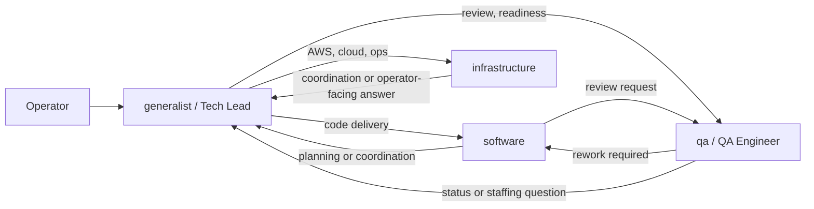
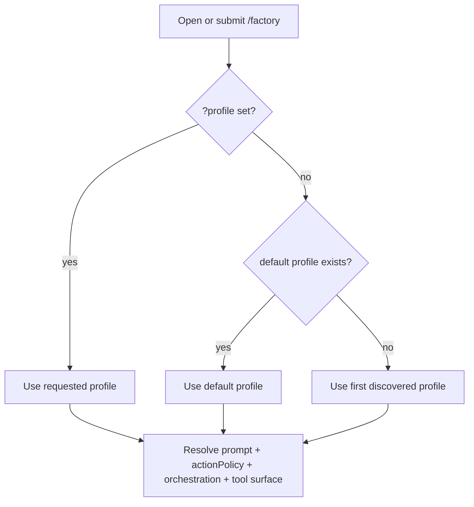
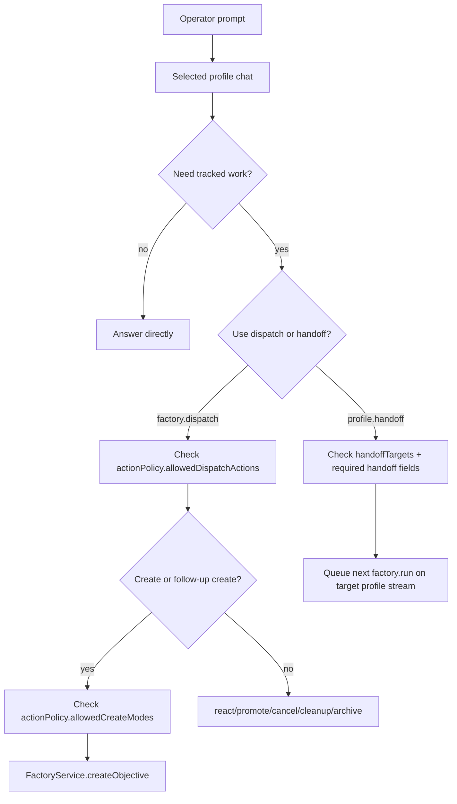
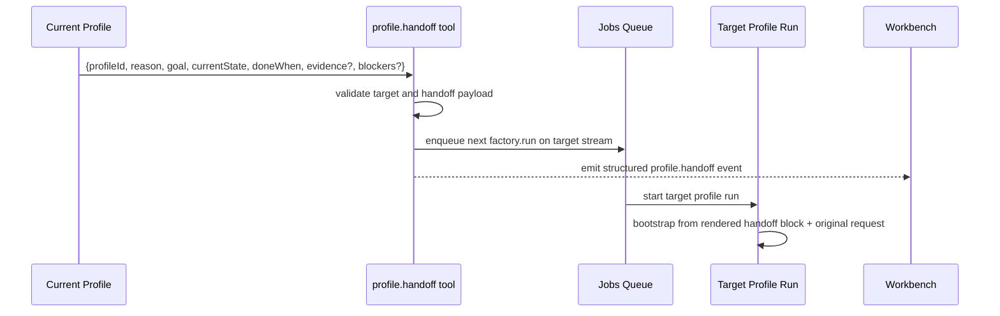

# Factory Profile Orchestration

Status: current implementation guide
Audience: engineering and repo customizers
Scope: how `/factory` uses engineer profiles as the operator-facing orchestration layer, how work ownership changes, and where role guardrails are enforced

## Purpose

This document explains the current profile model behind `/factory`.

It covers:

- what a Factory profile is
- how the active profile is selected
- how engineer-to-engineer handoff works
- how tracked work is created and controlled
- where role enforcement is hard and where it is still advisory

This document describes the current checked-in implementation. It complements:

- `docs/factory-on-receipt.md` for the core Factory execution engine
- `docs/factory-agent-orchestration.md` for the broader agent runtime

## The Short Version

`/factory` is a chat-and-workbench surface where the operator talks to one selected engineer profile at a time.

Profiles are not the execution engine. They are the decision layer in front of the Factory service:

- profiles decide who should own the next turn
- Factory owns objectives, tasks, candidates, integration, and receipts
- jobs queue and Codex workers do the long-running work
- Git remains the code truth

Current role guardrails are intentionally simple:

- `actionPolicy` limits what each profile may dispatch or promote
- `handoffTargets` limits who each profile may hand off to
- `profile.handoff` requires a structured engineer handoff payload

The core objective planner remains unchanged.

## Current Engineer Topology

The current workforce is small on purpose.



This is not a mandatory runtime pipeline. It is the intended ownership topology for the chat layer.

## Profile Files

Each profile lives under:

- `profiles/<id>/PROFILE.md`
- optional `profiles/<id>/SOUL.md`

`PROFILE.md` contains:

- JSON frontmatter for machine-readable policy
- markdown body for operating instructions

The frontmatter currently supports:

- `id`
- `label`
- `default`
- `roles`
- `responsibilities`
- `skills`
- `cloudProvider`
- `defaultObjectiveMode`
- `defaultValidationMode`
- `defaultTaskExecutionMode`
- `allowObjectiveCreation`
- `actionPolicy`
- `orchestration`
- `handoffTargets`

Example:

```json
{
  "id": "generalist",
  "label": "Tech Lead",
  "default": true,
  "roles": ["Tech lead"],
  "responsibilities": ["Route work to the owning engineer"],
  "defaultObjectiveMode": "delivery",
  "defaultValidationMode": "repo_profile",
  "allowObjectiveCreation": true,
  "actionPolicy": {
    "allowedDispatchActions": ["create", "react", "cancel", "cleanup", "archive"],
    "allowedCreateModes": ["delivery", "investigation"]
  },
  "orchestration": {
    "executionMode": "interactive",
    "discoveryBudget": 1,
    "finalWhileChildRunning": "waiting_message",
    "childDedupe": "by_run_and_prompt"
  },
  "handoffTargets": ["software", "infrastructure", "qa"]
}
```

`SOUL.md` is optional. When present, it shapes voice and conversational posture, not hard permissions.

## What Is Actually Enforced

The current hard contract is intentionally narrow.

### 1. Action policy

`actionPolicy` is the only hard role contract in the profile layer.

It supports:

- `allowedDispatchActions`
- `allowedCreateModes`

Supported dispatch actions:

- `create`
- `react`
- `promote`
- `cancel`
- `cleanup`
- `archive`

Supported create modes:

- `delivery`
- `investigation`

Current checked-in team policy:

- `generalist`: may `create`, `react`, `cancel`, `cleanup`, `archive`; may create `delivery` and `investigation`
- `software`: may `create`, `react`, `promote`, `cancel`, `cleanup`, `archive`; may create `delivery`
- `infrastructure`: may `create`, `react`, `cancel`, `cleanup`, `archive`; may create `investigation`
- `qa`: may `create`, `react`, `cancel`, `cleanup`, `archive`; may create `delivery`

### 2. Handoff topology

`handoffTargets` is hard-enforced.

If a target is not listed, `profile.handoff` rejects it.

### 3. Structured handoff contract

`profile.handoff` now requires:

- `profileId`
- `reason`
- `goal`
- `currentState`
- `doneWhen`
- optional `evidence`
- optional `blockers`
- optional `objectiveId`
- optional `chatId`

That payload is persisted as a `profile.handoff` event and used to bootstrap the next run.

## What Is Still Advisory

These fields shape prompts and UI, but they are not hard authorization:

- `roles`
- `responsibilities`
- `SOUL.md`

That is deliberate. V1 only hardens workflow actions, not the full conversational surface.

## Resolution Model

Profile resolution is now intentionally simple.

At runtime, Factory:

1. discovers profiles under the active `profileRoot`
2. selects the explicitly requested profile if `?profile=<id>` is present
3. otherwise selects the profile marked `default: true`
4. otherwise falls back to the first discovered profile
5. resolves prompt text, action policy, orchestration settings, and fixed tool surface

There are no current manifest imports.
There is no current route-hint-based profile selection for initial chat ownership.

Direct per-profile chat remains a first-class operator override.



## Prompt Assembly

The resolved system prompt is built from:

- a Factory runtime preamble
- optional `SOUL.md`
- objective defaults and action policy summary
- roles and responsibilities
- handoff guidance
- the active profile markdown body

The prompt is hashable and auditable through:

- `promptPath`
- `promptHash`
- `profilePaths`
- `fileHashes`
- `resolvedHash`

## Tool Surface

Profiles do not define arbitrary tools in frontmatter.

The current Factory chat tool surface is fixed in code and then slightly trimmed:

- memory tools
- `skill.read`
- `agent.delegate`
- `agent.status`
- `jobs.list`
- `repo.status`
- `codex.run`
- `codex.status`
- `codex.logs`
- `job.control`
- `factory.dispatch`
- `factory.status`
- `factory.output`
- `factory.receipts`
- `profile.handoff` only when `handoffTargets` is non-empty

So the current profile model is:

- fixed tool surface
- profile-specific prompt guidance
- profile-specific action policy
- profile-specific handoff topology

## Objective Creation And Routing

Plain chat stays with the selected profile unless the operator explicitly switches profiles or the active profile calls `profile.handoff`.

Tracked work starts in two main ways:

- the user uses `/new` or `/obj` in the workbench composer
- the active profile calls `factory.dispatch`

### `/new` and `/obj`

The workbench composer does one special thing for `generalist`:

- when the current profile is `generalist`
- and the operator creates a new objective
- the prompt is classified to choose the owning specialist profile

Current objective routing behavior:

- software-like prompts route to `software`
- AWS, cloud, inventory, and operations prompts route to `infrastructure`
- review and readiness prompts route to `qa`
- otherwise the work stays with the currently selected profile

That routing does not change chat ownership. It chooses objective ownership and the destination workbench lane for the new objective.

### `factory.dispatch`

Inside chat, `factory.dispatch` always acts as the current profile.

It may:

- create a new objective
- react the bound objective
- create a follow-up objective when reacting a terminal objective
- promote, cancel, clean up, or archive

It may not:

- silently reassign work to another profile via `profileId`

Cross-profile ownership changes must go through `profile.handoff`.



## Engineer Handoff

Handoffs are explicit and durable.

The current handoff path:

1. active profile calls `profile.handoff`
2. target profile is validated against `handoffTargets`
3. required handoff fields are validated
4. a `profile.handoff` event is emitted
5. a new `factory.run` is queued on the target profile stream
6. the next run starts from a rendered handoff block plus the original request

The UI shows the handoff as a visible work card rather than hiding it in raw transcript text.



## Where The Guardrails Live

Current hard checks live in the chat and workbench surfaces:

- profile parsing and validation in `src/services/factory-chat-profiles.ts`
- chat dispatch and handoff enforcement in `src/agents/factory/chat/tools.ts`
- workbench composer enforcement in `src/agents/factory/route/handlers.ts`
- structured handoff schema in `src/agents/capabilities-shared.ts`
- structured handoff event shape in `src/modules/agent.ts`
- workbench rendering in `src/agents/factory/chat-items.ts`

The current objective engine is intentionally unchanged:

- `resumeObjectives` still drives unattended progress
- planner task dispatch and integration behavior stays the same
- `run.continued` still handles automatic chat slice continuation

## Current Guarantees

What you can rely on today:

- invalid profile dispatch actions fail fast in chat
- invalid create modes fail fast in chat and composer flows
- `generalist` cannot promote
- `software` can promote
- `infrastructure` cannot create delivery objectives
- `qa` cannot create investigation objectives
- hidden cross-profile reassignment through `factory.dispatch.profileId` is rejected
- malformed handoffs are rejected before the next run is queued
- direct per-profile chat still works unchanged

What this does not guarantee yet:

- service-level callers can still bypass profile action policy if they call `FactoryService` directly
- `QA Engineer` is not a mandatory runtime stage
- structured handoff guarantees shape, not quality of the written content

## Next Minimal Fix

The next smallest loose end is to move the same `actionPolicy` checks into `FactoryService` entrypoints:

- `createObjective`
- `promoteObjective`
- `cancelObjective`
- `cleanupObjectiveWorkspaces`
- `archiveObjective`

Why this is the next minimal fix:

- it closes the only meaningful bypass left in this V1 design
- it does not add a new profile, stage, planner branch, or UI surface
- it keeps the current simple model but makes the guarantee service-level instead of chat-level

That should happen before adding more personas or more workflow stages.

## Code Map

- `src/services/factory-chat-profiles.ts`
  - profile discovery, parsing, resolution, prompt assembly, action policy parsing
- `src/agents/factory/chat/run.ts`
  - profile-aware chat runner and orchestration loop
- `src/agents/factory/chat/tools.ts`
  - `factory.dispatch`, `profile.handoff`, status tools, and chat-level enforcement
- `src/agents/factory/route/handlers.ts`
  - `/factory` route, workbench compose handling, and composer-side enforcement
- `src/modules/agent.ts`
  - emitted agent event types including structured `profile.handoff`
- `src/agents/factory/chat-items.ts`
  - chat/workbench rendering for handoffs and work cards
- `profiles/generalist/PROFILE.md`
  - current Tech Lead profile
- `profiles/software/PROFILE.md`
  - current software delivery profile
- `profiles/infrastructure/PROFILE.md`
  - current infrastructure investigation profile
- `profiles/qa/PROFILE.md`
  - current QA review profile

## Practical Takeaway

The current profile layer is not a generic agent marketplace. It is a small engineer roster with explicit ownership changes, a fixed tool surface, and a narrow hard-guardrail model around the actions that matter.

If you want to customize the system today, focus on:

- profile instructions
- `actionPolicy`
- `handoffTargets`
- objective defaults
- orchestration settings

If you want to harden the system further without piling on complexity, put the same action-policy rules into `FactoryService` next.
