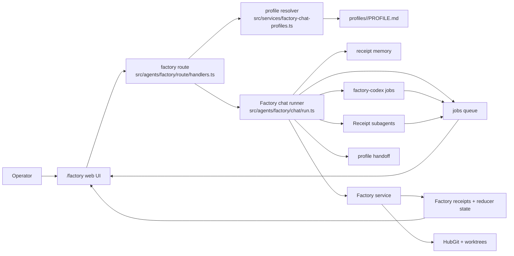
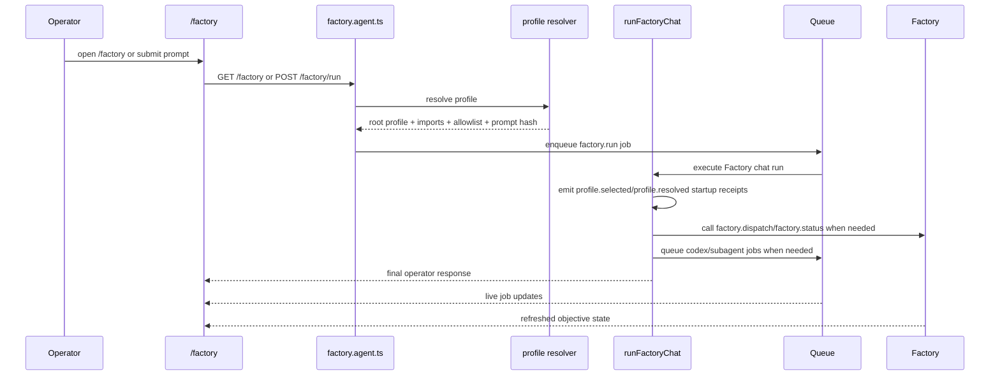

# Factory Profile-Based Orchestration

Status: Current implementation guide  
Audience: Engineering and repo customizers  
Scope: How `/factory` uses profiles as the operator-facing chat/thread orchestration layer, how profiles are resolved, how work is dispatched, and how this layer is customized per repo

## Purpose

This document explains the current profile-based orchestration model behind `/factory`.

It covers:

- what a Factory profile is
- how the active profile is selected
- how profile instructions become the system prompt
- how profile-scoped tools drive orchestration
- how the `/factory` web surface maps to profile state
- how repos can customize the behavior safely

This document is about the profile layer on top of the Receipt-native Factory core. It complements:

- `docs/factory-on-receipt.md` for the core Factory architecture
- `docs/factory-agent-orchestration.md` for the broader agent and Codex delivery path

## The Short Version

`/factory` is the operator-facing orchestration surface where the user talks to a selected Factory profile and moves between general chat, objective-scoped chat, and live workbench state. `GET /factory/control` is only a compatibility redirect to `/factory`, not a separate surface.

The main `/factory` chat surface is backed by a repo-customizable profile package made of:

- `profiles/<id>/PROFILE.md`

Each `PROFILE.md` contains:

- a small JSON frontmatter block for machine-readable orchestration policy
- the markdown body for the operator-facing instructions

At runtime, Factory:

1. discovers enabled profiles
2. selects one by explicit request, route hints, or default
3. resolves imported profiles into a final profile stack
4. expands profile capabilities into primitive tools, builds a merged system prompt and tool allowlist
5. runs the Factory chat agent against that profile
6. lets the profile answer directly, inspect memory/status/receipts, queue subagents, queue read-only Codex probes, dispatch Factory objectives, or hand off to another profile

The profile is the operator-facing decision layer. The Factory service remains the durable execution layer.
`/factory` is the canonical user-facing surface. Any generic supervisor outside Factory is internal/debug plumbing, not the primary product interface.

## Main Idea

The profile layer separates two concerns:

- conversational orchestration: what the operator should talk to right now
- durable objective execution: what Factory records and runs

That means:

- profiles shape behavior and tool access
- receipts still shape truth
- Factory still owns objectives, tasks, candidates, integration, and promotion
- Git still owns code
- profiles do not get direct repo read/write tools

Profiles do not replace Factory state. They provide a customizable front door into it.

## Architecture Diagram

## Core Components

### Profile definition

A profile is stored under `profiles/<id>/PROFILE.md`.

`PROFILE.md` has two parts:

- JSON frontmatter: machine-readable metadata and policy
- markdown body: natural-language operating instructions

The metadata currently supports:

- `id`
- `label`
- `enabled`
- `default`
- `imports`
- `capabilities`
- `toolAllowlist` for rare direct overrides
- `handoffTargets`
- `routeHints`
- `skills`
- orchestration shorthand such as `mode`, `discoveryBudget`, and `childDedupe`
- objective shorthand such as `defaultWorker` and `maxParallelChildren`

### Orchestration policy

Profiles now carry a small machine-readable orchestration policy in `PROFILE.md` frontmatter. The preferred shape is shorthand fields instead of a large nested policy blob.

Current supported fields:

- `mode`: `interactive` or `supervisor`
- `discoveryBudget`: max discovery-tool steps before delivery is required
- `suspendOnAsyncChild`: whether the parent should stop taking more repo-action tools while a child worker is active
- `allowPollingWhileChildRunning`: whether status-style tools are still allowed during an active child run
- `finalWhileChildRunning`: `allow`, `waiting_message`, or `reject`
- `childDedupe`: `none` or `by_run_and_prompt`

Objective overrides are also shorthand:

- `objective.defaultWorker`
- `objective.allowedWorkers`
- `objective.maxParallelChildren`
- `objective.validation`
- `objective.allowObjectiveCreation`

Legacy `orchestration`, `objectivePolicy`, and direct `toolAllowlist` fields still resolve, but built-in profiles now prefer capabilities plus small overrides.

### Capabilities

Profiles should describe orchestration intent, not carry giant raw tool arrays. Capability groups expand to primitive tools in `src/services/factory-chat-profiles.ts`.

Current capability groups include:

- `memory.read` -> memory inspection tools
- `memory.write` -> memory commit/diff tools
- `skill.read` -> `skill.read`
- `status.read` -> `agent.status`, `jobs.list`, `codex.status`, `codex.logs`, `factory.status`, `factory.output`, `factory.receipts`
- `async.dispatch` -> `codex.run`, `agent.delegate`
- `async.control` -> `job.control`
- `objective.control` -> `factory.dispatch`
- `profile.handoff` -> `profile.handoff`

This keeps profiles readable while the runtime still receives an exact tool allowlist.
Legacy `repo.read` and `repo.write` capabilities are rejected. Factory profiles are orchestration-only.

### Profile resolver

The resolver in `src/services/factory-chat-profiles.ts` is responsible for:

- discovering enabled profiles
- selecting the root profile
- walking profile imports
- expanding and merging capability-derived tools
- merging handoff targets
- merging orchestration policy
- building a deterministic resolved hash
- producing the final system prompt text

The resolved prompt is built as:

- imported profile instructions first
- active profile instructions last

This gives a clear override shape: imported profiles provide shared behavior, and the active profile provides the operator-facing specialization.

### Factory chat runner

The profile runtime lives in `src/agents/factory/chat/run.ts`.

It wraps the generic Receipt agent runner with Factory-specific behavior:

- profile resolution
- profile-scoped memory defaults
- profile-scoped tool allowlist
- Factory-specific tool specs
- Factory-specific async tools like `codex.run`, `factory.dispatch`, and `profile.handoff`
- objective-first status and evidence tools like `codex.logs`, `factory.status`, `factory.output`, and `factory.receipts`
- a bounded situation block built from current objective state, latest decisions, active jobs, worktrees, and recent receipts

The loop is intentionally constrained:

- the model picks one tool at a time
- tools are queued async where possible
- the final answer is returned to the operator without blocking on long-running work
- direct `codex.run` is a read-only probe path; code-changing delivery belongs to `factory.dispatch -> objective -> worktree -> Codex`

### Factory route and UI

The `/factory` route in `src/agents/factory/route/handlers.ts` turns profile state into the chat shell.

The current shell exposes:

- left rail: profile switcher and objective list
- center: chat transcript and composer
- right rail: selected objective inspector and recent jobs

The UI is profile-aware, but it is not the source of truth. It rehydrates from:

- agent receipts for chat history
- job state for live work
- Factory service projections for objective state

## Profile Resolution Model

Profiles are selected in this order:

1. explicit `?profile=<id>` request
2. best `routeHints` match against the operator problem text
3. the profile marked `default: true`
4. the first enabled profile

This means repos can support:

- a stable default operator profile
- lightweight auto-routing based on intent words
- explicit operator switching when needed

### Imports

Imports let one profile inherit another profile's guidance and permissions.

Current import behavior:

- imports are resolved recursively
- duplicates are removed
- imported profiles are added before the active root profile
- tool allowlists and handoff targets are merged uniquely

This is the main customization mechanism for shared behavior.

That same import stack now also lets repos share orchestration defaults. For example:

- an imported base profile can define `executionMode: "supervisor"`
- a concrete delivery profile can override only `discoveryBudget`
- another profile can inherit the same supervisor policy but choose a different tool allowlist

Example pattern:

- `base-ops`: common memory and inspection rules
- `reviewer`: imports `base-ops` and adds critique-specific instructions
- `release-manager`: imports `base-ops` and adds promotion rules

## Streams And Isolation

Profile chat state is repo-scoped and profile-scoped.

The stream key is:

- `agents/factory/<repoKey>/<profileId>`

The repo key is derived from the resolved repo root, not the profile root. This matters because:

- one shared profile pack can be reused across multiple repos
- each repo still gets isolated Factory profile streams

In practice:

- the profile definitions may live outside the repo if `profileRoot` is overridden
- the running conversation is still isolated per target repo

## Prompt Assembly

The final system prompt is composed from:

- a small runtime preamble describing the profile role
- imported profile markdown bodies
- the active profile markdown body

The resolved prompt also produces:

- `promptPath`
- `promptHash`
- `profilePaths`
- `fileHashes`
- `resolvedHash`

Those values are emitted into startup receipts so the run can later explain:

- which profile was selected
- which imported profiles were included
- which exact profile files shaped the run

## Tool Model

Profiles do not get every tool by default. They get only what `toolAllowlist` permits.

The current Factory-specific tools exposed by `src/agents/factory/chat/tools.ts` are:

- `agent.delegate`
- `agent.status`
- `jobs.list`
- `job.control`
- `codex.run`
- `codex.logs`
- `factory.dispatch`
- `factory.status`
- `factory.output`
- `factory.receipts`
- `profile.handoff`

The general profile guidance in `PROFILE.md` decides when to use them. The frontmatter allowlist decides whether they are available at all.

### Why this matters

This gives a clean customization boundary:

- instructions shape policy
- allowlists shape capability

A planning-oriented profile can be evidence-heavy and dispatch-light. A delivery profile can allow `codex.run` probes plus `factory.dispatch`. A reviewer profile can avoid promotion tools entirely.

## What The Profile Layer Can Do

A profile can:

- answer directly
- inspect memory before answering
- inspect current jobs, receipts, and live output
- queue a Receipt subagent
- queue a focused read-only Codex probe
- create or react a Factory objective for code-changing work
- promote, cancel, clean up, or archive an objective
- hand the conversation to another profile

What it cannot do on its own:

- read or write repo files directly
- mutate Factory state without going through the Factory service
- bypass receipts as the source of truth
- bypass queue lifecycle for async work
- bypass Git as the source of code truth

## Customization Model

This profile layer is intentionally repo-customizable.

### Customization points

#### 1. Add or remove profiles

Create a new directory:

- `profiles/<id>/`

Add:

- `PROFILE.md`

If `enabled` is true, the profile is discoverable automatically.

#### 2. Change the default profile

Mark one profile with:

- `"default": true`

This becomes the fallback when the operator does not request a profile and route hints do not match.

#### 3. Auto-route by intent

Use `routeHints` to bias selection based on operator text.

Examples:

- `"review"`
- `"debug"`
- `"ship"`
- `"release"`

This is a simple whole-word / phrase heuristic today. It is cheap, deterministic, and easy to reason about.

#### 4. Share behavior through imports

Use `imports` for common policy.

This is the preferred way to avoid duplicating:

- memory rules
- inspection discipline
- handoff style
- delivery rules

#### 5. Restrict or extend tools

Use `toolAllowlist` to control capability.

This is the safest customization seam because it lets repos define different operational profiles without changing the core runner.

Examples:

- a `reviewer` profile that can inspect status and hand off, but not dispatch
- a `delivery` profile that can dispatch objectives and run Codex
- an `ops` profile that emphasizes `jobs.list` and `job.control`

#### 6. Constrain handoffs

Use `handoffTargets` when you want explicit control over valid handoffs.

If this list is non-empty, `profile.handoff` will reject any target outside it.

#### 7. Override the profile root

The runtime supports a `profileRoot` separate from `repoRoot`.

This makes it possible to:

- share one profile pack across multiple repos
- test profiles independently
- keep repo-specific code and organization-wide orchestration policy separate

## Recommended Customization Patterns

### Base + specialist profiles

A good shape is:

- one default generalist profile
- one or more specialist profiles
- one shared imported base profile

This keeps shared rules centralized while allowing operator-facing specialization.

### Async-first specialist profiles

Profiles work best when they stay responsive.

Recommended pattern:

- inspect first
- queue long-running work
- return the live handle
- tell the operator what to ask next

This matches the current Factory chat runtime and avoids turning `/factory` into a blocking synchronous shell.

### Capability minimization

Prefer the smallest useful `toolAllowlist`.

This makes profile behavior easier to reason about and reduces accidental orchestration overlap between profiles.

## Current Request Flow

## Current Code Map

- `src/services/factory-chat-profiles.ts`
  - profile discovery, selection, imports, prompt assembly, resolved hash
- `src/agents/factory/chat/run.ts`
  - profile-aware agent runner, tool registry, async orchestration tools
- `src/agents/factory/route/handlers.ts`
  - `/factory` route, profile-aware shell model, UI islands, events
  - `/factory/workbench` and `/factory/control` compatibility redirects
  - `/factory/background/events`, `/factory/chat/events`, and objective-scoped workbench islands
- `profiles/generalist/PROFILE.md`
  - current default operator-facing behavior plus embedded policy frontmatter
  - current default capabilities and route hints
- `tests/smoke/factory-chat-profiles.test.ts`
  - discovery, route hinting, imports, stream scoping
- `tests/smoke/factory-chat-runner.test.ts`
  - async Codex queueing, delegation, status inspection

## Guardrails

The profile layer is customizable, but the system still keeps strong boundaries:

- Factory receipts remain the durable orchestration truth
- Git remains the durable code truth
- profiles only get the tools they are allowed to use
- one tool is chosen per loop step
- handoffs can be restricted explicitly
- profile selection is deterministic given the same inputs
- profile prompt composition is hashable and auditable

## Practical Takeaway

The current `/factory` design is a customizable orchestration shell built around profiles and already includes the live durable state for the selected objective.

If you want to adapt Factory behavior for a team or repo, the first place to customize is not the reducer or the UI. It is the profile layer:

- add or update profile instructions
- shape the allowlist
- share behavior with imports
- define handoff topology
- define routing hints

That keeps customization local, explainable, and compatible with the current Receipt-native Factory core.
