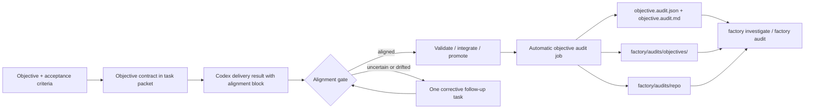

# Factory Self-Improvement

Status: Current implementation guide  
Audience: Engineering and operators  
Scope: How Receipt helps Factory runs stay aligned, learn from prior runs, and expose improvement signals

## Executive Summary

Factory self-improvement in this repo is not a hidden autonomous planner that rewrites itself.

It is a receipt-backed loop with four concrete parts:

1. prevent drift before publish by turning the objective into an explicit worker contract
2. require the worker to report alignment against that contract
3. reconstruct and score completed runs with `factory investigate` and `factory audit`
4. write compact audit summaries back into dedicated memory scopes so later humans and agents can course-correct

The important design rule is:

- Receipt remains the orchestrator and ledger
- Codex remains the executor
- self-improvement happens through visible contracts, gates, audits, and memory, not through opaque controller state

## What “Self-Improvement” Means Here

In this codebase, self-improvement is implemented as:

- better task context before coding starts
- explicit objective-alignment checks in task results
- one light-touch correction pass when a delivery result drifts
- automatic post-run auditing for terminal objectives
- repo-level aggregation of repeated failure modes and memory hygiene problems

It does **not** currently mean:

- automatic multi-objective strategy optimization
- automatic code changes from audit findings alone
- unrestricted repeated retries until something passes

## Loop Overview



## 1. Objective Contract Before Execution

The first self-improvement mechanism is preventative.

For delivery objectives, Receipt derives an `Objective Contract` from the planning receipt and current objective state in [`src/services/factory-service.ts`](/Users/kishore/receipt/src/services/factory-service.ts).

That contract includes:

- acceptance criteria
- allowed scope
- disallowed scope
- required checks
- proof expectation

The contract is then pushed into the worker-facing path in two places:

- the text-first task context summary
- the delivery result contract in the task prompt

This matters because it keeps the worker anchored to the objective before any code is written. The worker is not expected to infer alignment only from a long prompt or raw JSON packet.

## 2. Delivery Results Must Report Alignment

For delivery tasks, the result contract requires an explicit `alignment` block. The schema lives in [`src/services/factory/result-contracts.ts`](/Users/kishore/receipt/src/services/factory/result-contracts.ts).

The worker must return:

- `verdict`: `aligned`, `uncertain`, or `drifted`
- `satisfied`: which contract items were actually satisfied
- `missing`: which contract items remain unresolved
- `outOfScope`: work that should not be claimed as part of the objective
- `rationale`: short explanation

Receipt keeps this small and text-first. The alignment review is part of the delivery envelope, not a separate reporting system.

## 3. Controller-Side Alignment Gate

The next self-improvement mechanism is a visible controller gate in [`src/services/factory-service.ts`](/Users/kishore/receipt/src/services/factory-service.ts).

### Normal path

If the worker reports `aligned`, Receipt can continue toward validation, integration, and promotion.

### Corrective path

If the worker reports `uncertain` or `drifted`, Receipt does not immediately promote the result.

Instead it:

- marks the review as `changes_requested`
- appends explicit alignment detail to the candidate summary and handoff
- issues one structured corrective note tied to the missing or out-of-scope contract items

### Hard stop after one correction

If a second pass is still not aligned, Receipt leaves the work blocked instead of continuing to publish. The handoff tells the next operator or worker exactly which contract items are still missing.

This is intentionally light-touch:

- one corrective pass
- no aggressive mid-run auto-restarts for alignment
- no hidden retries

## 4. Investigation: Reconstruct What Happened

`receipt factory investigate` is the run-level introspection tool.

Implementation lives in [`src/factory-cli/investigate.ts`](/Users/kishore/receipt/src/factory-cli/investigate.ts).

It reconstructs:

- what happened
- DAG flow
- focused packet context
- tasks, candidates, jobs, and anomalies
- interventions and restart history
- a run assessment

The assessment includes self-improvement signals such as:

- verdict
- easy-route risk
- efficiency
- control churn
- contract criteria count
- alignment verdict
- corrective steer issued or not
- aligned after correction or not
- proof present or missing
- repo diff produced or avoided
- follow-up validation done or skipped
- operator guidance applied or not
- course correction worked or not

This is the main “why did this run go well or badly?” surface for both humans and agents.

## 5. Automatic Objective Audit

Self-improvement is not only manual.

When an objective reaches a terminal state, the server automatically queues a `factory.objective.audit` job. That trigger lives in [`src/server.ts`](/Users/kishore/receipt/src/server.ts).

The audit worker path lives in [`src/services/factory-runtime.ts`](/Users/kishore/receipt/src/services/factory-runtime.ts).

For each terminal objective it:

- runs the same receipt investigation logic
- writes `objective.audit.json`
- writes `objective.audit.md`
- retries transient `database is locked` failures
- commits a compact summary into audit-specific memory scopes

Artifact location:

- `${DATA_DIR}/factory/artifacts/<objectiveId>/objective.audit.json`
- `${DATA_DIR}/factory/artifacts/<objectiveId>/objective.audit.md`

Memory scopes written by the audit worker:

- `factory/audits/objectives/<objectiveId>`
- `factory/audits/repo`

Those memory entries are intentionally compact. They record the run verdict and improvement signals without dumping the entire task result into shared memory.

## 6. Repo-Level Audit

`receipt factory audit` is the repo-level rollup, implemented in [`src/factory-cli/audit.ts`](/Users/kishore/receipt/src/factory-cli/audit.ts).

It can sample recent objectives or target one objective directly:

```bash
receipt factory audit --limit 20
receipt factory audit --objective <objectiveId>
receipt factory audit --json
```

The audit aggregates:

- verdict counts
- easy-route risk
- efficiency and control churn
- anomaly categories
- intervention and restart counts
- alignment verdicts and corrective-steer outcomes
- memory hygiene signals

The memory hygiene pass is an important part of self-improvement. It checks for:

- run-specific entries leaking into `factory/repo/shared`
- run-specific entries leaking into `factory/agents/*`
- missing `Handoff` sections in task, candidate, integration, and publish memory

This makes the audit useful for improving the orchestrator itself, not just for grading individual objectives.

## 7. Memory Model

Receipt’s memory strategy is layered.

### What gets written automatically

Task execution writes durable notes into:

- `factory/objectives/<objectiveId>`
- `factory/objectives/<objectiveId>/tasks/<taskId>`
- `factory/objectives/<objectiveId>/candidates/<candidateId>`

Integration and publish stages write their own controller-readable summaries into:

- `factory/objectives/<objectiveId>/integration`
- `factory/objectives/<objectiveId>/publish`

Objective audits write into:

- `factory/audits/objectives/<objectiveId>`
- `factory/audits/repo`

### What does not get auto-promoted

Run-specific task results are not supposed to spill automatically into:

- `factory/repo/shared`
- `factory/agents/*`

Those scopes are meant for reusable lessons, not one-off run dumps. The repo-level audit explicitly reports when that hygiene has regressed.

## 8. Operator Surfaces

Self-improvement signals are exposed in the current UI and CLI surfaces.

### Workbench

The selected-objective view renders an `Objective Contract` card and current alignment state in [`src/views/factory-workbench-page.ts`](/Users/kishore/receipt/src/views/factory-workbench-page.ts).

Operators can see:

- acceptance criteria
- required checks
- proof expectation
- satisfied criteria
- missing criteria
- out-of-scope work
- gate status
- controller rationale and corrective action

### Investigate

`factory investigate` surfaces the same contract/alignment story in text and JSON form.

### Audit

`factory audit` turns those per-objective signals into repo-wide improvement signals.

## 9. Why This Helps Codex Without Constraining It Too Much

Receipt’s role here is not to replace Codex’s implementation ability.

It helps in three concrete ways:

1. it gives Codex a clearer target through the objective contract
2. it prevents quiet drift at publish time through the alignment gate
3. it preserves enough evidence and memory for later runs to debug patterns instead of repeating them blindly

Codex still chooses how to implement the fix. Receipt makes sure the result can be judged against the objective and learned from afterward.

## 10. Current Limits

The current self-improvement loop is useful, but it is still bounded.

Current limits include:

- objective decomposition is still weak; many runs remain single-task
- repo-level audit signals are descriptive, not automatically converted into new controller policy
- alignment correction is capped at one corrective pass
- audit memory is compact by design, so deeper repair still relies on receipts and artifacts

So the system is already self-observing and partially self-correcting, but not yet self-optimizing in a broader planning sense.

## 11. Relevant Commands

```bash
receipt factory investigate <objectiveId>
receipt factory investigate <objectiveId> --compact
receipt factory investigate <objectiveId> --json

receipt factory audit --limit 20
receipt factory audit --objective <objectiveId>
receipt factory audit --json

receipt memory summarize factory/audits/objectives/<objectiveId> --limit 4 --max-chars 1200
receipt memory summarize factory/audits/repo --limit 8 --max-chars 1600
```

## 12. Test Coverage

The current loop is covered by smoke tests in:

- [`tests/smoke/factory-policy.test.ts`](/Users/kishore/receipt/tests/smoke/factory-policy.test.ts) for alignment contract, delivery result schema, and corrective gate behavior
- [`tests/smoke/factory-investigate-script.test.ts`](/Users/kishore/receipt/tests/smoke/factory-investigate-script.test.ts) for investigation output, contract/alignment reporting, and audit artifact/memory writes
- [`tests/smoke/factory-client.test.ts`](/Users/kishore/receipt/tests/smoke/factory-client.test.ts) and [`tests/smoke/factory.test.ts`](/Users/kishore/receipt/tests/smoke/factory.test.ts) for operator-facing workbench surfaces

That means the self-improvement path is not only a doc concept. It is implemented as a tested combination of:

- contract shaping
- alignment gating
- receipt-backed investigation
- automatic objective audit
- memory-backed improvement summaries
