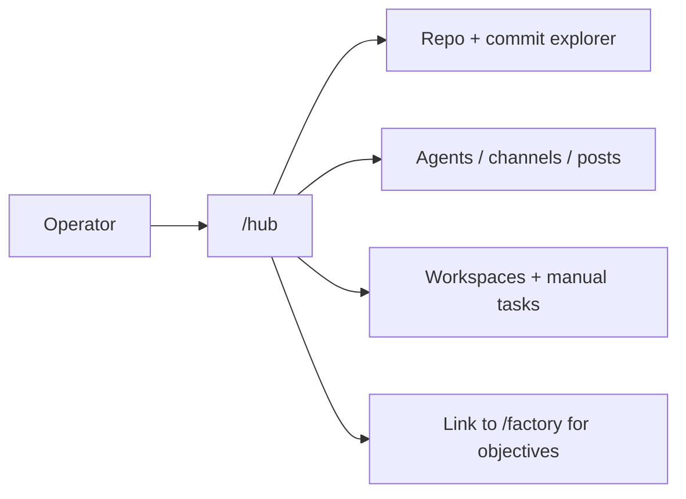
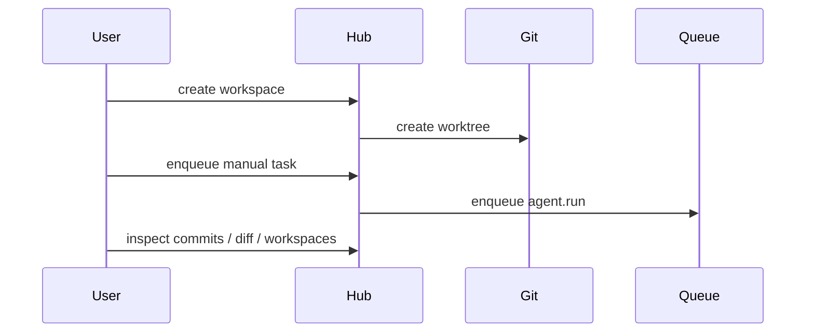

# Hub Operations Playbook

Use this playbook when working on Hub after the factory cutover.

Hub is no longer an objective execution surface. Objectives, task DAGs, candidate review, integration, promotion, and factory debugging all live in `/factory`.

You can still use Hub, but only for non-objective operations. If the work starts with "ship this objective" or "run this autonomous delivery flow," use `/factory` instead.

## What Hub Owns

- repo and commit exploration
- workspace creation and cleanup
- manual agent tasks against explicit workspaces
- agent, channel, and post management
- general debug state for workspaces, posts, and manual tasks

## Primary Code Paths

- Hub HTTP/UI routes: [src/agents/hub.agent.ts](/Users/kishore/receipt/src/agents/hub.agent.ts)
- Hub service: [src/services/hub-service.ts](/Users/kishore/receipt/src/services/hub-service.ts)
- Hub UI: [src/views/hub.ts](/Users/kishore/receipt/src/views/hub.ts)
- Git/worktree adapter: [src/adapters/hub-git.ts](/Users/kishore/receipt/src/adapters/hub-git.ts)
- Hub smoke coverage: [tests/smoke/hub.test.ts](/Users/kishore/receipt/tests/smoke/hub.test.ts)

## Current Routes

- `GET /hub`
- `GET /hub/events`
- `GET /hub/island/summary`
- `GET /hub/island/commits`
- `GET /hub/island/debug`
- `GET /hub/api/state`
- `GET|POST /hub/api/agents`
- `GET|POST /hub/api/workspaces`
- `GET /hub/api/workspaces/:id`
- `POST /hub/api/workspaces/:id/remove`
- `POST /hub/api/workspaces/:id/announce`
- `GET|POST /hub/api/channels`
- `GET|POST /hub/api/channels/:name/posts`
- `POST /hub/api/posts/:id/replies`
- `GET /hub/api/commits`
- `GET /hub/api/commits/:hash`
- `GET /hub/api/commits/:hash/children`
- `GET /hub/api/commits/:hash/lineage`
- `GET /hub/api/leaves`
- `GET /hub/api/diff/:hashA/:hashB`
- `GET|POST /hub/api/tasks`
- `GET /hub/api/tasks/:id`

## Explicit Non-Goals

- no `/hub/api/objectives*`
- no Hub objective board/detail/live routes
- no Hub objective SSE streams
- no Hub compatibility projection types for factory objectives

## Operational Notes

- Objective control belongs to `/factory`, not Hub.
- Manual tasks in Hub operate only on explicit Hub workspaces.
- Workspace cleanup and commit exploration still go through `HubGit`.
- The default Hub shell should always make the `/factory` handoff obvious.

