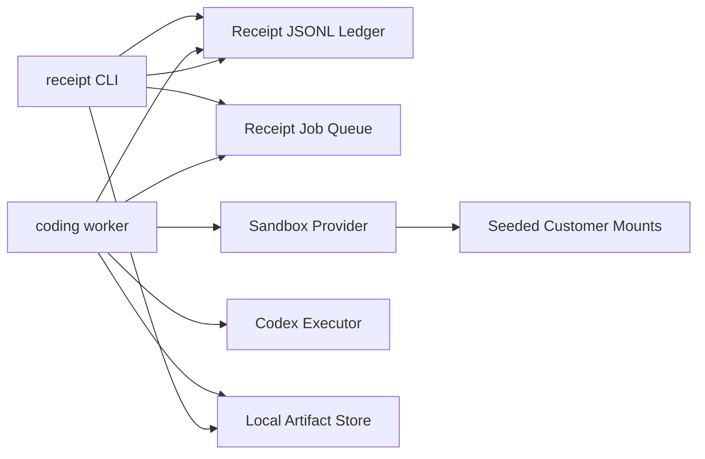

# MVP Architecture: CLI-First Receipt Coding Runtime

Status: Proposed MVP architecture  
Audience: Engineering  
Decision date: 2026-03-08  
Scope: Single-node CLI-first coding runtime built inside this repo

## Purpose

This document defines the simplest technical architecture that can ship the coding-runtime concept as an MVP inside this repository.

The MVP must do four things:

1. accept a coding task from the CLI
2. run a coding agent in an isolated seeded environment
3. persist the run and outputs in Receipt
4. let an operator inspect the run and outputs from the CLI

The goal is to prove the runtime contract quickly inside the existing TypeScript codebase.

## MVP Decision

For the CLI MVP:

- keep `Receipt` as the durable run ledger
- keep `JSONL` and the existing single-process runtime for persistence
- add a new `coding` runtime inside this repo
- use a TypeScript worker process, not Symphony, for the first slice
- use `Codex` as the executor behind an adapter
- use a sandbox provider adapter for isolated execution
- use local disk artifacts first

This is a speed-optimized MVP decision, not the final production architecture.


The MVP should first validate:

- seeded environment lifecycle
- Codex execution
- receipt emission
- artifact/output capture
- CLI inspection flow

The worker contracts in this document should deliberately mirror the future Symphony boundary so the worker can later be replaced without changing the run ledger, sandbox adapter, or artifact model.

## Explicit MVP Constraints

### In scope

- one operator on one machine
- one Receipt worker process
- one or more remote or managed sandboxes
- customer-specific seeded mounts
- disposable and persistent sandbox modes
- CLI submission, status, logs, artifacts, and resume

### Out of scope

- web UI
- multi-tenant auth
- distributed locking
- Postgres migration
- object storage
- Symphony integration
- cloud write approvals

## Runtime Topology

The MVP runs as two local processes plus the sandbox provider.

### Process 1: operator CLI

The operator uses `receipt` commands to:

- submit coding tasks
- inspect status
- stream logs
- inspect artifacts
- resume a persistent run

### Process 2: coding worker

The worker runs as a long-lived local process:

```bash
receipt coding worker
```

It is responsible for:

- claiming queued jobs
- preparing the sandbox
- mounting or syncing customer data
- launching Codex
- persisting receipts
- saving artifacts

### Process 3: sandbox provider

The sandbox provider may be remote, but from the CLI MVP point of view it is just an adapter that can:

- create or resume a sandbox
- copy files in and out
- execute commands
- destroy or pause the sandbox

## High-Level Topology



## Reused Components From This Repo

The MVP should reuse these existing pieces as-is where possible:

- `packages/core/src/runtime.ts`
- `src/adapters/jsonl.ts`
- `src/adapters/jsonl-queue.ts`
- `src/modules/job.ts`
- `src/engine/runtime/job-worker.ts`
- `src/cli.ts`

This keeps the MVP aligned with the current runtime model and avoids a rewrite before the runtime contract is proven.

## New Subsystem to Add

Add a dedicated coding runtime under:

```text
src/coding/
```

Recommended module layout:

```text
src/coding/
  types.ts
  streams.ts
  commands.ts
  events.ts
  reducer.ts
  projector.ts
  runtime.ts
  worker.ts
  artifacts.ts
  mount-sets.ts
  sandbox-registry.ts
  providers/
    sandbox.ts
    sandbox-e2b.ts
    codex.ts
```

## CLI Surface

Extend `src/cli.ts` with a `coding` command group.

### Commands

```bash
receipt coding submit --customer <id> --mount-set <id> --prompt <text> [--sandbox disposable|persistent] [--sandbox-name <name>]
receipt coding worker
receipt coding status <run-id>
receipt coding logs <run-id>
receipt coding artifacts <run-id>
receipt coding output <run-id>
receipt coding resume <run-id>
receipt coding ls
```

### Command behavior

`receipt coding submit`

- validates the mount set
- creates a run ID
- appends `run.created`
- enqueues a `coding.run` job in the existing job queue
- prints `{ runId, jobId, stream }`

`receipt coding worker`

- runs the claim loop forever
- processes queued `coding.run` jobs
- prints compact worker logs to stdout

`receipt coding status`

- prints the projected run state
- includes sandbox mode, current step, last artifact, and final status if present

`receipt coding logs`

- prints a receipt timeline and most recent command summaries

`receipt coding artifacts`

- lists artifact records and local file paths

`receipt coding output`

- prints the latest finalized response and output manifest

`receipt coding resume`

- re-enqueues a run with persistent sandbox semantics

`receipt coding ls`

- lists recent coding runs

## Stream and Queue Model

Reuse the existing queue stream:

- `jobs`
- `jobs/<jobId>`

Add coding run streams:

- `coding/runs/<runId>`
- `coding/sandboxes/<sandboxName>`

The queue payload kind should be:

```json
{
  "kind": "coding.run",
  "stream": "coding",
  "runId": "run_abc",
  "runStream": "coding/runs/run_abc",
  "customerId": "cust_123",
  "mountSetId": "default",
  "sandboxMode": "disposable",
  "sandboxName": null,
  "prompt": "Generate a migration script"
}
```

## Data Directory Layout

For MVP, store everything under `DATA_DIR`.

Recommended layout:

```text
DATA_DIR/
  _streams.json
  jobs/
  coding/
    mount-sets/
      <customerId>/
        <mountSetId>.json
    sandboxes/
      <sandboxName>.json
    artifacts/
      <runId>/
        manifest.json
        stdout.txt
        stderr.txt
        output.json
        files/
    projections/
      coding-runs.json
```

### Mount set file format

Each mount set file should be plain JSON:

```json
{
  "customerId": "cust_123",
  "mountSetId": "default",
  "workspaceSeed": "/absolute/path/to/repo-template",
  "mounts": [
    { "source": "/absolute/path/to/customer/config", "target": "/customer/config", "mode": "ro" },
    { "source": "/absolute/path/to/customer/data", "target": "/customer/data", "mode": "ro" },
    { "source": "/absolute/path/to/context", "target": "/context", "mode": "ro" }
  ]
}
```

## Seeded Environment Model

The worker should build the sandbox filesystem from four sources.

### 1. Base image

The base image should contain:

- `git`
- `node`
- `python`
- `uv`
- `ripgrep`
- test and build tooling
- the `codex` binary if the sandbox provider supports a custom image

### 2. Workspace seed

This is a writable starter tree copied into `/workspace` before Codex runs.

Examples:

- a repo template
- a pre-cloned customer codebase
- a generated scratch project

### 3. Customer mounts

These are mounted or synced read-only into the sandbox.

Recommended paths:

- `/customer`
- `/context`

### 4. Durable run outputs

These are synced back out of the sandbox after execution:

- `/workspace`
- `/artifacts`
- optional `/recipes`

## Sandbox Provider Contract

Define a small interface first:

```ts
type SandboxProvider = {
  create(input: CreateSandboxInput): Promise<SandboxHandle>;
  resume(input: ResumeSandboxInput): Promise<SandboxHandle>;
  exec(handle: SandboxHandle, input: ExecInput): Promise<ExecResult>;
  upload(handle: SandboxHandle, input: UploadInput): Promise<void>;
  download(handle: SandboxHandle, input: DownloadInput): Promise<void>;
  pause(handle: SandboxHandle): Promise<void>;
  destroy(handle: SandboxHandle): Promise<void>;
};
```

### First implementation

Implement:

- `src/coding/providers/sandbox-e2b.ts`

Keep all provider-specific details there.

## Codex Executor Contract

The coding runtime should not call the current OpenAI adapter directly.

Instead, add:

```ts
type CodeExecutor = {
  run(input: CodexRunInput): Promise<CodexRunResult>;
};
```

`CodexRunInput` should include:

- run ID
- prompt
- workspace path
- sandbox handle
- max turns
- output paths to collect

### MVP executor behavior

The executor should:

1. write a task file into the sandbox
2. start Codex against `/workspace`
3. wait for completion
4. capture stdout, stderr, and any structured output file
5. return a normalized result to the worker

The exact Codex invocation can vary by environment. The important design rule is that only `providers/codex.ts` knows that invocation detail.

## Receipt Event Model

Add a dedicated coding event union.

### Minimum events

- `run.created`
- `dispatch.enqueued`
- `dispatch.started`
- `environment.selected`
- `sandbox.requested`
- `sandbox.started`
- `sandbox.resumed`
- `workspace.seeded`
- `mount.attached`
- `executor.selected`
- `codex.started`
- `command.exec_started`
- `command.exec_finished`
- `file.written`
- `artifact.created`
- `output.published`
- `sandbox.paused`
- `sandbox.stopped`
- `run.completed`
- `run.failed`

### Event payload rule

Keep receipts small.

Receipts should contain:

- IDs
- summaries
- paths
- status
- hashes

Receipts should not contain:

- large logs
- full file contents
- raw customer data

## Projected Run State

The reducer should project:

- run status
- run step
- customer ID
- mount set ID
- sandbox mode
- sandbox name
- sandbox handle metadata
- last command summary
- latest artifacts
- final response summary

This projection is what `receipt coding status` should print.

## Run Lifecycle

### Submit path

1. operator runs `receipt coding submit`
2. CLI loads mount set config
3. CLI appends `run.created`
4. CLI enqueues `coding.run`
5. CLI prints identifiers

### Worker execution path

1. worker leases `coding.run`
2. worker appends `dispatch.started`
3. worker resolves mount set and sandbox mode
4. worker creates or resumes sandbox
5. worker uploads workspace seed
6. worker attaches or syncs customer mounts
7. worker appends `sandbox.started`, `workspace.seeded`, `mount.attached`
8. worker starts Codex
9. worker captures output
10. worker downloads generated files and artifacts
11. worker appends `artifact.created` and `output.published`
12. worker destroys or pauses sandbox
13. worker appends `run.completed` or `run.failed`

### Resume path

1. operator runs `receipt coding resume <runId>`
2. CLI reads the run projection
3. CLI verifies the run uses persistent sandbox mode
4. CLI enqueues a new `coding.run` job with `resume=true`
5. worker resumes the sandbox and continues execution

## Artifact Model

For MVP, artifacts stay on local disk.

Each run gets:

```text
DATA_DIR/coding/artifacts/<runId>/
```

The worker should persist:

- `stdout.txt`
- `stderr.txt`
- `output.json`
- `workspace.tar.gz` or copied output files
- `manifest.json`

`manifest.json` should contain:

- artifact IDs
- file paths
- content types
- sizes
- short summaries

The run stream should contain `artifact.created` events pointing to these files.

## Persistent Sandbox Registry

Persistent sandboxes need a local registry file for the MVP.

Store one JSON file per logical sandbox:

```text
DATA_DIR/coding/sandboxes/<sandboxName>.json
```

That file should track:

- sandbox name
- provider type
- provider sandbox ID
- last run ID
- last mount set ID
- workspace seed
- last touched timestamp
- status

The logical `sandboxName` is the stable identity. The provider sandbox ID is replaceable.

## Failure Handling

### Worker crash

If the worker crashes:

- the queue lease expires
- a restarted worker can reclaim the job
- the run stream is still intact

### Sandbox creation failure

If sandbox startup fails:

- append `run.failed`
- keep the run receipts
- keep partial worker logs as artifacts if available

### Codex failure

If Codex exits non-zero:

- persist stdout and stderr
- append `run.failed`
- do not discard generated files automatically

### Download failure

If artifact download fails after execution:

- append a failure receipt
- leave the sandbox alive for manual inspection if sandbox mode is persistent
- destroy the sandbox if sandbox mode is disposable

## Repo Changes Required

### Modify

- `src/cli.ts`
- `docs/api/cli.md`

### Add

- `src/coding/*`
- `tests/smoke/coding-cli.test.ts`
- `tests/smoke/coding-worker.test.ts`

### Optional later

- `src/server.ts` endpoints for UI or API access

## Implementation Order

### Phase 1: local run and receipts

Build:

- coding event types
- reducer and projector
- `receipt coding submit`
- `receipt coding status`
- `receipt coding ls`

Acceptance:

- a submitted run appears in receipts and can be listed

### Phase 2: sandbox and Codex execution

Build:

- sandbox adapter
- Codex executor adapter
- worker process
- local artifact persistence

Acceptance:

- worker can run Codex in a sandbox and persist artifacts

### Phase 3: seeded mounts and persistent mode

Build:

- mount set loader
- workspace seed loader
- persistent sandbox registry
- `receipt coding resume`

Acceptance:

- same customer mount set can be reused across runs
- persistent sandbox can be resumed

## Test Plan

### Smoke tests

- submit a coding run and verify it appears in `receipt coding ls`
- run a worker and verify the run completes
- verify artifact files are written under `DATA_DIR/coding/artifacts/<runId>`
- verify `receipt coding output <runId>` prints the finalized output

### Failure tests

- sandbox create failure emits `run.failed`
- Codex non-zero exit emits `run.failed`
- worker restart can continue from queued state

### Persistent mode tests

- submit a persistent run
- verify sandbox registry file exists
- resume the run and verify the same logical sandbox is reused

## Migration Path After MVP

Once the CLI MVP proves the contract, the next upgrades are:

1. replace JSONL ledger with Postgres
2. move artifact storage to object storage
3. add HTTP and SSE APIs for UI
4. replace the local TypeScript worker with a Symphony-derived dispatch worker if needed

The important technical boundary is this:

- the run ledger stays Receipt
- the sandbox adapter stays separate
- the Codex executor stays separate
- only the worker implementation changes
