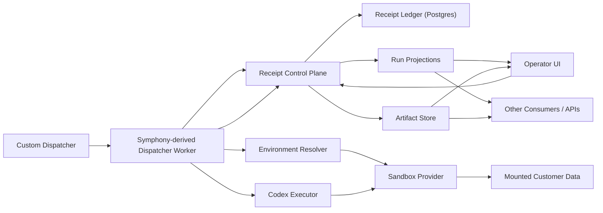
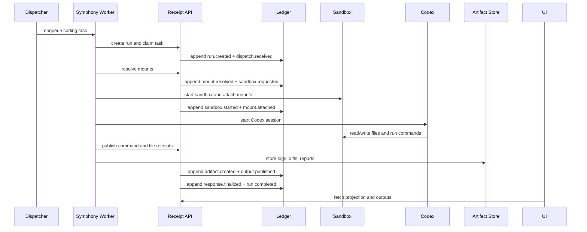
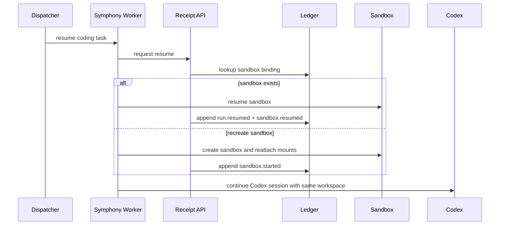

# Engineering Doc: Receipt-Powered Seeded Coding Runtime

Status: Proposed design  
Audience: Engineering, product, operations  
Decision date: 2026-03-08  
Scope: Production-grade coding-agent runtime with seeded customer environments

## Executive Summary

We want a coding agent that can generate and execute code inside an isolated environment that Receipt controls end to end.

The environment must be seedable with customer-specific data and context. The agent should be able to read that mounted data, write code against it, run commands, produce outputs, and make those outputs available through Receipt to the UI or any downstream consumer.

The core decision is:

- `Receipt` is the canonical system of record
- `Symphony` is reused for its dispatch and worker model, not as the run ledger
- `Codex` is the default coding executor
- a managed sandbox is the execution cell
- seeded customer data is mounted into the sandbox, not copied into Receipt
- outputs are promoted into Receipt-indexed artifacts and projections

This is not just a chat agent with a workspace. It is a coding runtime:

- work is dispatched into an isolated execution cell
- the execution cell is preloaded with customer context
- the agent writes and runs code inside that cell
- Receipt records what happened
- Receipt exposes the outputs to UI and other systems

The design should support both one-off disposable runs and resumable long-lived workspaces.

## Problem Statement

The current repo already has the right product idea:

- append-only receipts
- replay and inspection
- queueing, leases, and heartbeats
- operator-facing views and SSE updates

But the current execution model is still host-local:

- `src/agents/agent.ts` reads and writes directly against a local `workspaceRoot`
- shell commands execute on the host via `spawn(...)`
- runtime append ordering depends on in-process stream locks in `packages/core/src/runtime.ts`

That is good enough for a prototype, but not enough for a production coding runtime where:

- multiple customer environments must be isolated
- the same customer dataset may need to be mounted across runs
- coding outputs must be preserved outside the execution cell
- UI and downstream systems need stable access to final outputs and intermediate artifacts

## Desired User Experience

The intended experience is:

1. A user or dispatcher requests a coding task.
2. Receipt creates a durable run.
3. Receipt resolves the correct customer environment seed and mount set.
4. Receipt starts or resumes a sandbox.
5. Codex runs inside that sandbox.
6. Codex writes files, runs commands, and produces outputs.
7. Receipt records meaningful actions as receipts.
8. Files, logs, reports, diffs, and final responses are saved as artifacts.
9. UI and other services can read run state and outputs from Receipt.

Example tasks:

- "Generate a migration script for this customer schema."
- "Use the mounted customer config to update the deployment templates."
- "Inspect the existing code and write a remediation patch."
- "Create a report from customer data and make it visible in the UI."

## Goals

- Run Codex in an isolated execution environment rather than on the host machine.
- Seed the environment with stable customer-specific mounts and context.
- Keep Receipt as the durable source of truth for the run.
- Expose outputs through Receipt-backed APIs, projections, and artifacts.
- Support disposable and persistent execution modes.
- Keep the executor swappable so Codex is the first implementation, not the last one.

## Non-Goals

- Making the sandbox itself the system of record.
- Storing raw customer datasets inside Receipt receipts.
- Embedding full stdout or large generated files directly in the event stream.
- Coupling the runtime to Linear or any tracker-specific workflow model.
- Committing to OpenCode in v1. The first executor is Codex.

## Design Principles

### 1. Receipt owns the run

Receipt owns:

- run identity
- event append semantics
- replay and inspection
- operator projections
- artifact metadata
- final output references

The sandbox is disposable or resumable. The run is durable.

### 2. Customer data is mounted, not copied into Receipt

Customer-specific data should be mounted into the execution cell through managed volumes or a provider-specific file sync step.

Receipt should store:

- what mount set was used
- what version or snapshot was mounted
- whether the mount was read-only or writable

Receipt should not store:

- the full customer dataset
- secrets copied from the runtime
- large raw data payloads

### 3. Codex is the default code executor

The coding runtime should standardize on Codex first.

Reason:

- it matches the execution model we already want: read files, write code, run commands, inspect outputs
- it can be wrapped behind a stable executor interface
- it avoids delaying the architecture on an executor comparison exercise

OpenCode can be evaluated later behind the same executor boundary, but it should not block the runtime design.

### 4. Outputs are first-class products

The coding agent should not only produce a final answer.

It should also produce:

- changed files
- generated scripts
- command logs
- reports
- diffs
- structured summaries
- reusable recipes

Those outputs must be accessible through Receipt so they can be shown in UI or consumed by other systems.

## Current Repo State

The current repo already provides useful building blocks:

- append-only receipt chains in `packages/core/src/runtime.ts`
- JSONL-backed receipt persistence in `src/adapters/jsonl.ts`
- receipt-native job lifecycle and worker leasing in `src/engine/runtime/job-worker.ts`
- HTTP and SSE surfaces in `src/server.ts`
- receipt views in `src/views`

The current limitations for this use case are:

| Area | Current behavior | Gap for coding runtime |
| --- | --- | --- |
| Execution | Host-local file tools and shell commands in `src/agents/agent.ts` | Needs sandbox-backed execution |
| Durability | JSONL + in-process locking | Needs DB-backed coordination for production |
| Mounted customer state | No first-class mount model | Needs explicit seeded environment support |
| Artifact model | Limited artifact-like flows in self-improvement paths | Needs general output store for coding runs |
| UI output surface | Existing SSE and projections are generic | Needs first-class coding-run output views |

This design keeps the Receipt model and replaces the weak operational assumptions.

## Chosen Architecture

- `Receipt` for the durable run ledger
- `Postgres` for production receipt storage and projections
- `Symphony-derived dispatcher worker` for intake, claim, and Codex session orchestration
- `Codex` for coding-agent execution
- `Sandbox provider` for isolated execution cells
- `Object storage` for artifacts
- `Custom dispatcher` for work intake and assignment

The sandbox provider can be E2B in the first implementation, but the architecture should remain provider-neutral.

### Ownership Matrix

| Concern | Owner | Notes |
| --- | --- | --- |
| Run identity | Receipt | `runId` is the primary identifier |
| Receipt history | Receipt + Postgres | Canonical append-only run truth |
| Dispatching work | Custom dispatcher + Symphony-derived worker | Dispatcher defines work; Symphony-derived worker claims and executes it |
| Execution environment | Sandbox provider | Disposable or resumable execution cell |
| Coding loop | Codex executor | Writes code, executes commands, returns results |
| Customer mounts | Mount resolver + sandbox provider | Stable seed set per customer/environment |
| Output blobs | Object storage | Large files and logs live here |
| Output metadata | Receipt | UI and downstream systems read from Receipt |

## System Overview



### High-level flow

1. The custom dispatcher creates a coding task.
2. The Symphony-derived worker claims the task and notifies Receipt.
3. Receipt creates `run.created`.
4. The worker resolves environment seed inputs for the target customer.
5. Sandbox provider starts or resumes the execution cell.
6. Customer data and context mounts are attached.
7. Codex runs inside the environment.
8. The worker pushes meaningful events and outputs into Receipt.
9. UI and downstream systems read the run projection and artifacts.

## Are We Using Symphony

Yes, but only for the dispatch and worker model.

This document assumes we reuse the Symphony execution pattern because it is the fastest path to getting a real coding runtime running with Codex. The important constraint is that Symphony does not become the source of truth.

### Symphony's role

The Symphony-derived service is responsible for:

- claiming work from the custom dispatcher
- starting the Codex session
- coordinating workspace bootstrap
- calling the sandbox provider
- streaming step updates back into Receipt

### Symphony's non-role

The Symphony-derived service is not responsible for:

- canonical run history
- audit queries
- final operator projections
- output storage metadata
- replay semantics

Those stay in Receipt.

### Why use Symphony here

The value is not Linear integration. The value is the existing dispatch shape:

- work claiming
- concurrency control
- isolated workspaces
- Codex-oriented execution loop
- continuation and retry structure

We are reusing that model, not outsourcing Receipt's product core.

## How We Are Building This

This should be implemented as three cooperating layers.

### 1. This repo: Receipt control plane

The current Receipt repo should own:

- run creation
- receipt append and replay
- artifact metadata
- output projections
- approval and control APIs
- UI and SSE surfaces

This is where the durable run lives.

### 2. Symphony fork: dispatch worker layer

We should run a forked Symphony service in Elixir as the worker layer.

That fork should:

- replace Linear with a custom dispatcher adapter
- keep the claim and execution loop
- launch Codex for coding tasks
- bootstrap the sandbox workspace
- call back into Receipt at every meaningful step

### 3. Sandbox provider: execution environment

The sandbox provider should:

- start disposable or persistent environments
- attach seeded customer mounts
- expose filesystem and command execution
- allow output collection and upload

The sandbox provider can be E2B first, but the interfaces should stay neutral.

## Symphony Build Details

The Symphony integration should be explicit, not implied.

### Use a fork, not upstream as-is

We should treat Symphony as a forked subsystem.

Reason:

- upstream is oriented around Linear
- we need a custom dispatcher
- we need Receipt callbacks
- we need mount bootstrap logic for customer environments

### Required changes in the Symphony fork

The minimum changes are:

1. Add a custom dispatcher adapter in place of Linear.
2. Keep Symphony's claim and execution loop.
3. Replace tracker-specific prompt text with our coding-run prompt.
4. Disable or replace Linear-only dynamic tools.
5. Add Receipt callback hooks for run creation, step updates, artifacts, and completion.
6. Add sandbox bootstrap logic for mount attachment and workspace hydration.

### Concrete fork changes in Symphony

Based on the current Symphony Elixir structure, the fork should change the tracker boundary rather than rewriting the orchestrator.

#### Tracker layer

Add a new tracker adapter:

- `SymphonyElixir.Tracker.Dispatcher`

Implement the same core tracker behavior that the orchestrator already expects:

- fetch candidate work
- fetch work by state
- fetch state by work id
- create progress note or comment
- update work state

This preserves the existing dispatch loop and replaces only the work source.

#### Config layer

Extend the Symphony config so `tracker.kind` accepts `dispatcher` in addition to existing tracker kinds.

Add dispatcher-specific config fields such as:

- `tracker.endpoint`
- `tracker.api_key`
- `tracker.queue`
- `tracker.assignee`

#### Work item normalization

Do not start by renaming every Linear-shaped type in the fork.

Fastest path:

- keep the existing normalized work item struct for the first pass
- map custom dispatcher tasks into that normalized shape
- clean up naming later once the integration works end to end

#### Prompt and tool changes

Replace Linear-specific prompt text in the default workflow prompt with dispatcher-specific task language.

Also disable or replace Linear-only dynamic tools:

- remove `linear_graphql` from the active tool set
- add a dispatcher-aware tool only if the agent truly needs live task mutations during execution

#### Receipt callback path

Add a callback client in the Symphony fork so the worker reports to Receipt when it:

- claims a task
- creates a run
- starts or resumes a sandbox
- starts Codex
- produces files, commands, logs, and outputs
- completes or fails a task

These callbacks must be idempotent because the worker may retry after failure.

### Concrete Symphony fork responsibilities

The forked worker should:

- poll or receive tasks from the custom dispatcher
- translate them into a normalized execution payload
- request or resume the target sandbox
- start Codex with the mounted workspace and task prompt
- capture file changes, command runs, and final outputs
- publish those outputs into Receipt

### Concrete Symphony fork exclusions

The forked worker should not:

- store durable run truth
- own artifact metadata as the final system of record
- expose the primary operator UI
- define replay semantics

## Runtime Model

### A. Disposable coding sandbox

Use for:

- one-off code generation
- targeted fixes
- fresh verification
- tasks that should start from a clean environment

Lifecycle:

1. create run
2. resolve mounts
3. start sandbox
4. run Codex
5. persist outputs
6. destroy sandbox

### B. Persistent named coding sandbox

Use for:

- iterative implementation work
- long-running customer investigations
- multi-step patch and review cycles
- resumable developer-supervised sessions

Lifecycle:

1. create or lookup named sandbox
2. attach the same customer mount set
3. resume Codex work in the same workspace
4. persist outputs continuously
5. pause or archive when idle

The persistent sandbox is a convenience layer, not the durable truth layer.

## Seeded Environment Model

The environment should support the following mount classes.

### Immutable base image

Common tools and defaults:

- `git`
- `node`
- `python`
- `uv`
- `ripgrep`
- build tools and linters
- a small Receipt bridge process or sync helper

### Read-only customer mounts

These are mounted into the sandbox and should be immutable by default:

- customer config
- customer schemas
- sanitized datasets
- policy packs
- reference repositories

Recommended paths:

- `/customer`
- `/context`

### Writable run workspace

This is where Codex writes code and generated files:

- `/workspace`
- `/scratch`

### Durable outputs

These should outlive the sandbox:

- `/artifacts`
- `/recipes`

### Cache

Provider and package caches may exist, but should not be treated as durable truth:

- `/cache`

### Mount contract

Receipt must record:

- `customerId`
- `mountSetId`
- `mount version` or snapshot reference
- path and mode for each mount
- whether a run used a disposable or persistent sandbox

## Why Codex

The runtime should define a generic `CodeExecutor` interface, but Codex should be the first implementation.

Reasons:

- the desired workflow is already code-first rather than generic chat-first
- the executor needs file read, file write, and shell execution primitives
- Codex fits the intended engineering loop without requiring a different product architecture

The decision is not "Codex forever". The decision is "Codex first, executor boundary from day one".

## Custom Dispatcher Model

The dispatcher should be decoupled from the coding runtime.

Its responsibilities are:

- create work items
- assign priority
- decide retry intent
- supply customer and environment identifiers
- track high-level work status

Receipt responsibilities begin when a work item becomes a run.

### Dispatcher payload

The minimum dispatcher payload for a coding run should include:

```json
{
  "taskId": "task_123",
  "customerId": "cust_abc",
  "runKind": "coding.run",
  "prompt": "Generate a migration script for the mounted schema",
  "sandboxMode": "disposable",
  "mountSetId": "customer-prod-schema",
  "workspaceSeed": "repo-template-v3",
  "requestedBy": "operator_42"
}
```

### Dispatcher integration contract

Receipt should support:

- enqueue from dispatcher
- status callback to dispatcher
- optional progress notes
- final output reference callback

The dispatcher should not become the run ledger.

### Dispatcher plus Symphony interaction

The split should be:

- custom dispatcher owns business work state
- Symphony-derived worker owns claim and execution mechanics
- Receipt owns durable run truth and outputs

That separation keeps the dispatch path fast without compromising Receipt's product boundary.

## Receipt Event Taxonomy for Coding Runs

The minimum event set should be:

### Run lifecycle

- `run.created`
- `run.resumed`
- `run.paused`
- `run.completed`
- `run.failed`
- `run.canceled`

### Dispatch

- `dispatch.received`
- `dispatch.claimed`
- `dispatch.released`

### Environment and mounts

- `environment.selected`
- `sandbox.requested`
- `sandbox.started`
- `sandbox.resumed`
- `sandbox.paused`
- `sandbox.stopped`
- `mount.resolved`
- `mount.attached`
- `mount.detached`

### Codex execution

- `executor.selected`
- `codex.session.started`
- `codex.turn.started`
- `codex.turn.finished`
- `file.written`
- `file.deleted`
- `command.exec_started`
- `command.exec_finished`

### Outputs

- `artifact.created`
- `artifact.promoted`
- `output.published`
- `recipe.promoted`
- `response.finalized`

### Control and failure

- `approval.required`
- `approval.granted`
- `approval.denied`
- `error.recorded`

Large payloads should be stored as artifacts and referenced from receipts.

## Canonical Data Model

The production data model should include the following logical tables or aggregates.

### `runs`

| Field | Notes |
| --- | --- |
| `run_id` | Primary run identifier |
| `stream` | Receipt stream name |
| `task_id` | Dispatcher work item |
| `customer_id` | Customer/environment owner |
| `status` | Running state projection |
| `sandbox_mode` | `disposable` or `persistent` |
| `sandbox_name` | Stable logical name for persistent reuse |
| `executor` | `codex` in v1 |

### `mount_sets`

| Field | Notes |
| --- | --- |
| `mount_set_id` | Stable mount definition identifier |
| `customer_id` | Owner |
| `version` | Mounted snapshot or revision |
| `mounts` | Paths, refs, modes |

### `sandbox_bindings`

| Field | Notes |
| --- | --- |
| `sandbox_name` | Stable logical name |
| `run_id` | Last attached run |
| `provider` | `e2b` or other |
| `provider_sandbox_id` | Provider handle, not canonical |
| `workspace_ref` | Durable workspace location |
| `status` | Active, paused, archived |

### `artifacts`

| Field | Notes |
| --- | --- |
| `artifact_id` | Stable artifact identifier |
| `run_id` | Producing run |
| `kind` | log, diff, report, patch, bundle, output |
| `uri` | Object storage location |
| `content_type` | MIME type |
| `summary` | Short operator-facing label |

### `outputs`

| Field | Notes |
| --- | --- |
| `output_id` | Stable output identifier |
| `run_id` | Producing run |
| `artifact_id` | Optional backing artifact |
| `type` | final_response, generated_patch, report, script |
| `title` | Human-facing name |
| `published_at` | Visibility time |

## API Shape

### Create coding run

`POST /api/coding/runs`

```json
{
  "taskId": "task_123",
  "customerId": "cust_abc",
  "prompt": "Generate a migration script for the mounted schema",
  "sandboxMode": "disposable",
  "sandboxName": null,
  "mountSetId": "customer-prod-schema",
  "executor": "codex",
  "workspaceSeed": "repo-template-v3"
}
```

Response:

```json
{
  "ok": true,
  "runId": "run_abc",
  "stream": "coding/runs/run_abc"
}
```

### Get run status

`GET /api/coding/runs/:runId`

Returns:

- status
- current step
- sandbox metadata
- output summary
- artifact counts

### Stream run updates

`GET /api/coding/runs/:runId/events`

SSE events should publish:

- lifecycle updates
- output publication notifications
- approval waits
- completion

### List artifacts

`GET /api/coding/runs/:runId/artifacts`

### Get final outputs

`GET /api/coding/runs/:runId/outputs`

This should return UI-ready output records:

- final response text
- diff artifact links
- report links
- generated file manifests

### Resume persistent sandbox

`POST /api/coding/runs/:runId/resume`

### Approve or deny

- `POST /api/coding/runs/:runId/approve`
- `POST /api/coding/runs/:runId/deny`

## Internal Interfaces

The runtime should define these interfaces explicitly.

### `RunLedger`

Responsibilities:

- append receipts with ordering guarantees
- read chain and projections
- enforce idempotency keys

### `DispatcherAdapter`

Responsibilities:

- receive new work
- acknowledge claim
- send progress
- send completion or failure

### `DispatchWorker`

Responsibilities:

- run the Symphony-derived claim loop
- translate dispatcher tasks into Codex runs
- push lifecycle callbacks into Receipt
- recover cleanly after worker restarts

### `EnvironmentResolver`

Responsibilities:

- map `customerId` and `mountSetId` to actual environment refs
- resolve mount versions and policies

### `SandboxProvider`

Responsibilities:

- create
- resume
- pause
- kill
- upload
- download
- execute commands

### `CodeExecutor`

Responsibilities:

- start Codex session
- feed problem statement and execution context
- return tool actions and outputs
- terminate cleanly on cancel

### `ArtifactStore`

Responsibilities:

- store large blobs
- return stable URIs
- support listing and retrieval

### `RunProjector`

Responsibilities:

- build UI-facing snapshots
- build final output summaries
- map receipts into operator views

## Output Model

Outputs should be exposed at two levels.

### A. Durable artifacts

Examples:

- `patch.diff`
- `run.log`
- `report.md`
- `generated-script.ts`
- `test-results.json`

These are stored in object storage and indexed by Receipt.

### B. UI projections

Examples:

- final status
- final response
- changed file list
- latest artifact summary
- live step and recent actions

These are built by folding receipts into run projections.

### C. Downstream consumption

Other systems should be able to:

- fetch structured run outputs
- read final summaries
- download generated artifacts
- subscribe to run progress

This is how Receipt becomes the integration point rather than a dead-end audit log.

## Security and Data Handling

### Customer data rules

- customer mounts are read-only by default
- writable mounts must be explicit
- no secrets should be copied into receipts
- no large customer payloads should be stored in artifacts unless explicitly intended

### Secret handling

- inject secrets as ephemeral environment variables or provider-native secret mounts
- never persist secrets into `/recipes`, `/artifacts`, or shared cache volumes
- redact sensitive values from command outputs before persistence

### Isolation

- sandbox per run or per named persistent environment
- tenant-aware mount resolution
- sandbox cleanup on timeout, cancel, or operator kill

## Failure and Recovery Model

The runtime must assume worker crashes and sandbox loss.

### Worker crash

If the worker dies:

- run state remains in Receipt
- the dispatcher still has the task identity
- a new worker can reconstruct progress from receipts and resume

### Sandbox loss

If the sandbox is deleted:

- disposable runs can be retried from inputs
- persistent runs can recreate the sandbox and reattach mounts
- outputs already promoted to artifacts remain accessible

### Partial output persistence

If an artifact upload succeeds but the worker crashes before projection update:

- artifact metadata must be idempotent
- replay or recovery should safely re-link the artifact

## Sequence Diagrams

### Disposable coding run



### Persistent sandbox resume



## Operational Model

### Observability

Every run should expose:

- run timeline
- current step
- last successful command
- recent artifacts
- failure reason if terminal

Production telemetry should include:

- sandbox startup latency
- Codex turn latency
- artifact upload latency
- run completion rate
- sandbox reuse rate

### Rate limits

Apply limits at:

- dispatcher intake
- concurrent sandboxes per tenant
- concurrent Codex sessions
- artifact volume per run

### Cleanup policy

- disposable sandboxes are deleted after completion
- persistent sandboxes are paused after idle timeout
- orphaned sandboxes are garbage-collected by reconciliation

## Rollout Plan

### Phase 1: Receipt-backed disposable coding runs

Ship:

- `coding.run` job kind
- Symphony fork with custom dispatcher adapter
- sandbox provider abstraction
- Codex executor abstraction
- mounted customer data for read-only use
- artifact storage and output APIs

Acceptance criteria:

- a Symphony-derived worker can claim custom dispatcher tasks
- can run Codex in an isolated sandbox
- can mount customer context into the sandbox
- can expose final outputs through Receipt APIs

### Phase 2: Persistent named environments

Ship:

- named sandbox binding
- persistent workspace reuse
- resume endpoint

Acceptance criteria:

- a second run can reattach the same environment context
- prior outputs remain accessible through Receipt

### Phase 3: Promotion and reuse

Ship:

- recipe promotion
- reusable generated scripts
- output discovery by future runs

Acceptance criteria:

- generated utilities can be reused outside the original sandbox

## Relationship to the Production RFC

This document is a narrower runtime design for coding agents.

It should be read alongside:

- `docs/receipt-production-rfc.md`

The production RFC defines the broader control-plane architecture. This document narrows that architecture to a concrete developer-facing use case:

- seeded coding environments
- Codex-based execution
- customer data mounts
- UI and downstream output access

## Recommendation

Build this as a provider-neutral coding runtime on top of Receipt.

The first concrete implementation should be:

- Receipt for durable run truth
- Postgres for production storage
- Symphony fork for dispatch and worker execution
- Codex as executor
- E2B or equivalent as sandbox provider
- object storage for artifacts
- custom dispatcher for intake

That gives us a production path where:

- the environment can be seeded with the same customer data every time
- the agent can generate and execute code safely
- the outputs are preserved outside the sandbox
- the UI can render those outputs directly from Receipt
- other systems can consume the same outputs without talking to the sandbox
