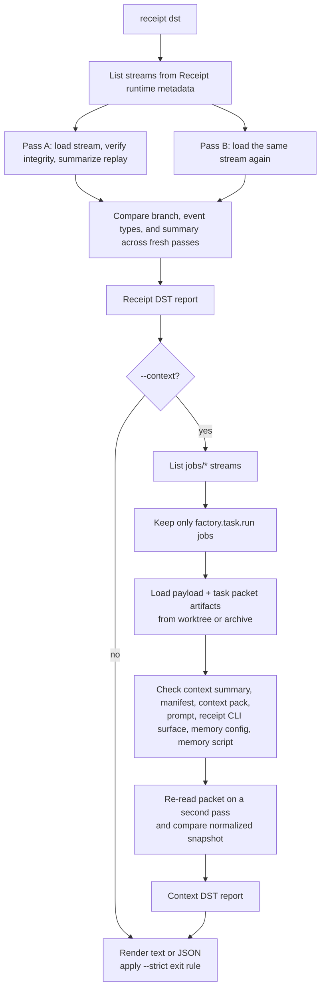

# Receipt DST

Status: Current implementation notes  
Audience: Engineering  
Scope: How `receipt dst` works today for receipt streams and Factory worker context packets

## Purpose

`receipt dst` is the repo's built-in audit pass for two related questions:

- are receipt streams structurally valid and replayable?
- for Factory task runs, did the worker packet stay internally consistent across payload, context summary, manifest, context pack, prompt, receipt CLI surface, and memory config?

This document describes the implementation that exists in code today.

It covers:

- the base receipt-stream audit
- the optional Factory context audit behind `--context`
- what `--strict` means
- where the audit gets its data
- what it can and cannot prove

The repo uses the term "DST audit" in code and CLI output. This document keeps that term as-is instead of inventing a different expansion.

## CLI Surface

Base audit:

```bash
receipt dst
receipt dst --json
receipt dst --strict
receipt dst factory/objectives/
```

Context-aware Factory audit:

```bash
receipt dst --context
receipt dst --context --json
receipt dst --context --strict
receipt dst jobs/ --context
```

Current behavior:

- without `--context`, the command audits receipt streams only
- with `--context`, it still audits receipt streams and also adds a `context` section for historical `factory.task.run` jobs
- with `--strict`, any receipt or context failure exits non-zero

## High-Level Flow



## Base Receipt DST

The base implementation is in [`src/cli/dst.ts`](/Users/kishore/receipt/src/cli/dst.ts).

It works per stream:

1. List streams from the runtime metadata store.
2. Load the chain, branch metadata, and `runtime.verify(stream)`.
3. Classify the stream as one of:
   - `factory.objective`
   - `job`
   - `agent.history`
   - `agent.control`
   - `generic`
4. Build a summary from replayed receipts.
5. Load the same stream again in a second fresh pass.
6. Compare the first and second pass summaries for deterministic stability.

The base report tracks three separate dimensions:

- `integrity`
  - did the receipt chain pass runtime verification?
- `replay`
  - could the stream be loaded and summarized at all?
- `deterministic`
  - did two fresh audit passes produce the same branch metadata, event-type counts, and summary?

### What base DST proves

- the stream is append-valid
- the stream can still be replayed now
- the replay-derived summary is stable across fresh reads when the stream is not actively changing
- empty historical Factory objective streams and legacy objective events that the current reducer no longer understands do not automatically fail the replay summary pass

### What base DST does not prove

- that every projection in SQLite matches the receipts
- that every referenced artifact file still exists
- that a worker actually consumed the prompt or packet it was given

## Stream Classification And Replay Summaries

Base DST does not just say "ok" or "broken". It also summarizes the stream by replaying it with the same reducer logic the runtime uses elsewhere.

Current summary modes:

- `factory.objective`
  - objective status, task count, candidate count, integration status, latest summary
- `job`
  - job count, status counts, latest job id and status
- `agent.history`
  - run count, run status counts, tool call count, final response count
- `agent.control`
  - run lifecycle, action selection counts, failure state
- `generic`
  - top event types and distinct run ids

That means `receipt dst` is not a raw file checker. It is a replay checker that also produces operational summaries.

## Determinism In Base DST

The deterministic check is intentionally simple:

- read the same stream twice
- compare:
  - branch metadata
  - event-type counts
  - replay-derived summary

This catches cases where:

- stream reads are unstable
- replay behavior depends on ambient mutable state
- the stream changed between audit passes

Important limitation:

- an actively mutating stream can legitimately fail the deterministic check during a live audit window

For example, a memory stream that is still being written can change between pass A and pass B even when nothing is logically corrupted.

## Factory Context DST

The optional Factory context audit is implemented in [`src/cli/dst-context.ts`](/Users/kishore/receipt/src/cli/dst-context.ts).

It exists because the most critical worker context is not stored inside the receipt stream itself. Factory workers read a materialized packet made of files such as:

- `*.context.md`
- `*.manifest.json`
- `*.context-pack.json`
- `*.prompt.md`
- `*.receipt-cli.md`
- `*.memory-scopes.json`
- `*.memory.cjs`

Those files are the actual worker bootstrap surface, so plain stream replay is not enough to audit them.

### How context DST selects runs

It scans `jobs/*` streams and keeps only jobs whose payload kind is:

```text
factory.task.run
```

For each matching job, it loads the parsed task run through [`src/factory-cli/parse/index.ts`](/Users/kishore/receipt/src/factory-cli/parse/index.ts).

### What context DST checks

For each task run, it verifies:

- required packet artifacts exist
- the job payload matches the context summary and receipt CLI surface paths when present
- the job payload matches the manifest
- the job payload matches the context pack
- the job payload matches the memory config
- the prompt includes the bootstrap contract:
  - task context summary
  - manifest
  - context pack
  - memory script
  - receipt CLI surface
  - `AGENTS.md`
  - `skills/factory-receipt-worker/SKILL.md`
- helper-first and cloud-context sections appear when the packet says they should
- live `steer` and `follow_up` guidance messages are present in the rendered prompt when queued commands existed
- a second fresh read of the same packet produces the same normalized snapshot

### Historical compatibility warnings

Context DST does not treat every older packet wording difference as a hard failure.

Several kinds of historical drift are downgraded to warnings instead of integrity failures, including:

- older prompt wording for the bootstrap contract
- older prompt section headings for operator guidance, helper-first execution, or live cloud context
- historical absolute packet paths stored in memory config files
- normalized skill-path or artifact-ref formatting drift between older manifests, context packs, and the current payload shape

Hard failures are therefore reserved for missing artifacts, real payload-to-packet disagreement, or unstable packet rereads.

### Context summary metrics

The context report also summarizes each audited run with:

- profile id
- helper count
- recent receipt count
- objective-wide receipt count
- memory scope count
- repo skill count
- cloud provider
- live guidance count

## Durable Packet Archive

One production problem with historical context auditing is that old worktrees get cleaned up.

If the worktree disappears, the original task packet files disappear with it, even though the receipts remain.

To make future runs auditable after cleanup, the runtime now archives each task packet under:

```text
<DATA_DIR>/factory/task-packets/<jobId>/
```

The archive implementation is in [`src/services/factory-task-packet-archive.ts`](/Users/kishore/receipt/src/services/factory-task-packet-archive.ts).

It preserves:

- context summary
- manifest
- context pack
- prompt
- receipt CLI surface
- memory config
- memory script

The runtime writes the archive from [`src/services/factory/runtime/service.ts`](/Users/kishore/receipt/src/services/factory/runtime/service.ts) at dispatch and again when rendering the actual prompt passed to Codex.

The parse layer prefers live worktree files when they still exist, and falls back to the archive when they do not.

## Why Prompt Archiving Matters

The prompt is not equivalent to the manifest or context pack.

The runtime renders the final worker prompt late, after:

- task state lookup
- helper selection
- cloud context shaping
- live operator guidance injection

Because of that, prompt correctness must be audited from the actual rendered prompt, not inferred from the packet alone.

Archiving the prompt gives context DST a durable copy of what the worker actually received.

## Known Limitation For Old Runs

Historical runs that predate the packet archive may still fail context DST after workspace cleanup.

Typical failure shape:

- receipts still exist
- job payload still exists
- worktree packet files are gone
- archive files do not exist because the run happened before archiving was added

In that case, context DST correctly reports missing packet artifacts.

That means:

- old runs may be unauditable for worker-context correctness
- new runs should become auditable after cleanup because the archive persists the packet

## `--strict` Behavior

`receipt dst --strict` exits non-zero when any of these are non-zero:

- `integrityFailures`
- `replayFailures`
- `deterministicFailures`
- `context.integrityFailures`
- `context.replayFailures`
- `context.deterministicFailures`

This makes it usable as a CI or deployment gate.

## Reading The Output

Text mode gives:

- global receipt audit counts
- failing streams first
- top stream summaries
- optional Factory context section when `--context` is enabled
- hard failures only; compatibility warnings stay in JSON output

JSON mode gives one top-level report with:

- base receipt audit fields
- `streams`
- optional `context`

The `context` object contains:

- aggregate failure counts
- per-status counts
- one entry per audited `factory.task.run`
- per-run `warnings` for tolerated historical drift
- per-run `issues` for hard integrity problems

## Code Map

Core files:

- [`src/cli/dst.ts`](/Users/kishore/receipt/src/cli/dst.ts)
- [`src/cli/dst-context.ts`](/Users/kishore/receipt/src/cli/dst-context.ts)
- [`src/cli/commands.ts`](/Users/kishore/receipt/src/cli/commands.ts)

Supporting files:

- [`src/factory-cli/parse/index.ts`](/Users/kishore/receipt/src/factory-cli/parse/index.ts)
- [`src/services/factory-task-packet-archive.ts`](/Users/kishore/receipt/src/services/factory-task-packet-archive.ts)
- [`src/services/factory/runtime/service.ts`](/Users/kishore/receipt/src/services/factory/runtime/service.ts)

Tests:

- [`tests/smoke/receipt-dst.test.ts`](/Users/kishore/receipt/tests/smoke/receipt-dst.test.ts)

## Practical Guidance

Use plain receipt DST when you want to know:

- whether receipt streams are healthy
- whether replay is stable
- whether the live store has integrity problems

Use context DST when you want to know:

- whether a Factory worker packet was internally consistent
- whether steer and follow-up guidance made it into the actual prompt
- whether future historical task runs will remain auditable after cleanup

Use both before production changes to Factory runtime, packet shaping, or cleanup behavior.
