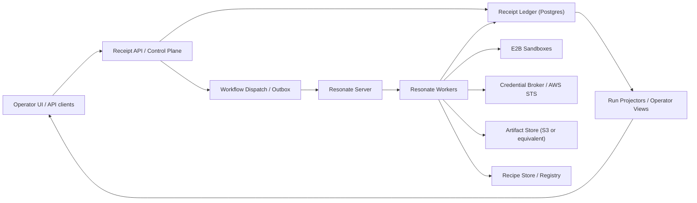
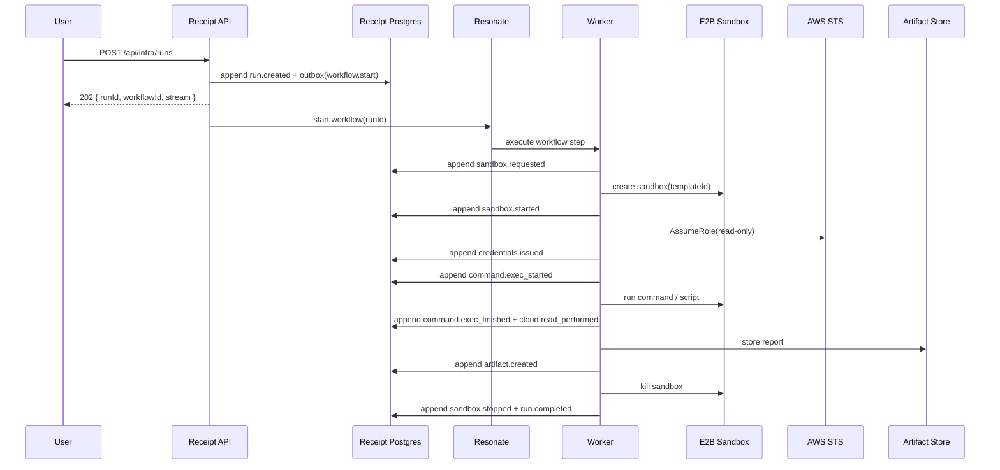
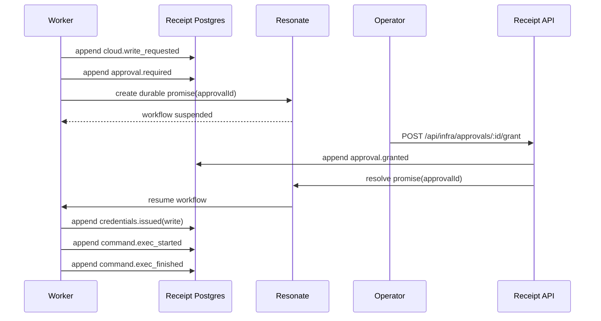
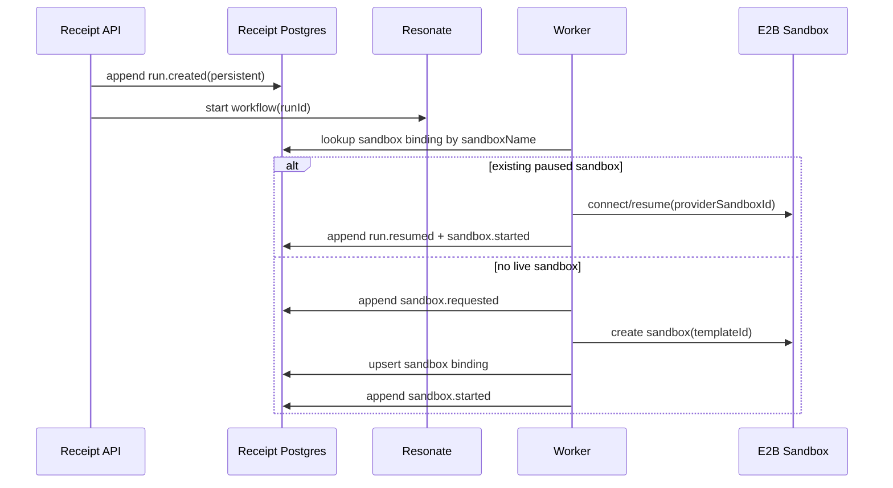
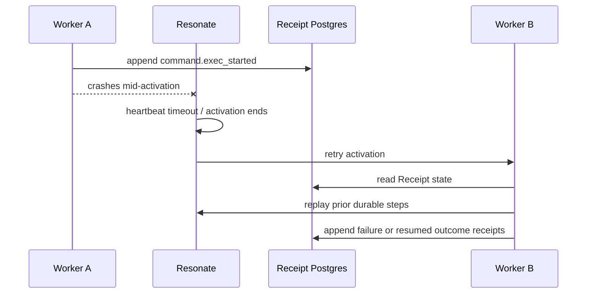

# Production RFC: Receipt Runtime with Resonate and E2B

Status: Proposed architecture  
Audience: Engineering, product, operations  
Decision date: 2026-03-08  
Scope: Production-grade infrastructure-agent runtime for Receipt

## Executive Summary

Receipt should remain the canonical system of record for long-running agent runs.

That is the product.

For production quality, Receipt should stop relying on:

- JSONL append files as the primary receipt store
- in-process stream locks for coordination
- host-local shell and filesystem execution as the default agent runtime

Instead, the production architecture should adopt:

- `Postgres` as the authoritative receipt and metadata store
- `Resonate` as the durable orchestration layer for retries, waits, worker recovery, and human-in-the-loop pauses
- `E2B` as the sandbox execution layer
- `AWS STS AssumeRole` as the short-lived credential mechanism
- object storage for artifacts

The core rule is:

> Receipt owns durable run truth.  
> Resonate owns durable workflow execution.  
> E2B owns isolated execution cells.  
> The sandbox is never the source of truth.

This document is intentionally opinionated. It is not a neutral comparison memo. It defines the chosen architecture and the contracts needed to build it in this repo without losing Receipt's core value: append-only, replayable, inspectable runs.

### Why this change is required

The current repo is a strong prototype. It already demonstrates:

- append-only receipts
- replay and branch/fork semantics
- job leases and heartbeats
- live operator projections
- agent orchestration and sub-run coordination

But the current implementation is not production-grade for an infrastructure runtime because:

- `src/core/runtime.ts` uses in-memory stream locks, so coordination is per-process only
- `src/adapters/jsonl.ts` persists receipts to local JSONL files rather than a replicated database
- `src/agents/agent.ts` executes tools against the host filesystem and local shell
- failure recovery is tied to one server process and local disk

Those constraints are acceptable for a prototype, but not for a multi-run, operator-facing, cloud-inspecting runtime.

### What stays as Receipt product core

Receipt still owns:

- run identity
- receipt append semantics
- branching and replay
- operator-visible audit history
- projections and inspection
- approval policy
- artifact metadata
- recipe metadata

Resonate is introduced to avoid rebuilding durable workflow execution from scratch. It is not introduced to replace Receipt's domain ledger.

### Non-goals

This RFC does not require:

- immediate migration of every existing agent path to Resonate
- replacing the current JSONL path for local development on day one
- broad multi-cloud write automation in the first milestone
- making E2B sandbox IDs the canonical identity of persistent workspaces

## Current Repo State

This section grounds the production architecture in the code that exists today.

### Existing strengths

Receipt already has several of the right primitives:

- receipt-native streams and replay in `src/core/runtime.ts`
- JSONL receipt storage and branch metadata in `src/adapters/jsonl.ts`
- indexed JSONL reads in `src/adapters/jsonl-indexed.ts`
- receipt-native queue lifecycle in `src/adapters/jsonl-queue.ts`
- job worker leases and heartbeats in `src/engine/runtime/job-worker.ts`
- receipt-based approval precedent in `src/modules/self-improvement.ts`
- operator SSE fanout in `src/framework/sse-hub.ts`
- monitor and receipt-inspection UI surfaces in `src/agents/monitor.agent.ts` and `src/views/receipt.ts`

Those are not throwaway ideas. The production system should preserve them.

### Current implementation limits

| Area | Current repo behavior | Why it is not production-grade |
| --- | --- | --- |
| Receipt durability | Local JSONL files keyed by stream in `src/adapters/jsonl.ts` | Local disk is not the right primary ledger for HA or multi-node coordination |
| Concurrency control | In-memory `streamLocks` in `src/core/runtime.ts` | Only safe inside one process; no cross-node append ordering |
| Queue durability | Receipt-native queue in JSONL | Useful design, but tied to the same local-disk and single-process assumptions |
| Execution environment | Built-in tools run on host filesystem and host shell in `src/agents/agent.ts` | Unsafe for production multi-tenant or cloud-executing agents |
| Sandboxing | No first-class sandbox provider abstraction | Infrastructure tasks need isolated execution cells |
| Credentials | No dedicated short-lived cloud credential broker | Production cloud access must be run-scoped and auditable |
| Artifacts | Some artifact concepts exist in self-improvement flows, but no general artifact store | Infra runs need reports, plans, logs, bundles, and reusable outputs |
| Persistent reuse | Workspace reuse is local and process-oriented | Reuse must outlive any one host or sandbox |

### Summary of current-state decision

The current repo should be treated as:

- a strong prototype of the Receipt model
- a good local-dev runtime
- not yet the production substrate for infrastructure automation

The production architecture should preserve the model and replace the weak operational assumptions.

## Decision and Ownership

### Chosen production stack

- `Receipt` for domain truth and replay
- `Postgres` for durable ledger and metadata
- `Resonate` for workflow durability
- `E2B` for sandbox execution
- `AWS STS` for temporary cloud credentials
- object storage for artifacts

### Ownership matrix

| Concern | Owner | Notes |
| --- | --- | --- |
| Run creation and identity | Receipt | `runId` is Receipt-owned |
| Receipt append ordering | Receipt + Postgres | Must be transactional and authoritative |
| Replay and branch/fork semantics | Receipt | User-facing source of truth |
| Workflow retries and waits | Resonate | Includes long waits, retries, worker reassignment |
| Human approval blocking | Resonate + Receipt | Resonate suspends; Receipt records the approval receipts |
| Sandboxes | E2B | Execution cells only |
| Persistent sandbox binding | Receipt | Logical sandbox name is canonical; provider ID is not |
| Cloud credential issuance | Credential broker using AWS STS | Run-scoped, read-only by default |
| Artifact storage | Object storage + Receipt metadata | Blob lives in object store; index lives in Receipt |
| Recipe promotion | Receipt + recipe store | Promoted outputs become reusable assets |
| Operator projection | Receipt | UI should read from Receipt projections, not Resonate internals |

### Key architectural invariant

If Resonate and Receipt disagree, Receipt is authoritative for domain history.

That means:

- operators inspect Receipt receipts
- replay is defined by Receipt
- branches are defined by Receipt
- artifacts and recipes are indexed by Receipt

Resonate state is operationally necessary, but not the user-facing audit ledger.

### Important inference from official sources

Official Resonate deployment guidance says:

- the server coordinates work and stores durable promise state
- workers are stateless and execute code
- production state lives in Postgres
- one server coordinates many workers

Inference:

Resonate is an excellent fit for workflow execution, but if Receipt's product value is durable run history, Receipt must mirror every meaningful workflow transition into its own ledger. Otherwise the true state of a run would drift into Resonate internals.

## Architecture Overview

### High-level component diagram



### Control-plane responsibilities

The `Receipt API / Control Plane` is responsible for:

- creating the run
- appending the initial receipts
- writing outbox messages
- serving projections
- resolving approvals
- enforcing tenancy and auth

The `Resonate Server` is responsible for:

- durable workflow state
- scheduling work to workers
- durable waits and promise resolution
- resuming work after crash or restart

The `Resonate Workers` are responsible for:

- evaluating workflow logic
- calling provider adapters
- appending receipts before and after side effects

### Sequence: disposable AWS read-only run



### Sequence: approval-gated write-intent run



### Sequence: persistent named sandbox resume



### Sequence: worker crash and recovery



## Canonical Data Model

### Core identifiers

| Identifier | Owner | Stability | Notes |
| --- | --- | --- | --- |
| `runId` | Receipt | Stable | Primary domain identifier |
| `stream` | Receipt | Stable | Canonical run stream name |
| `workflowId` | Resonate, derived from Receipt | Stable | Equal to `runId` for the primary workflow |
| `sandboxName` | Receipt | Stable | Logical identity for persistent sandbox reuse |
| `providerSandboxId` | E2B | Replaceable | Operational handle, not domain identity |
| `artifactId` | Receipt | Stable | Metadata ID; blob key may differ |
| `approvalId` | Receipt | Stable | Also used as deterministic Resonate promise ID |
| `recipeId` | Receipt | Stable | Logical reusable automation asset |

### Stream family

For compatibility with existing Receipt conventions, infra runs should use:

- index stream: `agents/infra`
- run stream: `agents/infra/runs/<runId>`
- branch stream: `agents/infra/runs/<runId>/branches/<branchId>`
- sub-run stream: `agents/infra/runs/<runId>/sub/<subRunId>`

This keeps the new runtime aligned with the existing monitor, trace, and replay mental model.

### Postgres tables

The exact schema may evolve, but the production system should include at least these logical tables.

#### `streams`

| Column | Purpose |
| --- | --- |
| `stream_id` | Surrogate key |
| `stream_name` | Canonical stream path |
| `kind` | `index`, `run`, `branch`, `sub_run`, `memory`, etc. |
| `created_at` | Creation time |

#### `stream_heads`

| Column | Purpose |
| --- | --- |
| `stream_id` | FK to `streams` |
| `head_seq` | Latest append sequence |
| `head_hash` | Latest receipt hash |
| `updated_at` | Last append time |

#### `receipts`

| Column | Purpose |
| --- | --- |
| `receipt_id` | Stable receipt ID |
| `stream_id` | FK to `streams` |
| `seq` | Monotonic per-stream order |
| `event_id` | Idempotency key for append |
| `prev_receipt_id` | Optional explicit chain link |
| `prev_hash` | Previous hash |
| `hash` | Current canonical hash |
| `type` | Event type |
| `body_json` | Event payload |
| `recorded_at` | Durable append time |
| `occurred_at` | Domain event time, if distinct |
| `tenant_id` | Tenancy boundary |
| `workflow_id` | Resonate correlation |
| `causation_id` | Optional upstream event correlation |

#### `branches`

| Column | Purpose |
| --- | --- |
| `branch_name` | Branch stream name |
| `parent_stream_id` | Parent stream |
| `fork_at_seq` | Parent prefix length |
| `created_at` | Branch creation time |

#### `runs`

| Column | Purpose |
| --- | --- |
| `run_id` | Primary domain ID |
| `stream_id` | Canonical run stream |
| `status` | `queued`, `running`, `waiting_approval`, `completed`, `failed`, `canceled` |
| `workflow_id` | Primary Resonate workflow |
| `sandbox_mode` | `disposable` or `persistent` |
| `sandbox_name` | Optional logical sandbox identity |
| `cloud` | `aws` in the first production slice |
| `credential_mode` | `read_only` or `write` |
| `tenant_id` | Tenant boundary |
| `created_at` | Created time |
| `updated_at` | Last status update |

#### `sandbox_bindings`

| Column | Purpose |
| --- | --- |
| `sandbox_name` | Logical stable name |
| `provider` | `e2b` |
| `provider_sandbox_id` | Current operational sandbox handle |
| `template_id` | E2B template |
| `snapshot_id` | Optional provider snapshot reference |
| `state` | `running`, `paused`, `killed`, `unknown` |
| `workspace_ref` | Durable workspace volume reference |
| `cache_ref` | Durable cache reference |
| `context_ref` | Durable context reference |
| `last_seen_at` | Last successful provider contact |

#### `approvals`

| Column | Purpose |
| --- | --- |
| `approval_id` | Domain approval ID |
| `run_id` | Owning run |
| `scope` | `cloud.write`, `git.push`, `terraform.apply`, etc. |
| `status` | `required`, `granted`, `denied`, `expired`, `canceled` |
| `promise_id` | Deterministic Resonate promise ID |
| `requested_by` | Agent or system actor |
| `resolved_by` | Operator or system actor |
| `requested_at` | Creation time |
| `resolved_at` | Resolution time |

#### `artifacts`

| Column | Purpose |
| --- | --- |
| `artifact_id` | Stable metadata ID |
| `run_id` | Source run |
| `kind` | `report`, `plan`, `stdout`, `stderr`, `script`, `bundle`, `log` |
| `uri` | Object store URI |
| `content_hash` | Dedup and integrity |
| `size_bytes` | Display and limits |
| `created_from_receipt_id` | Audit link |
| `metadata_json` | Labels, mime type, retention |

#### `recipes`

| Column | Purpose |
| --- | --- |
| `recipe_id` | Stable logical ID |
| `family` | `aws.inventory`, `gcp.idle-disk`, etc. |
| `version` | Version string or content hash |
| `source_run_id` | Source run |
| `artifact_id` | Source artifact |
| `status` | `active`, `deprecated`, `superseded` |
| `metadata_json` | Discovery metadata |

#### `workflow_outbox`

| Column | Purpose |
| --- | --- |
| `message_id` | Outbox idempotency key |
| `kind` | `workflow.start`, `approval.resolve`, `projection.refresh` |
| `payload_json` | Dispatch payload |
| `status` | `pending`, `sent`, `failed` |
| `created_at` | Creation time |
| `sent_at` | Dispatch time |

### Data-model rules

1. Receipt streams are authoritative for run history.
2. Resonate workflow state is operational state, not the audit ledger.
3. `sandboxName` is canonical for persistent reuse; `providerSandboxId` is replaceable.
4. Artifacts and recipes are first-class metadata records, not just files on disk.
5. Every operator-facing object must be traceable back to a run and a receipt.

## Event Taxonomy

The infra runtime needs its own receipt taxonomy.

### Run lifecycle

- `run.created`
- `run.resumed`
- `run.paused`
- `run.completed`
- `run.failed`
- `run.canceled`

### Sandbox lifecycle

- `sandbox.requested`
- `sandbox.started`
- `sandbox.resumed`
- `sandbox.paused`
- `sandbox.stopped`
- `sandbox.killed`
- `snapshot.selected`
- `snapshot.created`

### Volume lifecycle

- `volume.hydrate.started`
- `volume.hydrate.finished`
- `volume.persist.started`
- `volume.persist.finished`

### Credentials

- `credentials.issued`
- `credentials.revoked`
- `credentials.issue_failed`

### Agent execution

- `agent.mode_set`
- `file.written`
- `command.exec_started`
- `command.exec_finished`

### Cloud interaction

- `cloud.read_performed`
- `cloud.write_requested`
- `cloud.write_performed`

### Approval lifecycle

- `approval.required`
- `approval.granted`
- `approval.denied`
- `approval.expired`

### Outputs

- `artifact.created`
- `artifact.promoted`
- `recipe.promoted`

### Workflow coordination

- `workflow.checkpointed`
- `workflow.recovered`

### Failure

- `failure.reported`

### Event shape rules

Every event should include:

- `runId`
- `agentId` or `actor`
- enough metadata to explain what changed
- references to artifacts rather than large embedded payloads

Large stdout, stderr, report bodies, or generated scripts should live in artifacts and be linked from receipts, not embedded inline.

### Recommended representative payloads

```ts
type RunCreated = {
  type: "run.created";
  runId: string;
  stream: string;
  workflowId: string;
  sandboxMode: "disposable" | "persistent";
  sandboxName?: string;
  cloud: "aws";
  credentialMode: "read_only" | "write";
  prompt: string;
};

type ApprovalRequired = {
  type: "approval.required";
  runId: string;
  approvalId: string;
  scope: "cloud.write" | "git.push" | "terraform.apply";
  reason: string;
  requestedBy: string;
  promiseId: string;
};

type CommandExecFinished = {
  type: "command.exec_finished";
  runId: string;
  commandId: string;
  exitCode: number;
  durationMs: number;
  stdoutArtifactId?: string;
  stderrArtifactId?: string;
};
```

## Orchestration Contract

### Core rule

Every meaningful workflow transition must be mirrored into Receipt receipts.

Resonate is allowed to coordinate work. It is not allowed to become the sole observable state of the run.

### Mandatory orchestration rules

1. The API creates the run by appending `run.created` before starting the workflow.
2. Workflow start is dispatched via transactional outbox, not best-effort inline fire-and-forget.
3. Before any external side effect begins, the worker appends the intent receipt when that intent matters for audit or recovery.
4. After any external side effect succeeds, the worker appends the outcome receipt.
5. If a side effect fails after an intent receipt exists, the worker appends a failure receipt instead of silently retrying forever.
6. Approval waits must use deterministic `approvalId` / `promiseId` pairs.
7. Workflow recovery must reread Receipt state before continuing any step that could duplicate work.

### Step mapping

| Operation | Pre-receipt | Resonate primitive | Side effect | Post-receipt | Idempotency key |
| --- | --- | --- | --- | --- | --- |
| Start run | `run.created` | workflow start | dispatch workflow | none | `runId` |
| Start sandbox | `sandbox.requested` | `ctx.run` | call E2B create/connect | `sandbox.started` or failure | `runId + sandboxName + generation` |
| Issue credentials | none or intent optional | `ctx.run` | call STS AssumeRole | `credentials.issued` | `runId + credentialMode + scope` |
| Execute command | `command.exec_started` | `ctx.run` | call sandbox command | `command.exec_finished` | `commandId` |
| Wait approval | `approval.required` | `ctx.promise` | suspend | `approval.granted` or `approval.denied` | `approvalId` |
| Store artifact | none or intent optional | `ctx.run` | upload object | `artifact.created` | `artifactId` |
| Promote recipe | none or intent optional | `ctx.run` | registry write | `recipe.promoted` | `recipeId + version` |

### Why this mapping matters

Receipt must be able to answer:

- what happened
- what was about to happen
- what actually succeeded
- which steps were retried
- which operator approval unblocked the write

That is only possible if the workflow is mirrored into the ledger.

## Storage and Consistency

### Primary storage decision

Use Postgres as the primary Receipt ledger.

Reasons:

- production durability and backups
- cross-process concurrency control
- easy alignment with Resonate's production store
- simpler operations than a separate event-store product in v1

### Append contract

Receipt appends must be:

- transactional
- per-stream ordered
- idempotent by `event_id`
- concurrency-checked against the current stream head

### Recommended append protocol

1. Start DB transaction.
2. Lock or update the `stream_heads` row for the target stream.
3. Verify expected stream head or previous sequence if provided.
4. Insert the new receipt with `seq = head_seq + 1`.
5. Update `stream_heads`.
6. Commit.

If the transaction fails due to concurrency, the caller must reload state and decide whether to retry.

### Dispatch rule: outbox, not inline side effects

API writes that create or resume workflows must use a transactional outbox:

- append `run.created`
- upsert run metadata
- insert outbox message `workflow.start`
- commit
- outbox dispatcher starts the Resonate workflow

This avoids the classic gap where the run is recorded but the workflow never starts, or vice versa.

### Retry rules

1. Workflow retries must be safe to replay.
2. Every external side effect must have a deterministic idempotency key.
3. Workers must check existing Receipt state before redoing a step.
4. Write-capable cloud operations must only auto-retry when the cloud API or wrapper is itself idempotent.

### Projection model

Projections are disposable caches derived from receipts.

Operator UI should read:

- stable run projections
- approval projections
- artifact listings
- recipe listings

But any projection can be rebuilt from Receipt receipts.

## Sandbox Model

### Two modes

#### Disposable sandbox

Use for:

- one-off inventory questions
- fresh verification
- clean-room runs
- risky commands needing reset

Properties:

- created from an E2B template or snapshot
- receives hydrated durable state
- destroyed at end of run

#### Persistent named sandbox

Use for:

- ongoing investigations
- iterative script development
- operator-supervised sessions
- warm workspace reuse

Properties:

- bound to stable `sandboxName`
- may be paused and resumed
- may rotate provider sandbox ID over time

### Canonical identity rule

`sandboxName` is the stable domain identity.

`providerSandboxId` is an operational handle.

Why:

- E2B pause/resume may keep the same sandbox ID, but that is a provider behavior, not our domain contract
- a persistent investigation may need provider replacement while keeping the same logical workspace
- operators care about the named investigation, not a provider-generated ID

### State classes

#### Durable

- `/workspace`
- `/context`
- `/artifacts`
- `/recipes`

#### Non-authoritative but reusable

- `/cache`

`/cache` may be persisted selectively, but it is explicitly not part of canonical replay.

#### Ephemeral

- AWS credentials
- approval tokens
- run-scoped env vars
- temporary process state

### E2B-specific operating assumptions

Official E2B docs support the following decisions:

- templates can preload tools and start commands
- sandboxes support command execution
- filesystem upload/download is supported
- snapshots can capture a running sandbox
- pause/resume preserves filesystem and memory state
- env vars can be injected at sandbox or per-command scope

Production consequence:

E2B is a good execution substrate, but Receipt should still own the logical description of mounted state and reuse.

## Credentials and Security

### Credential model

Use `AWS STS AssumeRole` for run-scoped temporary credentials.

Default mode:

- read-only

Escalated mode:

- write-capable only after approval

### STS requirements

Every assumed session should include:

- deterministic role session name tied to `runId`
- session tags carrying tenant and run context
- source identity tied to the operator or workflow identity

Recommended tags:

- `ReceiptRunId`
- `ReceiptTenantId`
- `ReceiptWorkflowId`
- `ReceiptSandboxName` when applicable

### Security rules

1. No long-lived cloud credentials in E2B templates.
2. No shared-volume persistence of secret material.
3. Command-scoped env vars are preferred for sensitive values.
4. Approval is mandatory before write-capable credentials are issued.
5. Approval receipts must record who approved, what was approved, and why.
6. Cloud access should be attributable in AWS logs through source identity and session tags.

### Operator-visible approvals

Approvals must be explicit, not inferred.

The operator should see:

- the requested action
- the target account or scope
- the reason
- the exact run requesting it
- the approval outcome

## Artifacts and Recipes

### Artifacts

Artifacts are durable outputs of a run. Examples:

- cost report
- inventory CSV
- Terraform plan
- stdout/stderr bundle
- generated script
- operator summary

Rules:

- store blobs in object storage
- store metadata in Receipt
- reference artifacts from receipts instead of embedding large outputs

### Recipes

A recipe is a reusable automation promoted from a successful or useful run.

Examples:

- AWS inventory script
- cost-analysis normalizer
- Terraform plan wrapper
- tagging audit script

Rules:

- recipes must outlive any one sandbox
- recipe discovery is by metadata, not only by file path
- every recipe must link back to its source run and source artifact

### Promotion rules

A worker may promote a recipe only when:

- the output is useful beyond the current run
- the artifact is durably stored
- the recipe metadata write succeeds
- the run appends `recipe.promoted`

## Public APIs

The first production API surface should be explicit and narrow.

### Start a run

`POST /api/infra/runs`

Request:

```json
{
  "prompt": "What EC2 instances are running in account 123456789012?",
  "cloud": "aws",
  "sandboxMode": "disposable",
  "credentialMode": "read_only",
  "templateId": "receipt-aws-base",
  "sandboxName": null,
  "stream": "agents/infra",
  "contextRefs": [],
  "volumeBindings": {
    "workspace": "tenant_a/workspace/default",
    "context": "tenant_a/context/default",
    "artifacts": "tenant_a/artifacts/default",
    "recipes": "tenant_a/recipes/default"
  }
}
```

Response:

```json
{
  "ok": true,
  "runId": "run_01H...",
  "stream": "agents/infra/runs/run_01H...",
  "workflowId": "run_01H...",
  "status": "queued"
}
```

### Get a run

`GET /api/infra/runs/:runId`

Response should include:

- run summary
- current status
- active approval, if any
- active sandbox binding, if any
- artifact summary

### Stream events

`GET /api/infra/runs/:runId/events`

This is the operator-facing event stream for the run.

### Grant approval

`POST /api/infra/approvals/:approvalId/grant`

Request:

```json
{
  "note": "Approved for one-time write in dev account",
  "approvedBy": "operator@example.com"
}
```

### Deny approval

`POST /api/infra/approvals/:approvalId/deny`

Request:

```json
{
  "note": "Write access denied outside change window",
  "deniedBy": "operator@example.com"
}
```

### List artifacts

`GET /api/infra/runs/:runId/artifacts`

### Get artifact

`GET /api/infra/artifacts/:artifactId`

### Discover recipes

`GET /api/infra/recipes?family=aws.inventory&cloud=aws`

### Recommended operator control

Also expose:

- `POST /api/infra/runs/:runId/cancel`

Even though it is not the first user story, a production operator runtime needs explicit cancelation.

## Internal Interfaces

The following interfaces should exist in code, even if the first implementation is narrow.

### `RunLedger`

```ts
type ReceiptBody = Record<string, unknown>;

type AppendReceiptInput = {
  stream: string;
  eventId: string;
  type: string;
  body: ReceiptBody;
  expectedHeadSeq?: number;
  workflowId?: string;
  causationId?: string;
  occurredAt?: Date;
};

interface RunLedger {
  createRun(input: {
    runId: string;
    stream: string;
    initialEvent: AppendReceiptInput;
    metadata: Record<string, unknown>;
  }): Promise<void>;

  append(input: AppendReceiptInput): Promise<{
    receiptId: string;
    seq: number;
    hash: string;
  }>;

  readStream(stream: string, opts?: {
    afterSeq?: number;
    limit?: number;
  }): Promise<ReadonlyArray<unknown>>;

  fork(input: {
    parentStream: string;
    forkAtSeq: number;
    branchStream: string;
  }): Promise<void>;

  projectRun(runId: string): Promise<Record<string, unknown>>;
}
```

### `SandboxProvider`

```ts
interface SandboxProvider {
  create(input: {
    templateId: string;
    envs?: Record<string, string>;
    metadata?: Record<string, string>;
  }): Promise<{
    providerSandboxId: string;
    templateId: string;
  }>;

  connect(providerSandboxId: string): Promise<void>;
  pause(providerSandboxId: string): Promise<void>;
  kill(providerSandboxId: string): Promise<void>;

  exec(input: {
    providerSandboxId: string;
    command: string;
    cwd?: string;
    envs?: Record<string, string>;
    timeoutMs?: number;
  }): Promise<{
    exitCode: number;
    stdout: string;
    stderr: string;
    durationMs: number;
  }>;

  upload(input: {
    providerSandboxId: string;
    path: string;
    content: Buffer | string;
  }): Promise<void>;

  download(input: {
    providerSandboxId: string;
    path: string;
  }): Promise<Buffer>;

  createSnapshot(providerSandboxId: string): Promise<{
    snapshotId: string;
  }>;
}
```

### `CredentialBroker`

```ts
interface CredentialBroker {
  issueAws(input: {
    runId: string;
    tenantId: string;
    mode: "read_only" | "write";
    roleArn: string;
    sessionTags: Record<string, string>;
    sourceIdentity: string;
    durationSeconds?: number;
  }): Promise<{
    accessKeyId: string;
    secretAccessKey: string;
    sessionToken: string;
    expiresAt: string;
  }>;
}
```

### `ArtifactStore`

```ts
interface ArtifactStore {
  put(input: {
    artifactId: string;
    kind: string;
    contentType: string;
    body: Buffer | string;
    metadata?: Record<string, string>;
  }): Promise<{
    uri: string;
    contentHash: string;
    sizeBytes: number;
  }>;

  get(artifactId: string): Promise<{
    uri: string;
    body?: Buffer;
  }>;
}
```

### `RecipeStore`

```ts
interface RecipeStore {
  promote(input: {
    recipeId: string;
    family: string;
    version: string;
    sourceRunId: string;
    artifactId: string;
    metadata?: Record<string, unknown>;
  }): Promise<void>;

  list(query?: {
    family?: string;
    cloud?: string;
  }): Promise<ReadonlyArray<Record<string, unknown>>>;
}
```

### `ApprovalService`

```ts
interface ApprovalService {
  require(input: {
    approvalId: string;
    runId: string;
    scope: string;
    reason: string;
    promiseId: string;
  }): Promise<void>;

  grant(input: {
    approvalId: string;
    approvedBy: string;
    note?: string;
  }): Promise<void>;

  deny(input: {
    approvalId: string;
    deniedBy: string;
    note?: string;
  }): Promise<void>;
}
```

### `RunProjector`

```ts
interface RunProjector {
  refreshRun(runId: string): Promise<void>;
  refreshApproval(approvalId: string): Promise<void>;
}
```

## Operational Model

### Observability

Instrument the system with OpenTelemetry.

Every trace should include:

- `run.id`
- `workflow.id`
- `stream`
- `sandbox.name`
- `provider.sandbox_id`
- `approval.id`
- `artifact.id`
- `tenant.id`

Metrics to expose:

- receipt append latency
- workflow step retry count
- worker activation recovery count
- sandbox startup time
- sandbox resume time
- approval wait duration
- artifact upload latency
- recipe promotion count

### Rate limits and tenancy

Every run must be tenant-scoped.

At minimum:

- tenant ID on all run, receipt, artifact, approval, and recipe records
- per-tenant concurrency limits
- per-tenant sandbox quotas
- per-tenant approval authority rules

### Failure classes

Use explicit failure classes in receipts and operational logs:

- `receipt_conflict`
- `workflow_dispatch_failed`
- `worker_recovered`
- `sandbox_start_failed`
- `sandbox_resume_failed`
- `credential_issue_failed`
- `command_timeout`
- `artifact_store_failed`
- `recipe_promotion_failed`
- `approval_denied`
- `approval_expired`
- `run_canceled`

### Retry policy

Retry automatically only for transient classes:

- provider network issues
- worker crash / lost activation
- temporary Postgres unavailability
- temporary object storage errors

Do not blindly retry:

- cloud write actions without strong idempotency guarantees
- approval-denied steps
- invalid credentials due to policy

### Cleanup policy

- disposable sandboxes must be killed at terminal completion
- persistent sandboxes may be paused when idle
- orphaned running sandboxes must be reconciled by periodic sweeper workflows
- artifact retention and recipe retention should be policy-driven, not ad hoc

## Alternatives Considered

### 1. Pure Receipt runtime in TypeScript without Resonate

Why it is attractive:

- purest expression of the Receipt model
- no external workflow engine
- full control of orchestration semantics

Why it was not selected now:

- we would need to rebuild durable waits, promise-style human approvals, activation recovery, crash-safe resumption, and distributed worker orchestration ourselves
- this delays the production move without adding product differentiation

Decision:

Keep Receipt as domain truth, but buy workflow durability.

### 2. Temporal

Why it is attractive:

- mature durable execution platform
- broad ecosystem and adoption

Why it was not selected now:

- heavier conceptual and operational surface than needed for the first production shape
- less aligned with the narrow goal of adding durable orchestration under a Receipt-owned ledger
- Resonate's simpler TypeScript story and promise-based HITL model are a better fit for the first cut

### 3. Elixir control plane

Why it is attractive:

- strong concurrency model
- OTP supervision is a good fit for orchestration

Why it was not selected now:

- the immediate blockers are storage, coordination, and sandbox abstraction, not language limits
- the current repo is already in TypeScript and should be hardened before a control-plane rewrite is justified

### 4. Full Elixir rewrite

Why it is attractive:

- potentially elegant long-term system

Why it was not selected now:

- highest migration cost
- abandons working Receipt runtime ideas and code while product requirements are still moving
- pushes infrastructure and operational unknowns later instead of resolving them now

## Validation and Failure Scenarios

The architecture is only acceptable if it survives the following scenarios.

### Workflow and worker failures

- worker crashes after `command.exec_started` but before `command.exec_finished`
- worker crashes while waiting on approval
- worker crashes after artifact upload but before `artifact.created`
- Resonate server restarts while many runs are waiting on promises

Expected behavior:

- work resumes from durable checkpoints
- no duplicate writes
- operator can still inspect the run through Receipt

### Database failures

- Postgres restart during append
- outbox message persisted but dispatcher crashes before send
- concurrent append conflict on the same run stream

Expected behavior:

- append retries are safe
- outbox guarantees eventual workflow dispatch
- no broken stream ordering

### Sandbox failures

- sandbox creation timeout
- sandbox killed externally mid-run
- paused sandbox cannot be resumed
- provider sandbox ID changes for a logical persistent workspace

Expected behavior:

- failure or replacement is visible in Receipt
- persistent named sandbox can be rebound

### Approval failures

- duplicate grant callback
- deny arrives after grant
- approval expires before operator action
- operator grants but worker recovery happens first

Expected behavior:

- deterministic `approvalId` prevents double-resolution
- final approval state is consistent and auditable

### Artifact and recipe failures

- artifact upload retries
- blob exists but metadata append failed
- metadata exists but blob upload failed
- recipe promotion retried

Expected behavior:

- deterministic artifact and recipe IDs prevent duplication
- reconciliation can repair partial states

### Replay guarantee

A completed run must still be explainable from Receipt alone even if:

- Resonate history is unavailable
- the sandbox no longer exists
- temporary credentials are expired

Replay will not reproduce the exact cloud environment, but it must reproduce the exact recorded decisions, commands, and outputs that were trusted.

## Implementation Appendix

This appendix is intended to become tickets.

### Phase 0: Production ledger foundations

Scope:

- introduce `RunLedger` abstraction
- add Postgres-backed receipt and metadata storage
- keep JSONL path for local development only
- add transactional outbox

Repo impact:

- new `src/adapters/postgres/`
- new receipt migration files
- `src/core/runtime.ts` split or wrapped behind ledger abstraction

Acceptance criteria:

- Postgres can append ordered receipts with idempotent `event_id`
- run creation and outbox dispatch are transactional
- replay from Postgres matches replay semantics from JSONL for equivalent test runs

### Phase 1: Infra domain and Resonate orchestration

Scope:

- add `infra` module and receipts
- add Resonate adapter
- start runs through Resonate workflows
- keep legacy JSONL queue for existing agents

Repo impact:

- new `src/modules/infra.ts`
- new `src/adapters/resonate.ts`
- new `src/engine/infra/`
- new infra API routes, likely `src/agents/infra.agent.ts`

Acceptance criteria:

- `POST /api/infra/runs` creates a Receipt run and starts a workflow
- worker restart does not lose run progress
- Receipt remains the operator-visible event stream

### Phase 2: Disposable AWS read-only sandboxes

Scope:

- add `SandboxProvider`
- add E2B adapter
- add AWS STS credential broker
- support one end-to-end AWS read-only inventory flow

Repo impact:

- new `src/adapters/e2b.ts`
- new `src/adapters/aws-sts.ts`
- execution abstraction extracted from `src/agents/agent.ts`

Acceptance criteria:

- run creates sandbox
- run issues read-only credentials
- run executes commands in sandbox
- run stores at least one artifact
- disposable sandbox is destroyed on completion

### Phase 3: Approvals, artifacts, and recipes

Scope:

- add approval APIs
- integrate Resonate promises
- add artifact metadata and object storage
- add recipe promotion and discovery

Repo impact:

- new approval routes
- new artifact store adapter
- new recipe store adapter
- monitor UI updates for pending approvals and artifacts

Acceptance criteria:

- workflow suspends cleanly on `approval.required`
- operator grant or deny is reflected in Receipt
- artifacts are downloadable
- promoted recipes are searchable

### Phase 4: Persistent named sandboxes

Scope:

- add `sandboxName` binding
- support pause/resume
- add sandbox sweeper and reconciliation jobs

Repo impact:

- sandbox registry tables and projector
- reconciliation worker

Acceptance criteria:

- a named persistent sandbox can be resumed on a later run
- the logical sandbox identity survives provider replacement
- persistent state is durable across runs

### Migration strategy from current repo

1. Preserve JSONL for local development and tests initially.
2. Introduce new infra runtime without rewriting existing theorem/writer/agent paths.
3. Reuse current monitor and receipt-inspection surfaces where possible.
4. Move generic abstractions back into shared code only after the infra path is stable.

This avoids a dangerous rewrite of unrelated agent paths.

## References

### Internal repo references

- `src/core/runtime.ts`
- `src/adapters/jsonl.ts`
- `src/adapters/jsonl-indexed.ts`
- `src/adapters/jsonl-queue.ts`
- `src/engine/runtime/job-worker.ts`
- `src/agents/agent.ts`
- `src/framework/sse-hub.ts`
- `src/modules/self-improvement.ts`
- `docs/api/streams.md`
- `architecture.md`

### Official external references

- [Resonate documentation](https://docs.resonatehq.io/)
- [Resonate constraints and gotchas](https://docs.resonatehq.io/develop/constraints)
- [Resonate TypeScript SDK](https://docs.resonatehq.io/develop/typescript)
- [Resonate deployment guide](https://docs.resonatehq.io/deploy/)
- [E2B documentation](https://e2b.dev/docs)
- [E2B filesystem docs](https://e2b.dev/docs/filesystem)
- [E2B upload docs](https://e2b.dev/docs/filesystem/upload)
- [E2B download docs](https://e2b.dev/docs/filesystem/download)
- [E2B sandbox snapshots](https://e2b.dev/docs/sandbox/snapshots)
- [E2B sandbox persistence](https://e2b.dev/docs/sandbox/persistence)
- [E2B sandbox environment variables](https://e2b.dev/docs/sandbox/environment-variables)
- [E2B sandbox template docs](https://e2b.dev/docs/sandbox-template)
- [E2B template internals](https://e2b.dev/docs/template/how-it-works)
- [AWS STS AssumeRole API](https://docs.aws.amazon.com/STS/latest/APIReference/API_AssumeRole.html)
- [AWS session tags](https://docs.aws.amazon.com/IAM/latest/UserGuide/id_session-tags.html)
- [AWS source identity guidance](https://docs.aws.amazon.com/IAM/latest/UserGuide/id_credentials_temp_control-access_monitor.html)

## Final Position

Receipt should be implemented as a production-grade runtime by hardening the ledger, not by abandoning the model.

Use Resonate to execute durable workflows.

Use E2B to run code safely.

Use Postgres to make receipt history durable.

But keep the product truth in Receipt.
