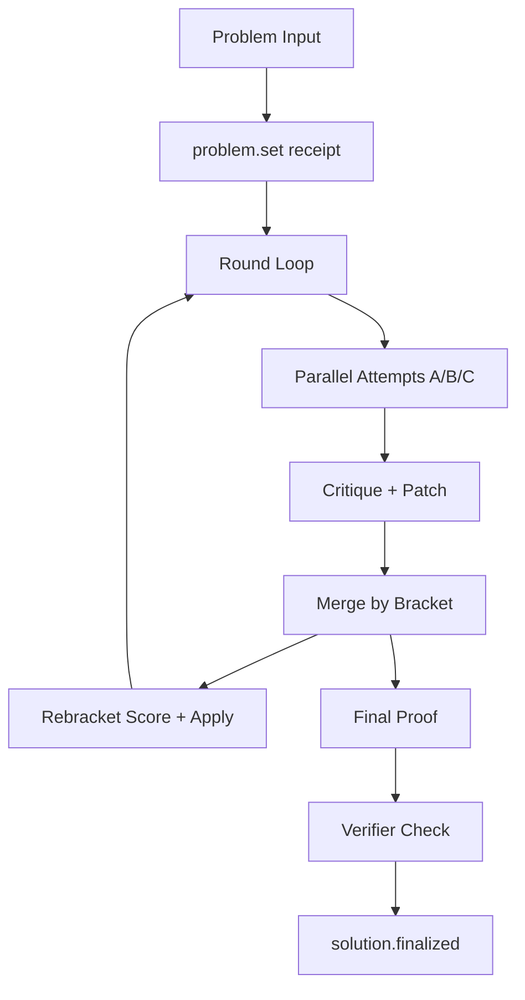
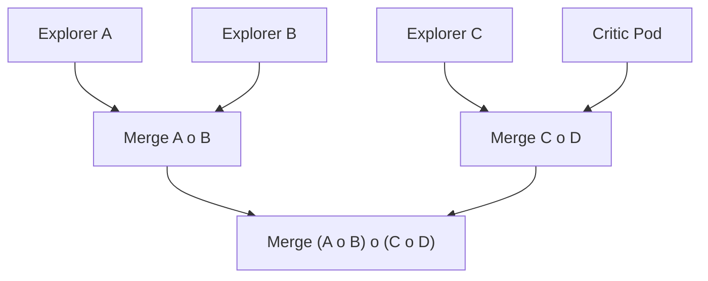

# Theorem Guild: How It Works

This document explains the Theorem Guild demo, how receipts drive everything, and how rebracketing changes collaboration order.

The system is intentionally minimal:
- Receipts are the only durable artifact.
- State and UI are pure folds over receipts.
- No hidden memory or mutable state.

Implementation layout (framework-style):
- `src/agents/theorem.ts`: workflow entry + public exports
- `src/agents/theorem.constants.ts`: team + examples + workflow ids
- `src/agents/theorem.memory.ts`: memory selection policy
- `src/agents/theorem.rebracket.ts`: rebracketing engine
- `src/agents/theorem.runs.ts`: run slicing + UI helpers

---

## Core loop (high level)

Mermaid flow:



---

## Receipts (events)

Every step emits a receipt:
- `problem.set`
- `run.configured`
- `attempt.proposed`
- `lemma.proposed`
- `critique.raised`
- `patch.applied`
- `summary.made`
- `rebracket.applied`
- `solution.finalized`
- `verification.report`

Parallel phases are explicit:
- `phase.parallel` (attempt / critique / patch)

All UI is derived from these receipts.

`run.configured` stores the workflow id/version, model, prompt hash, and run parameters (rounds/depth/memory/branch threshold) for reproducibility.

---

## Memory (receipt-only)

Agents never use hidden memory.
Each prompt receives a **memory slice** built from receipts:
- last round's attempts / critiques / patches
- the latest summary

This is computed on demand by folding the chain.

---

## Rebracketing (causal)

Brackets are not decorative. They control merge order.

Example bracket:

```
((A o B) o (C o D))
```

Meaning:
1) Merge A + B
2) Merge C + D
3) Merge those two results

Each merge is a `summary.made` receipt tagged with its subtree bracket.

Mermaid for the merge tree:



The rebracket scorer uses evidence from receipts
(critiques, patches, summary links) to pick a better bracket for the next round.

---

## Branching (real)

Branches are real streams:
- each explorer can fork the run at a specific receipt index
- branch streams receive their attempt receipts
- the main stream still stores the merged summary

Branching is triggered only when critiques show strong divergence.

---

## Parallelism (explicit)

Attempts, critiques, and patches run in parallel.
Each parallel phase emits a `phase.parallel` receipt so the UI reflects it.

---

## Verification (heuristic)

We add a final verifier pass after the proof:
- emits `verification.report`
- updates metrics with `valid / needs / false`

This is still LLM-based, not formal proof.

---

## What makes it "the best"

The system gets better because:
- rebracketing changes **who merges first**
- memory is limited to **useful recent receipts**
- parallel work happens where safe
- verification provides a consistent “gap signal”

Still minimal. Still receipt-only. Everything is observable and replayable.
